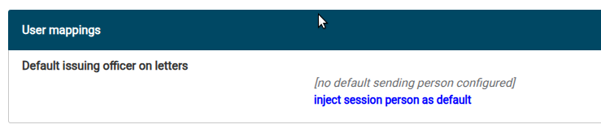
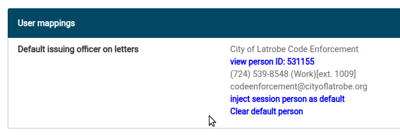

# Setting Up Generic Officer Signatures

A municipality can opt to sign letters (notices of violation) from a generic/arbitrary person
without a signature image. The issuing officer is still tracked internally; the recipient
only sees the designated generic person as the signing party. This is a one-time setup task
per municipality.

## Steps

1. Create a person whose name, title, phone, and email are as desired for the generic
   signature. Linked mailing addresses are **not** used in letter signatures. This person
   should now be your session person, displayed in the top session person box.
2. Navigate to the municipality management page and load the desired municipality.
3. Scroll down to the **User mappings** panel.
4. Click **Inject session person as default**. Your generic person, now loaded into your
   session, is mapped to this municipality. When a letter is generated in this municipality,
   this generic signing person will be selected as the signer by default.

Once this is configured, officers can still override it on any individual letter — see the
[user guide](/users/subsystems/letters/generic-officer-signatures) for the day-to-day usage
note.
