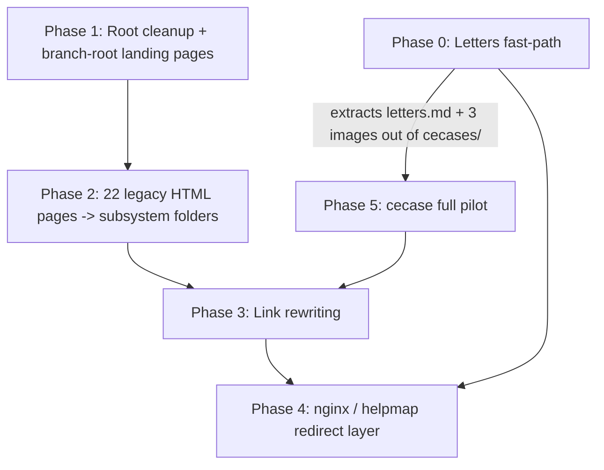

# Documentation Site Overhaul — Directory Structure & Taxonomy Plan (Aug 2026)

## Status: APPROVED 2026-08-07 — see §9 for sign-off. Root cleanup done; canonical registry
finalized (23 subsystems + X-series); all 23 hub pages plus all 77 branch/subsystem stub
pages written (see §8b). **§11 migration TODO list drafted 2026-08-07** — covers the Letters
fast-path launch, remaining root cleanup, the 22-file legacy HTML migration, link rewriting,
and the static-link/nginx redirect implementation. **§11.1 (Letters fast-path) and §11.2
(root directory cleanup) executed 2026-08-07 night** — see per-item checkmarks below.
**§11.3 (22-file legacy HTML migration) executed 2026-08-14** — all 7 subsystem batches
(accounts, basics, permitting, person, property, codebook, cecase) migrated, old files/dirs
deleted, images moved into per-subsystem `img/` folders, inbound links fixed; see per-row
status in the §11.3 table and the resolved decisions in §11.8. §11.4's repo-wide grep pass was
run as part of this cleanup (see §11.3 note). §11.5 (static-link/nginx redirect) and §11.6
(`cecase` full pilot — the deeper `users/cecases/` folder + `cecases/*.png`, distinct from the
single overview page migrated in §11.3) remain not started — still gated on VPS/DNS
provisioning (§11.5) or a dedicated pilot pass (§11.6).

**§12 (meta-organization flow) appended 2026-08-12** — specs three cross-repo tracking organs
(a reverse-chrono **worklog**, a **subsystem-status dashboard**, and a **dev↔docs correlation
policy**) plus the codenforce subsystem-slug alignment task. T1–T3 done 2026-08-12; T4–T7
(registry crosswalk note, `status:planned` tag adoption, docbacklog row, codenforce dir-slug
rename) remain open, not touched by the §11.3 cleanup pass.

This plan answers the open organizational questions carried over in
[docbacklog.md](/system/docbacklog) ("Consolidate down to four main branches", "Build a
subsystem overview listing", "Develop a template + plan for organizing subsystem docs") and
supersedes that backlog entry with a concrete structure. See
[docs-flow-architecture.md](docs-flow-architecture.md) for how content *arrives* in this repo
(GitLab drafting → GitHub canonical → Wiki.js sync) — this document is about how content is
*organized* once it's here.

The canonical subsystem list now lives at
[system/subsystem-registry.md](/system/subsystem-registry) — that file, not the table in §2
below, is the source of truth going forward. §2 is kept for its rationale/history.

---

## 0. Current state (why this is urgent)

A quick inventory of the tracked repo today:

| Metric | Count |
|---|---|
| Total tracked files | 106 |
| Markdown pages (`.md`) | 45 |
| Legacy CKEditor pages (`.html`) | 22 |
| Images (`.png`/`.jpg`) | 37 |
| Misc (`.xhtml`, `.pdf`) | 2 |

67 pages already, with no subsystem registry, no page-type convention, and three different
top-level shapes competing (`users/<Basics|cecases|...>/`, `admin/<user|...>/`, plus a set of
root-level `cecases/`, `inspections/`, `permitting/`, `properties/` image folders). Concretely
broken things found during this review, **now resolved** (see §10):

- **A raw JSF source file was sitting in the repo root**: `occPermitApplicationUnitList.xhtml`
  — actual application code (`<h:body>`, `<p:panel>`, PrimeFaces tags), almost certainly an
  accidental copy-paste from the codenforce repo into the wrong clone. **Deleted 2026-08-07.**
- **Root-level image folders — correction after verification.** These were initially assumed
  to be fully orphaned. A grep of every filename against the whole repo showed that's only
  true for **2 of the 17 images**: `properties/propgroups.png` and
  `inspections/addspacebytype.png` had zero references anywhere and have been moved to a new
  `xarchive/` root folder (2026-08-07) — this repo's equivalent of the `xarchive/` convention
  already used in the codenforce Java repo for material nobody wants to spend time sorting.
  The remaining 15 images (all of `cecases/`, `permitting/`, and 3 of 4 in `inspections/`) are
  **actively referenced** by real pages using absolute Wiki.js paths, e.g.
  `` from `users/cecases/finetracking.md`. This is a
  real, live (if inconsistent-with-the-newer-convention) pattern — root-level absolute-path
  image folders alongside the newer per-page `img/` colocation convention seen in
  `users/cecases/img/` and `users/permitting/img/`. **Do not delete or bulk-move these** —
  fold each subsystem's root-level image folder into that subsystem's own `img/` folder (and
  update the referencing pages in the same commit) as part of that subsystem's migration pass
  in §10, not as a separate blind sweep.
- **Two competing editors**: 22 `.html` pages use the Wiki.js CKEditor format
  (`admin.html`, `home.html`, most of `users/**`), while newer content uses
  `editor: markdown`. `doclog.md` already documents converting `release_notes.xhtml` for
  this exact reason — the rest of the CKEditor pages need the same treatment.
- **Link rot from prior reorganizations**: `home.html` linked to `/users/hardware`, but the
  file actually lives at `users/basics/hardware.md`. **Fixed 2026-08-07** along with the
  casing rename below. `admin.html` still links to `/admin/user` (no `.html`/`.md` — relies
  on Wiki.js path resolution) alongside plain text "Muni config" with no link at all — left
  for the full link-check pass in §10.
- **Inconsistent casing**: `users/Basics/` was the only capitalized folder in the tree.
  **Renamed to `users/basics/` 2026-08-07** (`git mv`, history preserved).
- **Frontmatter `tags:` is empty on every page.** Wiki.js's tag-browse feature is completely
  unused — a free navigational axis is sitting idle (see §5).
- **The subsystem list itself was a hodgepodge**, split across two repos with no single
  canonical source. **Resolved 2026-08-07** — see `system/subsystem-registry.md`.

None of this is a criticism of past work — it's the natural result of a fast-moving one- or
two-person doc effort with no registry to check new folders against. The fix is structural,
not a one-time cleanup, or the mess reappears in six months at 10x the page count.

---

## 1. Reader domains (the audience model this plan is built around)

| Domain | Who | Wants |
|---|---|---|
| **Backend developers** | Contributors to the codenforce Java/JSF codebase | Architecture, schema, subsystem internals, build/deploy |
| **Municipal system admins** | Configure users, munis, data flows, payment processing, canned comments, cert types | Admin runbooks, config reference |
| **Code officers** | Logged-in end users who make case-state legal judgments | Task how-tos, authority-gated actions |
| **Municipal staff** | Logged-in end users, no legal judgment authority | Task how-tos (subset of officer's) |
| **Read-only / viewer users** | Logged-in, view case state only | Task how-tos (further subset) |
| **Public users** | Unauthenticated — submitting CEAR forms, permit applications, status lookups | Plain-language forms guidance, no internal workflow exposure |

The last three are grouped as **"logged-in end users"** for structural purposes (§3) because
they share the same screens and mostly differ by *authority level*, not by *content type* —
this distinction drives the recommendation below. Public users are pulled out entirely because
they differ by *security boundary*, not just authority: nothing behind the login should ever
leak into public-facing pages.

---

## 2. Building the canonical subsystem registry

The codenforce repo's `docs/subsystems/` is dev-facing engineering scratch space (feature
plans, implementation summaries, upgrade backlogs) — it is **not** end-user documentation and
was never meant to be a registry. But it's the best available census of what subsystems
actually exist, and it's more complete than the "official" list in codenforce's own
`.github/copilot-instructions.md`, which only names 11 subsystems
(`N_USER, I_MUNICIPALITY, II_CODEBOOK, III_PROPERTY, IV_PERSON, V_EVENT, VI_OCCPERIOD,
VII_CECASE, VIII_CEACTIONREQUEST, X_PAYMENT, XII_BLOB`). The `docs/subsystems/` folder on
disk has **23 directories**, including several with real content and no Roman-numeral home
(`XI`, `XIII`, `XIV` exist as folders but aren't in the instructions list at all; `permitting`,
`inspections`, `letters+emailing`, `data_exchange`, `evaluations`, `workflows` have no numeral
at all).

**Recommendation:** this docs repo — not the Java repo — becomes the source of truth for the
subsystem registry, since it's the one place all audiences meet. Publish it as
`system/subsystem-registry.md`, one row per subsystem, and treat it as the only place new
top-level subsystem slugs get approved. Once stable, propose a matching update to codenforce's
`copilot-instructions.md` so the two lists converge (a follow-up cross-repo task, not part of
this plan).

Proposed registry (slug is the folder name used everywhere in this repo):

| Slug | Java subsystem | Kind | Source dir in codenforce | Branches needing content |
|---|---|---|---|---|
| `accounts` | `N_USER` | domain | `n_user` | dev, admin, users(basics) |
| `municipality` | `I_MUNICIPALITY` | domain | `i_municipality` | dev, admin |
| `codebook` | `II_CODEBOOK` | domain | `ii_codebook` | dev, admin, users |
| `property` | `III_PROPERTY` | domain | `iii_property` | dev, users, public |
| `person` | `IV_PERSON` | domain | `iv_person` | dev, users |
| `event` | `V_EVENT` | domain | `v_event` | dev, users |
| `occupancy` | `VI_OCCPERIOD` | domain | `vi_occperiod` | dev, users |
| `cecase` | `VII_CECASE` | domain | `vii_cecase` | dev, users |
| `cear` | `VIII_CEACTIONREQUEST` | domain | `viii_ceactionreq` | dev, users, public |
| `letters` | *(unlisted — spans VII/VIII)* | domain | `letters+emailing` | dev, admin, users |
| `payment` | `X_PAYMENT` | domain | `x_payment` | dev, admin, users, public |
| `reporting` | *(unlisted)* | domain | `xi_report` | dev, users |
| `files` | `XII_BLOB` | domain | `xii_blob` | dev only (infra-ish) |
| `public-info` | *(unlisted)* | domain | `xiii_publicinfo` | dev, public |
| `mapping` | *(unlisted)* | domain | `xiv_spatial` | dev, admin, users |
| `permit-applications` | *(unlisted)* | domain | `viv_occapp_publicforms` | dev, admin, users, public |
| `permitting` | *(nested conceptually under occupancy, kept distinct)* | domain | `permitting` | dev, users, admin |
| `inspections` | *(spans occupancy + cecase)* | domain | `inspections` | dev, users |
| `data-exchange` | *(unlisted — WestMC integration)* | domain (admin-critical integration) | `data_exchange` | dev, **admin** |
| `evaluations` | *(unlisted)* | domain | `evaluations` | dev, users |
| `workflow-builder` | *(unlisted — Workflow Builder engine)* | domain (technical) | `workflows` | dev, admin |
| — | — | infra (not a subsystem) | `system` | dev only |
| — | — | cross-cutting UI concern | `system-general-xsubsystem` | dev only |

**Correction after review (§9):** `data-exchange` is *not* dev-only — it's one of the most
admin-critical pathways in the system (tens of thousands of lines of WestMoreland County
integration code, with complex admin config pages for reviewing, enabling, and monitoring
regular data exchanges). Only the two `system*` folders are genuinely **cross-cutting/infra**
deliberately excluded from `users/`/`admin/` — engineering concerns a code officer or muni
admin will never browse to by subsystem name. `data-exchange` gets full `admin/` treatment
like any other domain subsystem.

This is a starting registry, not a locked one — it will grow. The point is that *every* new
top-level folder in `dev/`, `admin/`, or `users/` must correspond to a row in this table before
it's created, so the "which folder does this go in" question always has one answer.

---

## 3. Question 1 — domain-first or subsystem-first at the top level?

### Option A — subsystem-first (`subsystems/cecase/dev/`, `subsystems/cecase/users/`, …)

All content about one subsystem lives together. Good for a subsystem deep-dive, bad for
audience isolation: a code officer landing in `subsystems/cecase/` is one wrong click away
from `subsystems/cecase/dev/` full of JDBC and coordinator notation — exactly the mixing the
prompt worried about. Access control and the QR/stable-ID public-portal boundary (see
[static-link-redirect-architecture.md](../wiki.js/static-link-redirect-architecture.md)) also
get harder to reason about, since "everything public users may see" is scattered across one
subfolder inside every subsystem rather than one clean subtree.

### Option B — domain-first (`dev/`, `admin/`, `users/`, `public/`), subsystem-second

Matches the direction already chosen in `docbacklog.md`. A code officer's entire world is
under `users/`; nothing dev-only or public-only can leak in by accident. Maps cleanly onto:

- The existing GitLab → `drafts/gitlab-generated/` pipeline, which produces **dev-facing**,
  code-aware drafts almost by definition — they land in `dev/` and nowhere else without a
  human rewrite.
- The stable-ID redirect layer already designed for in-app help and QR codes — each audience's
  IDs get a clean namespace prefix (`/help/officer-...`, `/help/dev-...`).
- Any future Wiki.js path-based access rules, and the hard requirement that public-portal
  content never contains internal workflow detail.

The cost is real: the subsystem taxonomy is now duplicated as a folder name across up to four
branches, which can drift. That's exactly what §2's registry exists to prevent, and what the
hub page in §4 exists to stitch back together.

### Recommendation: **Option B**, with one amendment to the existing backlog plan

Confirm the domain-first direction, but use **five** branches, not four — split `public/` out
of `users/` rather than nesting it underneath:

```text
dev/            backend developers
admin/          municipal system admins
users/          logged-in end users (officers, staff, viewers)
public/         unauthenticated public (CEAR forms, permit applications, status lookup)
system/         meta: doc-site governance itself (registry, changelog, releases, architecture)
```

`public/` earns its own top-level branch because its boundary is a *security* boundary, not
just an audience preference — it's the one branch where "did anything internal leak in" is a
real risk, and QR codes on physical decals make its base path effectively permanent. Nesting
it inside `users/` would blur that line for no organizational benefit, since public users
never log in and share none of the officer/staff/viewer screens.

Within `users/`, do **not** create three parallel `officers/` / `staff/` / `viewers/`
subsystem trees — see §4 for why, and how role differences are handled without tripling every
page.

---

## 4. Question 2 — structuring a feature that touches every audience

**Recommendation: hub-and-spoke, full page separation across branches, in-page tagging
within `users/`.**

### The hub

Every subsystem gets exactly one short **hub page**, living at
`system/subsystems/<slug>.md`, that is *not* documentation of the feature itself — it's a
one-paragraph plain-English description plus links out:

```markdown
# CE Case Management (`cecase`)

Tracks code enforcement cases from opening through closure, including case status,
priority, and linked properties/persons.

- Developers: [dev/subsystems/cecase/](../../dev/subsystems/cecase/overview.md)
- Code officers & staff: [users/cecase/](../../users/cecase/overview.md)
- Public: not applicable — cases are not directly public-facing (see `cear` for the public
  submission side of this workflow)
```

This solves the "whole story" problem Option B creates: anyone who wants the full picture of
a subsystem starts at one page and fans out, instead of guessing which branch to check first.

### The spokes

**Do not** put multiple audiences' content in one page with collapsible sections, except for
genuinely tiny features. Reasons:

1. **Search noise.** Wiki.js indexes and returns whole pages; an officer searching "close a
   case" shouldn't land mid-scroll next to coordinator/JDBC notes.
2. **Depth conflict.** A page trying to satisfy both a developer and a code officer either
   stays too shallow to be useful to the developer or gets too jargon-heavy for the officer —
   there's no register that serves both well.
3. **Future permissioning.** If Wiki.js path/group-based access rules are ever introduced,
   section-level gating inside one page isn't possible — full page separation is the only
   structure that supports it later without a rewrite.
4. **Ownership.** A developer updates the dev page after a code change; someone else updates
   the officer page after a workflow/training change. Shared pages force both edits through
   the same file.

So: **yes, three (or four) pages minimum** for any substantial feature — one dev page, one
admin page (if applicable), one users page, one public page (if applicable) — tied together
by the single hub page above. Keep the same slug across branches
(`dev/subsystems/cecase/overview.md`, `users/cecase/overview.md`) so the mapping is obvious
without needing the hub to explain it.

**Exception:** a feature small enough that the admin-config paragraph and the end-user-usage
paragraph are each a few sentences can stay as one page with labeled `##` sections. The moment
either section needs its own screenshots or a click-by-click sequence, split it out — that's
the trigger, not a page-count rule of thumb.

### The one place page-splitting is *not* the answer: officer vs. staff vs. viewer

These three differ by **authority**, not by content type — the screens are identical, the
click-by-click is identical, only *who is allowed to do the last step* differs. Splitting
`users/cecase/` into three near-duplicate subtrees would triple maintenance for ~80% identical
content. Instead:

- Baseline task/how-to pages live directly under `users/<slug>/`, written for whichever role is
  the common denominator (usually "staff", since officers and viewers are supersets/subsets
  of what staff can see).
- Where authority actually gates a step, add an inline callout at that step, not a whole
  separate page:

  ```markdown
  > **Officer authority required.** Finalizing a violation is a legal determination and is
  > only available to users with the Code Officer role.
  ```

- Only create a role-specific page when the divergence is a genuinely separate workflow, not
  just a gated button (e.g., an officer-only "batch close cases" tool with its own multi-step
  UI gets its own page under `users/cecase/`, cross-linked from the shared overview, rather
  than being wedged into the shared page as a giant conditional section).
- Use `tags:` (see §6) to mark `audience:officer`, `audience:staff`, `audience:viewer` on
  pages/sections so Wiki.js's tag-browse view can filter by role even though the folder
  structure doesn't fork.

---

## 5. Question 3 — page type taxonomy

Formalize distinct page *types*, each with a clear purpose and naming convention. A page's
type should be obvious from its tags and roughly from its filename pattern:

| Type | Purpose | Where it lives | Naming pattern |
|---|---|---|---|
| **Hub / index** | One-paragraph subsystem landing page, links out to every branch's spoke | `system/subsystems/<slug>.md`, plus one curated `index.md` per branch/subsystem-folder | `index.md` or `overview.md` |
| **Concept / overview** | "What can the letter subsystem do?" — prose, index-like, scope & capability description | Top of each `<branch>/<slug>/` folder | `overview.md` |
| **Task / click-by-click** | Screenshot-heavy, numbered steps, minimal prose, one task per page | `<branch>/<slug>/` | verb-first: `add-an-event.md`, `close-a-case.md` |
| **Reference** | Dense factual tables — field lists, status codes, canned-comment catalogs, cert types, permission matrices | `<branch>/<slug>/reference/` or `reference.md` if small | `reference.md` or `<topic>-reference.md` |
| **Best-practice** | Cross-subsystem business-process guidance ("running your monthly rental inspection cycle") | **Not** inside any one subsystem folder — see below | `<branch>/best-practices/<topic>.md` |
| **Architecture / ADR** | Design decisions with options considered and a verdict (like this file) | `dev/architecture/` | `<topic>-architecture.md` or `<topic>-<month><year>.md` |
| **Admin runbook** | Step-by-step operational task for muni admins (create a muni, configure a payment processor) | `admin/<slug>/` | verb-first, same as task pages |
| **Release notes / changelog** | Already established | `system/releases/` | (unchanged) |
| **FAQ / troubleshooting** | Common errors and fixes | One `faq.md` per subsystem folder, or a single running `<branch>/faq.md` if sparse | `faq.md` |

### Where best-practice / cross-subsystem pages live

These pages deliberately span multiple subsystems (a rental-inspection cycle touches
`property`, `occupancy`, `event`, and `cecase` all at once), so they must **not** be forced
into any single subsystem folder. Give them a dedicated sibling folder at the same level as
the subsystem folders:

```text
users/best-practices/monthly-rental-inspection-cycle.md
admin/best-practices/onboarding-a-new-municipality.md
```

**Naming collision avoided:** don't call this folder `workflows/`. That name is already
taken by the *Workflow Builder* — a specific technical subsystem/engine
(`docs/subsystems/workflows` in the codenforce repo, `workflow-builder` slug in the registry)
— and reusing it for "general business best practices" would immediately recreate the
hodgepodge this plan is trying to fix. **Decided 2026-08-07: `best-practices/`**, not
`playbooks/` — settled in §9.

Cross-link liberally: each relevant subsystem's `overview.md` should have a "See also" line
pointing at any best-practice page that touches it, since these are the one place a reader
won't find their way to by folder-browsing alone.

---

## 6. Tags as the second navigational axis

Domain-first folders (§3) necessarily suppress the subsystem-first view as a *folder*
structure. Recover it without duplicating files by actually using Wiki.js's `tags:`
frontmatter field, currently empty on every page in this repo. Adopt a three-facet tagging
contract, enforced by convention (and spot-checked during migration, not by tooling initially
— this is a two-person doc team, not a CI pipeline problem yet):

```yaml
tags: subsystem:cecase, audience:officer, type:howto
```

- `subsystem:<slug>` — must match a row in the §2 registry.
- `audience:<dev|admin|officer|staff|viewer|public>` — matches §1.
- `type:<hub|overview|howto|reference|best-practice|architecture|runbook|faq>` — matches §5.

This gives Wiki.js's built-in tag browser a working cross-cutting index ("show me every
`cecase` page regardless of audience", "show me every officer-only howto") without touching
the folder-based primary navigation at all.

---

## 7. Illustrative target tree

Not exhaustive — enough to show the pattern across a few subsystems plus the cross-cutting
folders:

```text
boroughforge-wikidocs/
  system/
    subsystem-registry.md
    subsystems/
      cecase.md              # hub page
      cear.md
      letters.md
      payment.md
      ...
    doclog.md
    docbacklog.md
    releases/
  dev/
    architecture/
      docs-flow-architecture.md
      docs-overhaul-aug26.md   # this file
      static-link-redirect-architecture.md
      qr-redirects-guide.md
    subsystems/
      cecase/
        overview.md
        reference.md
      cear/
        overview.md
      letters/
        overview.md
      payment/
        overview.md
    db/
    jsf/
    java/
  admin/
    subsystems/
      municipality/
        overview.md
        onboarding-a-municipality.md
      payment/
        overview.md
        configure-a-payment-processor.md
      accounts/
        overview.md
        creating-a-user.md
    best-practices/
      onboarding-a-new-municipality.md
  users/
    basics/
      user-login.md
      dashboard-overview.md
    subsystems/
      cecase/
        overview.md
        add-an-event.md
        close-a-case.md          # officer-authority callout inline
      property/
        overview.md
        add-a-property.md
      letters/
        overview.md
        managing-letter-types.md
    best-practices/
      monthly-rental-inspection-cycle.md
  public/
    subsystems/
      cear/
        overview.md
        submitting-a-cear.md
      permit-applications/
        overview.md
        applying-for-an-occupancy-permit.md
```

Note `dev/`, `admin/`, and `users/` all gain a `subsystems/` layer beneath them (rather than
subsystem folders sitting directly at the branch root) — this keeps each branch's root free
for the branch's own cross-cutting folders (`best-practices/`, `basics/`, `architecture/`,
`db/`, etc.) without those competing visually with the subsystem list in the sidebar.

---

## 8. Other cleanup considerations (Question 4)

- ~~Delete or relocate the stray XHTML file~~ **Done 2026-08-07** —
  `occPermitApplicationUnitList.xhtml` confirmed accidental and removed via `git rm`.
- **Fold the root-level image folders into per-subsystem `img/` folders during migration**
  (not as a standalone sweep). Corrected finding: only 2 of 17 images were truly unreferenced
  (`properties/propgroups.png`, `inspections/addspacebytype.png`) — both moved to `xarchive/`
  **2026-08-07**. The other 15 (`cecases/`, `permitting/`, 3 of 4 in `inspections/`) are live
  and referenced via absolute Wiki.js paths from real pages; move each subsystem's folder into
  that subsystem's `img/` and fix the referencing pages together, in that subsystem's own
  migration commit (the `cecase` pilot in §9 will do this for `cecases/` first).
- **Convert the remaining 22 CKEditor `.html` pages to markdown**, following the precedent
  already set for `release_notes.xhtml` → `releasenotes.md` in `doclog.md`. Do this
  page-by-page as each is migrated into the new structure, not as a separate blanket pass —
  otherwise it's a second full-repo churn on top of the directory migration.
- ~~Fix `users/Basics/` casing~~ **Done 2026-08-07** — renamed to `users/basics/` via `git mv`
  (history preserved), and the one inbound link from `home.html` (which also pointed at the
  wrong path, `/users/hardware`) fixed to `/users/basics/hardware` in the same pass.
- **Run a link-check pass** after migration. Given the repo's small size, a simple script
  that greps all `.md`/`.html` files for internal links and checks each target exists is
  sufficient — no need for a hosted link-checker service.
- **Reuse the stable-ID redirect layer from day one.** [static-link-redirect-architecture.md](../wiki.js/static-link-redirect-architecture.md)
  already solves "in-app help links must never break when pages move." Every new page that
  might reasonably be linked from an in-app help icon should get a stable ID registered in
  that system at creation time, not retrofitted later once XHTML files already hardcode a
  path.
- **The GitLab draft pipeline should feed `dev/subsystems/**` primarily.** Code-aware
  generated drafts are backend-flavored almost by construction; the promotion step (§ in
  `docs-flow-architecture.md`) should default to landing promoted content in the `dev/`
  branch, with admin/user/public pages written by a human afterward in plain language rather
  than by promoting the same generated draft verbatim into multiple branches.
- **Curate, don't auto-generate, each branch's root index page.** With hundreds of pages
  incoming, the `dev/index`, `admin/index`, `users/index`, `public/index` pages become the
  single most important pages in the whole site for discoverability — treat them as living
  documents that get a line added every time a new subsystem folder is created, not
  something regenerated from a script.
- **Registry gatekeeping is a review habit, not tooling — for now.** With a two-person doc
  team, the fix for "don't invent new top-level folders" is: check §2's registry before
  creating one, and add the row if it's genuinely new. Revisit automated enforcement
  (a pre-commit check or CI lint) only if/when more contributors start touching this repo.

---

## 8a. Image resource convention

Formalizes the pattern already in use at `users/permitting/img/op-cse-links/`:

- Every subsystem folder (`<branch>/subsystems/<slug>/`) gets one `img/` directory as a
  sibling to its pages, created the first time a page in that folder actually needs an
  image — not pre-scaffolded, since empty directories aren't tracked by git anyway.
- **Default:** images sit flat in `img/` (`img/some-diagram.png`) when the folder only has
  one or two image-bearing pages.
- **Nest a page-named subfolder** (`img/<page-slug>/`) the moment a single page needs 3+
  dedicated screenshots, so a busy folder's `img/` doesn't become an unlabeled flat pile from
  several different pages.
- **Use relative links** (`img/file.png` or `img/<page-slug>/file.png`), not absolute Wiki.js
  paths (`/users/permitting/img/...`) — relative links survive a folder rename; the older
  `cecases/` content used absolute paths and should not be treated as the model to copy.
- Images are **never shared across branches**, even for the same subsystem — duplicate
  rather than reference across a branch boundary, consistent with §4's full-page-separation
  reasoning.

## 8b. Stub-page convention (2026-08-07)

Since the Wiki.js browser editor is never used for normal editing (see
[docs-flow-architecture.md](docs-flow-architecture.md)), "a place to put the docs" has to mean
a file that already exists in git at the right path — there's no "create page" affordance to
rely on later. So every subsystem's `dev/`, `admin/`, `users/` (and `public/` where
applicable) spoke got a stub `overview.md` up front, in one batch, rather than created on
demand:

- `published: false` in frontmatter — hidden from live nav/search until real content lands;
  flip to `true` when the page is actually written.
- Every stub body carries a `🚧 Stub` marker, so `grep -rl "🚧 Stub"` finds everything still
  unwritten.
- `data-exchange`'s `admin/` stub is special-cased to point at the already-migrated
  `admin/westmc-data-exchange.md` instead of duplicating content.
- **Not** included in this pass: the four branch-root landing pages (`dev.md`/`admin.html`/
  `home.html` → `dev/index.md` etc. per §8) and `best-practices/` folders — both involve
  moving/renaming existing live content or have no concrete topic yet, a different risk
  profile than pure new-file stubbing. Tracked as separate follow-ups.

## 9. Decisions (resolved 2026-08-07)

1. Confirm the five-branch model (`dev/ admin/ users/ public/ system/`) and the `playbooks/`
   naming (vs. `best-practices/`) in §5.

ECD Response 7-AUG-2026: Let's go with your proposed 5 branches, with the hub pages for each subsystem in /system. We'll call the broader guides best-practices, not playbooks. Playbooks is a sports term, and sports will destroy and rot one's soul down to the bone.

2. Confirm `accounts` as the slug for `N_USER` (chosen to avoid colliding with the `users/`
   branch name — "user" would otherwise mean two different things in the same sentence).

ECD Response 7-AUG-2026: Confirmed: accounts. When we create the canonical subsystem list, we'll migrate away from roman numerals which is excessively pedantic and a relic of my 2017 self.

3. Confirm the `permitting` / `occupancy` / `inspections` boundary — these three overlap
   conceptually in the source subsystem list and need one clear line drawn before folders are
   created, or they'll collide the same way the current repo's stray directories do.

ECD Response 7-AUG-2026: These three are distinct subsystems, although permitting might technically be thought of as a nested sub-sub system since all permitting occurs on the "occupancy" side of the system. They should remain separate because Permitting is such a distinct and critical function within CNF that shouldn't be muddled with all its related infrastructure on the Occ period side (as opposed to code enforcement, the violation of statues side). Inspections are also a major subsystem whose objects live in both occ and ce. 

4. Decide whether `data-exchange` (WestMC) needs any `admin/` content at all beyond
   `westmc-data-exchange.md` (already migrated per `doclog.md`), or whether it's dev-only from
   here forward.

ECD Response 7-AUG-2026: Absolutely data exchange needs admin--perhaps the most admin critical pathway of reviewing, enabling, and monitoring regular data exchanges with westmoreland county. it's tens of thousands of lines of code with complex admin config pages.

5. Decide migration order — recommend starting with the subsystem that has the most existing
   scattered content (`cecase`, per current `users/cecases/` + `docs/subsystems/vii_cecase/`
   scope) as the pilot, since it will surface every edge case this plan didn't anticipate
   before the pattern is copied to 20 more subsystems.

ECD Response 7-AUG-2026: Migration order can certainly start with ce cases. 


## 10. Immediate action items (carried into `docbacklog.md`)

- [x] Get sign-off on §3 (five branches) and §5 (`best-practices/` naming) — resolved §9.
- [x] Create `system/subsystem-registry.md` from the §2 table (arabic numerals, not Roman).
- [x] Delete `occPermitApplicationUnitList.xhtml`.
- [x] Clear the two confirmed-dangling images into `xarchive/`; correct the record on the
      other 15 root-level images, which are live and get folded into per-subsystem `img/`
      folders during each subsystem's own migration pass instead.
- [x] Fix `users/Basics/` → `users/basics/` casing and its one broken inbound link.
- [x] Write all 23 per-subsystem hub pages at `system/subsystems/<slug>.md` (one flat batch,
      2026-08-07) — gives every subsystem a stable landing point and spoke links before any
      branch content exists.
- [x] Scaffold all 77 branch/subsystem stub pages (`<branch>/subsystems/<slug>/overview.md`,
      2026-08-07, see §8b) — `published: false`, marked 🚧 Stub — since Wiki.js's browser
      editor is never used, the stub file itself (not a UI prompt) is what makes a subsystem
      a real place to write new-feature docs into tonight.
- [ ] Pilot the *full* branch/subsystem/hub pattern on `cecase` (confirmed in §9) — i.e. the
      deeper migration pass: folding `cecases/*.png` into `users/subsystems/cecase/img/` and
      updating `finetracking.md` / `letters.md` in the same pass. This is explicitly
      **not** a blocker for documenting new features — it's the deferred cleanup of
      *existing* scattered content, tracked separately from the stub scaffolding above.

---

## 11. Migration TODO list (drafted 2026-08-07 — pending review before execution)

This section plans out the full push from "stub pages exist" to "real content, real links,
real redirects." Nothing below has been executed yet unless explicitly marked **DONE**. It is
ordered so the Letters launch (this weekend) is not blocked by, and does not have to wait for,
the rest of the repo-wide cleanup.

### 11.0 Why Letters jumps the queue

The engineering side of the `letters` subsystem (registry #12) has landed an enormous amount
of scope since the existing docs were written — see
`codenforce/docs/subsystems/letters+emailing/letterSubsystem-remainingWork-aug2026.md`: PDF
generation at finalization, email delivery via Resend (+ webhooks), unified mail/email/
posting/door-hanger distribution history, the two-path clone workflow, and a **user-visible
rename of the panel header from "Letters" to "Correspondence."** None of this exists in the
docs yet. The only existing user-facing content, `users/cecases/letters.md`, covers just the
January 2026 generic-officer-signature feature on CE-case letters — it doesn't mention
property/permit-file letters, mail merge, cloning, PDF, email, or the distribution history
panel at all. Users are about to see a renamed panel and several brand-new capabilities with
zero documentation. This is the actual near-term goal driving all of §11: get real pages
in place, then wire the static-link redirect layer to them.

### 11.1 Phase 0 — Letters fast-path (target: this weekend)

**DONE 2026-08-07 night.** One deviation from the original plan below: while migrating
`users/cecases/letters.md`, its content turned out to be mixed-audience (setup steps are
admin-only, per §4's full-page-separation policy) — it was split into two files instead of
one: `admin/subsystems/letters/generic-officer-signatures.md` (setup) and
`users/subsystems/letters/generic-officer-signatures.md` (day-to-day usage), cross-linked to
each other. Images split accordingly: `noneinjected.png`/`genericloaded.png` →
`admin/subsystems/letters/img/`, `letterwithgenericsigner.png` → `users/subsystems/letters/img/`.
The codenforce-repo `helpLinkCC` wiring item remains an open follow-up, not done tonight.

Runs independently of every other phase below — do not wait on root cleanup or the other 21
legacy HTML pages.

- [x] Rewrite `users/subsystems/letters/overview.md` (currently a ð§ stub) for the full
      current feature set, in plain end-user language: letters on CE cases, properties, and
      permit files; mail-merge template fields; the clone/two-path workflow; PDF generation at
      finalization; the **Correspondence** distribution-history panel (mail, email, posting/
      placard, door-hanger); email delivery status badges. Source material: `LetterCoordinator`
      + `letterTableCC.xhtml` + `letterFlow.xhtml` in the codenforce repo, translated — not
      copied — into task-oriented language (no JDBC/coordinator terms).
- [x] Migrate `users/cecases/letters.md` (generic-signer content, still accurate) — split per
      the deviation noted above into `admin/subsystems/letters/generic-officer-signatures.md`
      and `users/subsystems/letters/generic-officer-signatures.md`. Images moved from root
      `cecases/` into the two new `img/` folders, `` references rewritten to relative
      `img/...` links (see §8a), old file deleted.
- [x] Write new task pages under `users/subsystems/letters/`, split by task (per §5, not one
      giant page):
  - `generating-and-sending-a-letter.md` — clone/two-path chooser, mail-merge fields, step
    2–4 flow.
  - `distributing-a-letter.md` — the unified **Correspondence** panel: mailing, email
    (suggest-and-confirm address), posting/placard + door-hanger with evidence photo upload.
  - `printing-a-letter.md` — short page, cross-linking to `users/basics/printing.md` rather
    than duplicating general printing instructions.
- [x] Write real content for `admin/subsystems/letters/overview.md` — template management
      (`letterTemplateManager.xhtml`), print orientation/format, court-documentation flag.
- [x] Flip `published: true` on every page actually written; leave anything not written this
      weekend as the existing `published: false` stub — do not publish partial/inaccurate
      pages just to hit a deadline.
- [x] Confirm the `system/subsystems/letters.md` hub page's spoke links still resolve (they
      already point at `overview.md` for each branch — no hub edit needed unless new page
      slugs replace `overview.md` as the primary landing page for a branch).
- [ ] Cross-repo dependency (codenforce, not this repo): the new Letters UI panels don't yet
      call `<cnf:helpLinkCC>` anywhere — that composite component doesn't exist yet either (see
      §11.4). Wiring in-app help links is **not required** to ship docs this weekend; users can
      be pointed at the docs site directly (e.g. via the existing user guide / announcement)
      until the stable-ID layer is live. Track the JSF wiring as a follow-up codenforce-repo
      task once §11.4 exists.

### 11.2 Phase 1 — Root directory cleanup

**DONE 2026-08-07 night** (the two checklist items below covering the three referenced-image
groups remain intentionally unchecked — they move with their owning subsystem in §11.3, not
tonight). All five orphans (`cnfpropprofilehome.png`, `login-logo.png`, `logo-n_font.png`,
`property_page_diagram_2025.pdf`, `tbedit.png`) plus the reviewed `letterAddresseeJumbledInFlow.png`
are now in `xarchive/`. `admin.html` → `admin/index.md`, `home.html` → `users/index.md`,
`dev.md` → `dev/index.md` (with a new "Around here" links section added, since `dev/` has
grown substantially), and a net-new `public/index.md` were all created; the two old `.html`
files were deleted via plain `rm`.

Audited every loose file at repo root against real inbound references (grep, not guesswork)
before deciding move-vs-archive:

| Root file | Referenced by | Disposition |
|---|---|---|
| `google_chrome_logo_with_wordmark_(2015).svg.png` | `users/basics/hardware.md` | Move to `users/basics/img/` when `hardware.md` is next touched |
| `tbaccess.png`, `tbtoolsandblocklist.png`, `tbdetail.png`, `tblinktoord.png`, `tbexport.png`, `sampleexport.png` | `users/code/textblocks.md` | Move together with that page into `users/subsystems/codebook/img/` during the `codebook` migration pass (§11.3) |
| `property_page_diagram_2025.png` | `users/properties.md` | Move into `users/subsystems/property/img/` during the `property` migration pass |
| `cnfpropprofilehome.png` | *(none found)* | Orphan — move to `xarchive/` |
| `login-logo.png` | *(none found)* | Orphan — move to `xarchive/` |
| `logo-n_font.png` | *(none found)* | Orphan — move to `xarchive/` |
| `property_page_diagram_2025.pdf` | *(none found — the `.png` sibling is referenced, this source file is not)* | Likely a design source file, not a doc asset — move to `xarchive/` rather than delete |
| `tbedit.png` | *(none found — `textblocks.md` has no dedicated edit-step screenshot)* | Orphan — move to `xarchive/` |
| `letterAddresseeJumbledInFlow.png` | *(none found)* | **Flagged, not auto-archived** — name suggests a Letters addressee-flow screenshot; worth a quick look during the Phase 0 Letters write-up before deciding whether it's useful source material or genuinely dead. See open decision D5. |

- [x] Move the five genuinely-orphaned images plus the `.pdf` above into `xarchive/`.
- [x] Review `letterAddresseeJumbledInFlow.png` during Phase 0 (D5) before archiving it —
      viewed it; it confirmed the exact 4-step wizard labels used in
      `generating-and-sending-a-letter.md`, but the screenshot itself contains test/placeholder
      text unsuitable for publication, so it was archived rather than used as a doc image.
- [x] The three referenced-image groups above move as part of their *owning subsystem's*
      migration pass in §11.3, not as a standalone image sweep — consistent with the existing
      §0/§8 policy for `cecases/`, `permitting/`, `inspections/`. **Done 2026-08-14** as part of
      §11.3: `google_chrome_logo_with_wordmark_(2015).svg.png` → `users/basics/img/`, the six
      `tb*.png`/`sampleexport.png` textblock screenshots → `users/subsystems/codebook/img/`,
      `property_page_diagram_2025.png` → `users/subsystems/property/img/`.
- [x] Convert `admin.html`, `home.html`, `dev.md` into the four branch-root landing pages
      (`admin/index.md`, `users/index.md`, `dev/index.md`, plus a new `public/index.md`).
      `home.html`'s content ("CodeNforce User Guide" table of contents) is already, in
      substance, what `users/index.md` should be — this is largely a rename + frontmatter
      conversion, not a rewrite. `admin.html` becomes `admin/index.md` similarly. `dev.md`
      needs review since `dev/` content has grown substantially since it was written.
      **Correction, 2026-08-14:** folding `home.html` into `users/index.md` left the actual
      site root with no page at all — `docs.codenforce.org` was silently serving Wiki.js's
      generic default splash. Added a genuine root `home.md` (distinct from `users/index.md`)
      that fans out to all five branches; see the worklog for 2026-08-14.
      `public/index.md` is net-new (no legacy source page). Treat all four as living documents
      per §8's guidance from here forward.

### 11.3 Phase 2 — Legacy HTML → Markdown, sorted into subsystem folders

**DONE 2026-08-14.** All 22 planned rows below migrated, plus several additional "real
content" files discovered sitting alongside them in the same flat folders (not in the original
22-file count, folded in anyway per the "tidy while you're in there" goal):
`users/permitting/managing-canned-cert-text.md`,
`users/permitting/linking-permit-files-to-ce-cases.md`,
`users/person-tools/users.md` (folded into the `person` overview), and
`users/properties/alertevents.md` → `users/subsystems/property/property-alerts-setup.md`.
All legacy source files and now-empty legacy directories (`users/permitting/`,
`users/person-tools/`, `users/properties/`, `users/code/`, `admin/user/`) were deleted.
Inbound links in `users/index.md` and `admin/index.md` updated to the new paths (§11.4's
repo-wide grep for stale old paths came back clean afterward). ⚠ flags a naming or content
issue resolved *during* that file's migration:

| Legacy file | Subsystem | New path | Status |
|---|---|---|---|
| `users/cecases.html` | `cecase` (#10) | `users/subsystems/cecase/overview.md` (merge with existing stub; folds in alongside `caseload_manager.md`, `finetracking.md` per the §9 cecase pilot) | ✅ done |
| `users/basics/user-login.html` | *(basics, no subsystem)* | `users/basics/user-login.md` | ✅ done |
| `users/basics/dashboard-overview.html` | *(basics)* | `users/basics/dashboard-overview.md` | ✅ done |
| `users/basics/printing.html` | *(basics)* | `users/basics/printing.md` | ✅ done |
| `admin/user.html` | `accounts` (#1) | `admin/subsystems/accounts/overview.md` (merge with stub) | ✅ done |
| `admin/user/umaps.html` | `accounts` (#1) | `admin/subsystems/accounts/umaps.md` | ✅ done |
| `users/permitting/creating-permit-files.html` | `permitting` (#8) | `users/subsystems/permitting/creating-permit-files.md` | ✅ done |
| `users/person-tools/person-search.html` | `person` (#5) | `users/subsystems/person/person-search.md` | ✅ done |
| `users/person-tools/persons-to-properties.html` | `person` (#5) | `users/subsystems/person/connecting-people-to-properties.md` — ⚠ D3 resolved: byte-for-byte identical to the row below, merged into one canonical file under `person`, cross-linked from `property`'s overview | ✅ done |
| `users/person-tools/updating-person-property-links.html` | `person` (#5) | `users/subsystems/person/updating-person-property-links.md` | ✅ done |
| `users/properties/session-property.html` | `property` (#4) | `users/subsystems/property/session-property.md` (cross-link X1 `session`) | ✅ done |
| `users/properties/parcelinfo.html` | `property` (#4) | `users/subsystems/property/parcel-info.md` | ✅ done |
| `users/properties/users.html` *(titled "Property Search")* | `property` (#4) | `users/subsystems/property/property-search.md` — ⚠ renamed on migration per D2 | ✅ done |
| `users/properties/creating-a-property-linking-mailing-address.html` | `property` (#4) | `users/subsystems/property/creating-a-property-linking-mailing-address.md` | ✅ done |
| `users/properties/groups.html` | `property` (#4) | `users/subsystems/property/property-groups.md` | ✅ done |
| `users/properties/new-page.html` *(titled "Add a Property Alert")* | `property` (#4) | `users/subsystems/property/add-a-property-alert.md` — ⚠ renamed on migration per D2 | ✅ done |
| `users/properties/reporting.html` | `property` (#4) | `users/subsystems/property/property-reporting.md` (cross-link `reporting` #14) | ✅ done |
| `users/properties/unit-configuration.html` | `property` (#4) | `users/subsystems/property/unit-configuration.md` | ✅ done |
| `users/properties/connecting-people-to-properties.html` | `property` (#4) | *(deleted — D3 resolved as a dedup, not a second page; see the `person`-side row above)* | ✅ done |
| `users/properties/add-an-event.html` | `property` (#4) | `users/subsystems/property/add-an-event.md` (cross-link `event` #6) | ✅ done |
| `users/code/textblocks.md` *(already markdown, not `.html`, but not yet moved)* | `codebook` (#3) | `users/subsystems/codebook/textblocks.md` | ✅ done |

(`admin.html`, `home.html` are handled in §11.2 above as branch-root landing pages, not
subsystem pages.)

- [x] Convert each CKEditor/Scribe page's frontmatter to the standard convention (§ frontmatter
      block already in use elsewhere) and `editor: markdown`.
- [x] Many Scribe-generated pages (`users/properties/*.html`) embed screenshots hosted on
      `colony-recorder.s3.amazonaws.com` (a third-party service), not local files — **D4
      resolved: left as external links, not rehosted.** Only repo-local images (root-level
      PNGs referenced by these pages, e.g. `property_page_diagram_2025.png`, the `tb*.png`
      textblock screenshots) were moved into the new per-subsystem `img/` folders.
- [x] One file per commit (or one subsystem's batch per commit) is strongly preferred over one
      giant migration commit — easier to review and to revert a single page if something's off.

### 11.4 Phase 3 — Link rewriting mechanics

**DONE 2026-08-14** for everything touched by the §11.3 batch (the 22-file migration + the
extra real-content files folded in alongside them). Not yet exercised against §11.5/§11.6 since
neither has landed real pages yet.

- [x] After each page moves, grep the **whole repo** for its old path (both the `.html` path
      and, for images, the old absolute `/rootfolder/file.png` form) before deleting the old
      file — catches inbound links from pages that aren't moving in the same commit.
- [x] Absolute Wiki.js image paths (`/cecases/actiondate.png`) become relative (`img/file.png`)
      per §8a — this is the bulk of the rewriting work, since nearly every legacy page uses
      absolute paths.
- [x] Internal page-to-page links (e.g. `home.html`'s `<a href="/users/properties">`) get
      rewritten to the new subsystem path once the target has moved — do this link-by-link as
      each target subsystem is migrated, not as a guess-ahead pass. Fixed in `users/index.md`
      (all four "By subsystem" links) and `admin/index.md` (`/admin/user` → the new accounts
      overview path).
- [x] Run a repo-wide link-check pass (per §8's existing recommendation — simple grep-based
      script, no hosted service needed) once Phase 2 is complete, to catch anything missed —
      ran a repo-wide grep for every deleted old path plus every old absolute image path;
      came back clean except the one `admin/index.md` reference, which was fixed.

### 11.5 Phase 4 — Static-link redirect system (nginx + `helpmap/`)

This is the piece the weekend push is ultimately building toward, but it has real
infrastructure dependencies this repo alone can't satisfy — VPS access, DNS, and GitHub Actions
secrets are the user's to provision, not something executable from here. What **can** be
drafted in-repo ahead of time:

- [x] Create `helpmap/_redirects` (format defined in
      [static-link-redirect-architecture.md](../wiki.js/static-link-redirect-architecture.md)) —
      seeded with the 21 SL.0 stable IDs (12 confirmed targets, 9 `# TODO` pending page
      confirmation), not the Letters IDs (those belong to a separate, later pass).
- [x] Create `helpmap/generate-helplinks-nginx.sh` exactly as specified in that architecture
      doc.
- [x] Create `.github/workflows/deploy-helplinks.yml` — 2026-08-14, see
      [SL-2-helplinks-cicd.md](../../../codenforce/docs/subsystems/documentation/SL-2-helplinks-cicd.md)
      (codenforce repo) for the full runbook.
- [X 14AUG26 ] **Needs the repo owner, not the agent:** provisioning nginx + certbot on the docs VPS
      (in progress, see codenforce `SL-1-nginx-tls-vps.md`), DNS for `docs.codenforce.org`, and
      the three GitHub Actions secrets (`DOCS_VPS_HOST`/`DOCS_VPS_USER`/`DOCS_VPS_SSH_KEY`) plus
      a scoped sudoers entry on the VPS. Flag when ready to do this together.
- [ ] **Cross-repo, codenforce Java repo:** build the `helpLinkCC` composite component and wire
      `<cnf:helpLinkCC helpId="..."/>` into the new Letters panels (`letterTableCC.xhtml`,
      `letterFlow.xhtml`). Not required to ship docs this weekend (11.0's last item) — the
      redirect layer can go live and be linked to manually from the docs site before any JSF
      page references it.

### 11.6 Phase 5 — `cecase` full pilot (as already planned in §9/§10)

**DONE 2026-08-16.** Folded the remaining `cecases/*.png`
(`actiondate.png`, `fineeventattached.png`, `finepaid.png`, `finepaidinlist.png`,
`selectfineamounteventcat.png`) plus `users/cecases/img/*.png`
(`caseExport.png`, `casesearch_overview.png`, `customcecasesearch.png`, `selected_caseses.png`)
into `users/subsystems/cecase/img/`; migrated `caseload_manager.md` → `caseload-manager.md`
and `finetracking.md` into `users/subsystems/cecase/`, rewriting `finetracking.md`'s absolute
`/cecases/*.png` image references to relative `img/*.png`. Cross-linked both from
`users/subsystems/cecase/overview.md`. Root `cecases/` and `users/cecases/` deleted.
Same pass also folded the analogous `inspections` legacy content (not formally tracked as its
own §11.x item, but identical shape): `inspections/{editspaceorder,reorderingtools,
spacedetailsdialog}.png` → `users/subsystems/inspections/img/`, `users/inspections/
spacetools.md` → `users/subsystems/inspections/spacetools.md` (image refs rewritten to
relative `img/`), and `overview.md` flipped from stub to real, published content linking to
it. Also deleted the stale `users/properties/creating-a-property-linking-mailing-address.html`
(superseded duplicate of the already-migrated `.md`), and moved `users/workflows.md` →
`users/subsystems/workflow-builder/overview.md` (replacing that branch's stub). See the
worklog entry for 2026-08-16.

### 11.7 Sequencing



Phase 0 (Letters) and Phase 1 (root cleanup) can run in parallel — neither blocks the other.
Phase 4 (redirects) only strictly needs *some* real pages to point at — Phase 0's Letters
pages are enough to go live with a first, small `helpmap/_redirects`; it doesn't need to wait
for Phases 2/3/5 to finish.

### 11.8 Open decisions for review

1. **Promote `letters` ahead of `cecase` as the fast-tracked launch subsystem** (©11.0),
   running in parallel with — not replacing — the `cecase` full-pattern pilot from §9 decision
   5. Confirm? — ✅ **Resolved 2026-08-07**, executed as §11.1.
2. **Rename two misnamed legacy files** during migration (`new-page.html` →
   `add-a-property-alert.md`, `users.html` → `property-search.md`) — confirm no external
   inbound links (bookmarks, JSF help links, Scribe share links) depend on the old filenames.
   — ✅ **Resolved 2026-08-14**: both renamed as planned; no in-app JSF help links exist yet
   (help-link wiring is still gated on §11.5), so there was nothing to break.
3. **Dedup review**: `persons-to-properties.html` vs. `connecting-people-to-properties.html` —
   merge into one page, or keep both if they cover genuinely distinct scope? — ✅ **Resolved
   2026-08-14**: the two Scribe exports were byte-for-byte identical. Merged into one canonical
   file, `users/subsystems/person/connecting-people-to-properties.md`; the `property`-side
   duplicate was deleted and replaced with a "see also" cross-link from the `property` overview.
4. **Externally-hosted Scribe screenshots** (`colony-recorder.s3.amazonaws.com`) on the
   `users/properties/*.html` pages — download and rehost locally per page (recommended, avoids
   depending on a third party's continued hosting) vs. leave as external links for now? — ✅
   **Resolved 2026-08-14**: left as external links for this pass, to keep the migration scoped
   to reorganizing existing content rather than also taking on image-hosting risk/scope this
   weekend. Revisit as a follow-up if any of these external links ever 404.
5. **`letterAddresseeJumbledInFlow.png`** (orphaned root image) — review as possible source
   material for the new Letters docs before archiving to `xarchive/`. — ✅ **Resolved
   2026-08-07** per §11.2: viewed, archived (contained placeholder text, unsuitable to publish).
6. **nginx/VPS provisioning timeline** (§11.5) — when to schedule the hands-on infra session,
   since it needs the user directly (SSH access, DNS, GitHub secrets). — still open; the repo
   owner is now working this personally via the `SL-1-nginx-tls-vps.md` runbook (separate
   effort, not part of this legacy-cleanup pass).

---

# Part 12 — Meta-Organization Flow (taming the two-repo, N-subsystem beast)

> **Appended 2026-08-12. Status: DRAFT / pending review — nothing here executed yet.**
> Scope: the *governance layer above* the subsystem indexes and doc pages — how a solo
> developer working with an AI that specs faster than one person can read keeps two repos,
> ~23 subsystems, and four audiences from drifting into chaos.

## 12.0 The actual problem (stated plainly)

The bottleneck is no longer *writing* code or specs — the AI removes that constraint. The new
bottleneck is **human situational awareness**: on any given day, work crosses subsystems
(`letters` → `pdf compression` → `docs` → `callouts`) and crosses both repos (`codenforce`
engineering, `boroughforge-wikidocs` docs), each with its own indexes, specs, and per-phase
triggers. Without a governance layer, the solo dev loses the thread of *what was touched, on
which branch, in which subsystem, and whether the docs still match the code*.

The fix is three small, boring, **single-source-of-truth** artifacts ("organs") plus one
correlation policy. None of them is a tool to build — they are markdown files and habits. That
is deliberate: at a one-person scale, tooling/CI is premature (this repo already decided the
same in §8's "review habit, not tooling — for now"). The organs are designed so that *the AI
maintains them as a side effect of every turn* (see the codenforce
`.github/copilot-instructions.md` "Progress Tracking (every turn)" rule this plan extends).

## 12.1 What small teams / solo devs actually do (grounding in practice)

The industry patterns that scale *down* to one person, and which of them this plan adopts:

| Practice | What it is | Adopted here as |
|---|---|---|
| **Engineering daybook / devlog** | A reverse-chronological running log of what you did and why | **Organ 1 — the Worklog** (§12.2) |
| **Single source of truth (SSOT) registry** | Every fact lives in exactly one place; everything else links to it | The existing `subsystem-registry.md` becomes the **join key** between repos (§12.4) |
| **Status dashboard / "now-next-later"** | One board showing every workstream's state at a glance | **Organ 2 — the Subsystem Status dashboard** (§12.3) |
| **Docs-as-code + "docs in Definition of Done"** | Docs live in git and a feature isn't "done" until its docs are updated | **Organ 3 — the correlation policy** (§12.4) + the DoD checklist (§12.6) |
| **Diátaxis** (tutorial/how-to/reference/explanation) | A taxonomy of doc *types* | Already adopted in §5 |
| **ADRs** (architecture decision records) | Dated design decisions with options + verdict | Already the format of this very file and the `*-architecture.md` pages |
| **Trunk-based dev + short-lived, task-named branches** | Small branches named after the work item, merged fast | Branch-naming convention tied to subsystem slug + item ID (§12.2) |
| **Conventional Commits + Keep-a-Changelog** | Structured commit/release messages that double as a log | Feeds the worklog and `system/releases/` |

The meta-lesson from all of them: **do not duplicate state.** Each fact (a subsystem's
canonical name, a feature's status, a page's published-ness) gets exactly one home; every other
surface *links* to it. The three organs below each own one slice of state and link to the rest.

## 12.2 Organ 1 — The Worklog (reverse-chronological devlog)

**Purpose.** A single, personal, reverse-chrono ledger of core work steps that answers, at the
end of a scattered day: *what did I touch, in what subsystem, on which branch, and where's the
index/spec for it?* It is the developer's flow-of-consciousness spine — the one place that is
allowed to cross every subsystem and both repos in a single entry.

**Home.** `codenforce/docs/worklog.md` (the engineering home base, where the dense subsystem
indexes and git branches live). It logs work in **both** repos; docs-side work is tagged
`[wikidocs]`. It is an **editor-time dev artifact, never published** to Wiki.js — so it may use
workspace-relative cross-repo links freely (both repos are always checked out as workspace
siblings).

**Shape.** One `##` heading per day, newest at top. Under each day: a one-line theme, then
bullets **grouped by subsystem slug**, each bullet naming its git branch and linking to the
governing index/spec/impl page. Keep entries terse — this is a ledger, not prose.

```markdown
# CodeNForce Worklog
Reverse-chronological. Group by subsystem slug (see subsystem-registry). Note the branch on
every line. Tag docs-repo work [wikidocs]. This file is never published.

## 2026-08-12 — callouts spec, static-link plan, docs meta-flow
- **letters** `feat/letters-III-H-compression` — shipped III.H image compression (high tier,
  parallelized, on-doc disclosure note). → [letters-index-pt3 §III.H](subsystems/letters+emailing/letters-index-pt3.md)
- **system-general-xsub** `feat/xsub-FC-callouts` — authored callout subsystem plan; wired
  wiki.js help-link integration (§5a). → [xsubsystem-feature-index FC.*](subsystems/system-general-xsubsystem/xsubsystem-feature-index.md)
- **system-general-xsub** `feat/xsub-SL-staticlink` — planned static-link facility items SL.1–SL.5.
  → [xsubsystem-feature-index SL.*](subsystems/system-general-xsubsystem/xsubsystem-feature-index.md)
- **[wikidocs] docs-site** `docs/meta-flow` — appended §12 meta-organization flow.
  → [docs-overhaul-aug26 §12](../../boroughforge-wikidocs/dev/architecture/docs-overhaul-aug26.md)

## 2026-08-07 — docs overhaul night
- **[wikidocs] docs-site** `docs/overhaul-structure` — 23 hub pages + 77 stubs; letters fast-path.
  → [docs-overhaul-aug26 §11.1](../../boroughforge-wikidocs/dev/architecture/docs-overhaul-aug26.md)
```

**Git-branching convention** (the worklog's second job is being the branch ledger a solo dev
context-switching across subsystems needs):

- One short-lived branch per subsystem work-thread, named `<type>/<slug>-<itemID>-<kebab>`:
  - `type` ∈ `feat | fix | docs | chore | refactor` (Conventional-Commits vocabulary).
  - `slug` = the registry slug (`letters`, `cecase`, `xsub` for `system-general-xsubsystem`).
  - `itemID` = the index's stable item id where one exists (`III-H`, `FC-0`, `SL-2`).
- The worklog records which branch each thread lived on, so "where did I leave the callout
  work?" is answerable without `git branch | grep`.
- Commits reference the item id in the subject (`feat(letters): III.H parallelize compression`)
  so `git log --oneline | grep III.H` reconstructs a single item's history across days.
- Merge/delete the branch when its index item reaches `DONE`; the worklog line is the durable
  record after the branch is gone.

## 12.3 Organ 2 — The Subsystem Status Dashboard (meta-index)

**Purpose.** A one-screen board that mirrors the canonical subsystem registry and answers, per
subsystem: *when did I last work it, what's its current state, and where are its dev index and
its docs?* This is the "I jumped off `letters` a week ago — what shape did I leave it in and
where's the index?" view.

**Home.** `codenforce/docs/subsystem-status.md` (editor-time dev artifact, not published). It
lives on the code side because it links primarily to the dense dev indexes and changes
constantly; the *canonical naming/numbering* it mirrors stays in the wikidocs
`system/subsystem-registry.md` (SSOT — the dashboard never redefines slugs, only references
them). It links to the wikidocs docs hubs via workspace-relative paths (editor-only).

**Shape.** One row per registry subsystem, in registry order. Volatile columns (date, status)
are the whole point; stable columns (slug, dirs) are copied from the registry once.

| # | Subsystem | Last worked | Active state | Dev index (codenforce) | Docs (wikidocs) |
|---|---|---|---|---|---|
| 12 | `letters` | 2026-08-12 | Pt III: III.G IN-PROGRESS, rest DONE | [letters-index-pt3](subsystems/letters+emailing/letters-index-pt3.md) | published (users+admin) |
| — | `system-general-xsub` | 2026-08-12 | SL.* + FC.* all PLANNING | [xsubsystem-feature-index](subsystems/system-general-xsubsystem/xsubsystem-feature-index.md) | n/a (dev-only) |
| 10 | `cecase` | 2026-08-05 | pilot migration pending | [vii_cecase/](subsystems/vii_cecase/) | stub (users) |
| 4 | `property` | 2026-07-28 | — | [iii_property/](subsystems/iii_property/) | stub (users) |
| … | … | … | … | … | … |

- **Last worked** is bumped by whoever (usually the AI, per the every-turn rule) touches that
  subsystem — it is the cheap signal that makes staleness visible at a glance.
- **Active state** is a one-phrase summary; the linked dev index remains the authority for
  per-item detail. Do not restate every item here (no duplicate state).
- **Docs** column encodes the correlation at a glance: `n/a` (dev-only subsystem), `stub`
  (`published:false`), or `published (branches)`. This is the seam Organ 3 governs.

## 12.4 Organ 3 — The Dev↔Docs correlation policy (the gating line)

The registry is the **join key**: its `slug` ↔ `codenforce dir` ↔ wikidocs `<branch>/subsystems/<slug>/`
mapping (already the §2 "Source dir in codenforce" column) is what lets the two repos refer to
the same subsystem unambiguously. The policy layered on top:

**The line: only *implemented* features get *published* wikidocs pages.** A feature that is
`PLANNING`/`LOCKED`/`IN-PROGRESS` in its codenforce dev index has **no published** user/admin
page — at most a `published:false` stub (§8b). The dev index is the sole home of not-yet-shipped
state; the public doc site never advertises vaporware as if it exists.

**The one allowed exception: planned-feature *references*.** A user-facing page for an existing
feature may *mention* a planned one inline, clearly marked, never as its own page:

```markdown
> 📅 **Planned — Fall 2026.** Linking a CE case directly to a permit file is on the roadmap;
> today, use the property record as the bridge. (Tracked: cecase index item VII-x.)
```

Tag such a page `status:has-planned-ref` so these forward-looking notes can be swept and
updated the moment the feature ships (grep the tag; remove/replace each callout). This is the
same idea as the FC callout subsystem's `helplinkid` staying dormant until its doc is published
(see `system-general-xsubsystem/dismissable-feature-callouts.md` §5a) — forward references are
allowed to exist *unresolved* as long as they are *marked* so they can be found and closed.

**The trigger table** — what fires when a feature crosses a lifecycle boundary:

| Dev-index status change | Docs-side action | Worklog / dashboard |
|---|---|---|
| → `IN-PROGRESS` | none (or keep stub `published:false`); may add a `📅 Planned` ref on a related published page | worklog line; bump dashboard *Last worked* |
| → `DONE` (feature ships) | **Definition of Done fires** (§12.6): write/flip the wikidocs page to `published:true`, register a `/help/` stable id, remove any now-obsolete `📅 Planned` ref | worklog line; dashboard *Docs* → `published` |
| user-visible rename (e.g. Letters→Correspondence) | update the published page + `helpmap/_redirects` label | worklog line |

## 12.5 Taming the codenforce repo: subsystem-slug alignment

The docs repo already migrated to arabic-numeral **slugs** (`accounts`, `cecase`, `letters`,
…); the codenforce `docs/subsystems/` tree is still Roman-numeral + ad-hoc
(`vii_cecase`, `letters+emailing`, `system-general-xsubsystem`). The registry's crosswalk
already maps the two, so alignment is a **convenience/consistency** task, not a blocker — and it
must be **incremental**, because many inbound links (this file, `copilot-instructions.md`, the
memory files, cross-index links) reference the current dir names.

**Crosswalk (authoritative copy lives in `system/subsystem-registry.md` §"Source dir"):**

| codenforce dir (today) | registry slug | codenforce dir (target) |
|---|---|---|
| `n_user` | `accounts` | `accounts` |
| `i_municipality` | `municipality` | `municipality` |
| `ii_codebook` | `codebook` | `codebook` |
| `iii_property` | `property` | `property` |
| `iv_person` | `person` | `person` |
| `v_event` | `event` | `event` |
| `vi_occperiod` | `occupancy` | `occupancy` |
| `vii_cecase` | `cecase` | `cecase` |
| `viii_ceactionreq` | `cear` | `cear` |
| `letters+emailing` | `letters` | `letters` |
| `x_payment` | `payment` | `payment` |
| `xi_report` | `reporting` | `reporting` |
| `xii_blob` | `files` | `files` |
| `xiii_publicinfo` | `public-info` | `public-info` |
| `xiv_spatial` | `mapping` | `mapping` |
| `viv_occapp_publicforms` | `permit-applications` | `permit-applications` |
| `permitting` | `permitting` | `permitting` (already aligned) |
| `inspections` | `inspections` | `inspections` (already aligned) |
| `data_exchange` | `data-exchange` | `data-exchange` |
| `evaluations` | `evaluations` | `evaluations` (already aligned) |
| `workflows` | `workflow-builder` | `workflow-builder` |
| `system` | *(infra)* | `system` (keep — not a subsystem) |
| `system-general-xsubsystem` | *(cross-cutting)* | `system-general-xsubsystem` (keep — not a subsystem) |

**Alignment approach (deliberately not a big-bang rename):**

1. **Freeze the naming going forward.** Any *new* subsystem doc dir in codenforce uses the
   registry slug from day one. New subsystems get a registry row first (same gate as the docs
   repo, §2).
2. **Rename opportunistically, per subsystem, when it's already being worked** — the same
   "migrate the thing you're touching anyway" discipline the docs repo uses for the `cecase`
   pilot. A rename commit does `git mv` (preserve history) **and** updates every inbound link in
   the same commit (grep the old dir name repo-wide first).
3. **Update the two authoritative link surfaces** as each rename lands: the codenforce
   `.github/copilot-instructions.md` subsystem list (currently only 11 Roman names — replace with
   a pointer to the registry + the slug set) and any memory files that hardcode the old path.
4. **Never rename `system/` or `system-general-xsubsystem/`** — they are infra/cross-cutting,
   not registry subsystems (consistent with §2's two excluded rows).

## 12.6 The loop — how the organs are used (daily / per-feature / weekly)

- **Every turn / every work step (already the rule):** append or extend the current day's
  **worklog** entry; bump the touched subsystem's **dashboard** *Last worked* date. This is
  cheap and keeps both organs live instead of stale.
- **Per feature reaching `DONE` — Definition of Done checklist** (the correlation trigger):
  1. Dev index item → `DONE`, impl file linked.
  2. wikidocs page written + `published:true` (or explicitly deferred with a dated worklog note).
  3. `/help/` stable id registered in `helpmap/_redirects` if the feature has an in-app help link.
  4. Any `📅 Planned` reference to this feature removed/replaced (grep `status:has-planned-ref`).
  5. Dashboard *Docs* column updated; worklog line written.
- **Weekly self-review (10 minutes):** scan the **dashboard** for subsystems whose *Last worked*
  is stale while their dev index still shows `IN-PROGRESS` items (dangling work), and for `DONE`
  dev items whose *Docs* column isn't `published` yet (doc debt). Reconcile drift; this is the
  solo-dev substitute for a standup.

## 12.7 Concrete tasks

- [x] **T1 — Create `codenforce/docs/worklog.md`** (Organ 1) — DONE 2026-08-12. Header + branch
      convention + seeded 2026-08-07 and 2026-08-12 entries.
- [x] **T2 — Create `codenforce/docs/subsystem-status.md`** (Organ 2) — DONE 2026-08-12. Mirrors the
      registry (core / workflow / supporting / public / integration / X-series), seeded with
      `letters`, `cecase`, `property`, `xsub`/`ui-mobile`, `db`; `—` placeholders for the rest.
- [x] **T3 — Add the correlation policy (Organ 3) to `codenforce/.github/copilot-instructions.md`**
      — DONE 2026-08-12. Added a "Meta-Organization" section: worklog + dashboard every-turn rules,
      the implemented-only-gets-published line, the `📅 Planned` marked-reference exception, the
      Definition-of-Done checklist, and the incremental subsystem-dir rename rule.
- [ ] **T4 — Extend `subsystem-registry.md`** so its "Source dir in codenforce" column is the
      authoritative crosswalk (§12.5 table) and add a one-line note that codenforce dirs migrate
      to slugs incrementally.
- [ ] **T5 — Adopt the `status:planned` / `status:has-planned-ref` tags** in the §6 tagging
      contract so forward-references are greppable.
- [ ] **T6 — Add a "Meta-organization" row set to `docbacklog.md`** pointing here, so the three
      organs are tracked like any other doc-governance work.
- [ ] **T7 (incremental, non-blocking) — codenforce subsystem-dir slug rename**, one subsystem
      per active-work pass per §12.5, starting with whichever is next actively worked (likely
      `letters` or `cecase`). Not a standalone sweep.

## 12.8 Where each organ lives (and why the split)

| Artifact | Repo / path | Published? | Owns (SSOT for) |
|---|---|---|---|
| Subsystem **registry** | wikidocs `system/subsystem-registry.md` | yes (dev-tagged) | canonical slug ↔ number ↔ codenforce-dir crosswalk |
| **Worklog** (Organ 1) | codenforce `docs/worklog.md` | no (editor-only) | reverse-chrono work steps + branch ledger |
| **Status dashboard** (Organ 2) | codenforce `docs/subsystem-status.md` | no (editor-only) | per-subsystem last-worked + state + index links |
| **Correlation policy** (Organ 3) | codenforce `.github/copilot-instructions.md` + this §12 | no | the implemented→published gating rule + DoD |
| Per-subsystem **dev index** | codenforce `docs/subsystems/<dir>/*-index.md` | no | per-item status/spec/impl for that subsystem |
| Per-subsystem **docs pages** | wikidocs `<branch>/subsystems/<slug>/` | yes when real | end-user/admin/dev/public content |

The guiding rule behind the split: **volatile, cross-repo, editor-only tracking state lives in
the codenforce home base** (worklog, dashboard) where the dense indexes and branches are and
where cross-repo relative links are harmless; **canonical naming and all published content live
in wikidocs**; and **each fact has exactly one owner** — everything else links. That single
principle (SSOT + link, never duplicate) is what keeps the beast tame as the subsystem count and
the AI's output rate both keep climbing.

## 12.9 Open decisions for review

1. **Organ homes** — confirm worklog + dashboard live in **codenforce** (`docs/`) as
   editor-only artifacts, rather than in wikidocs `system/` (which would publish them and break
   the cross-repo links). Recommended: codenforce.
2. **Worklog granularity** — one entry per *day* (recommended, matches how the mind
   reconstructs a day) vs. per *session* vs. per *branch*. Confirm daily.
3. **Branch convention** — confirm `<type>/<slug>-<itemID>-<kebab>` and the `xsub` short-slug for
   `system-general-xsubsystem`.
4. **codenforce dir rename** — confirm incremental/opportunistic (§12.5) rather than a one-shot
   mass `git mv` (which would touch every inbound link at once and is higher-risk).
5. **Who bumps the dashboard** — rely on the AI's every-turn rule to keep *Last worked* current,
   with the weekly self-review as the human backstop? Recommended: yes.
