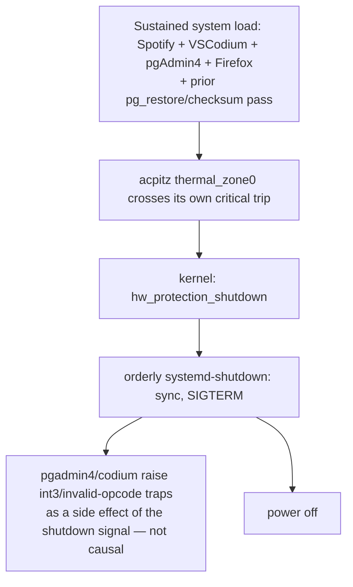

# ThinkPad T14 (tangoonefour) — thermal shutdown post-mortem & fan management

Personal hardware/OS notes, not CodeNforce-specific. Machine: `tangoonefour`, Lenovo ThinkPad T14, Ubuntu 22.04 LTS, Intel CPU (`intel_pstate` driver).

## Incident summary (2026-09-09, ~08:59 EDT)

The machine powered off abruptly while a PDF (extracted from a restored `blobbytes` row — see
`cnf-backup-strategy.md` in the codenforce docs) was open in Firefox and being scrolled. First
impression from watching the screen was "kernel dumped something and the machine died" — looked
exactly like the kind of thing a GPU-driver crash or kernel panic produces.

**It wasn't either of those.** `journalctl -b -1 -k` for that boot showed, in plain text:

```
kernel: thermal thermal_zone0: acpitz: critical temperature reached
kernel: reboot: HARDWARE PROTECTION shutdown (Temperature too high)
```

repeated a few times in the same second, followed by a normal `systemd-shutdown` sequence
(filesystem sync, SIGTERM to processes). Two other lines in the same log window looked alarming
but were downstream casualties, not causes:

```
traps: pgadmin4[13196] trap invalid opcode ...
traps: codium[3939] trap int3 ...
```

Electron/V8-based apps (VSCodium, pgAdmin4) often raise `int3`/invalid-opcode traps from their own
crash-reporter machinery when they receive an unexpected signal mid-shutdown — noise, not root
cause.

**Conclusion:** this was a genuine ACPI thermal critical-trip shutdown (`acpitz` zone), not a
kernel panic, not a GPU driver bug, and completely unrelated to the PDF or the extraction script
that produced it. A malformed/malicious PDF has no plausible path to an ACPI thermal trip — Firefox's
PDF.js is a sandboxed, memory-safe JS renderer with zero ability to reach kernel/ACPI state. The
likely actual trigger was cumulative system load (Spotify + VSCodium + pgAdmin4 + Firefox, on top
of a recent `pg_restore -j 4` + full-table `md5()` checksum pass) tipping an already-marginal
cooling setup over the edge — coincidence of timing with the PDF, not causation.

## Diagnosing "the machine just died" in general

Useful regardless of root cause — this is the general playbook, most useful command first:

```bash
# Which boot ended in the crash? (crashed boot is usually -1 relative to current)
journalctl --list-boots

# Confirm persistent journal storage is even on (otherwise the crash's own
# final messages may never have hit disk before power died)
ls -la /var/log/journal/ 2>/dev/null || echo "no persistent journal"

# The single most useful command: tail the kernel ring buffer from the crashed boot
sudo journalctl -b -1 -k --no-pager | tail -300

# One-pass grep for known danger signatures across that boot
sudo journalctl -b -1 -k --no-pager | grep -iE \
  "panic|oops|bug:|call trace|mce|hardware error|thermal|critical temp|i915|amdgpu|nvidia|nouveau|watchdog|under-voltage|out of memory|killed process"

# Apport/whoopsie crash dumps (per-app crashes, not OS-level)
ls -la /var/crash/

# Cross-check the actual wall-clock time of the crash/reboot
last -x | head -20

# Once you know the approximate time, narrow the log to just that window
# (works directly in local time if your clock/tz is set correctly — check with `timedatectl`)
sudo journalctl -b -1 --since "08:55" --until "09:05" -k --no-pager
```

**Why a kernel panic/oops looks similar but isn't the same thing:** a real panic/oops shows a
`Call Trace:` stack dump and usually either hangs or triggers a kernel-configured auto-reboot. A
thermal `HARDWARE PROTECTION shutdown` is a deliberate, orderly last-resort safety response —
different code path, different meaning, and (unlike most panics) it always tells you exactly why
in the log line itself.

## Reading `sensors` output — what actually matters

Sample captured 2026-09-09 (`lm-sensors`, mid-`stress-ng --cpu 4` run, `platform_profile=performance`, fan `level: auto`):

```
iwlwifi_1-virtual-0
Adapter: Virtual device
temp1:        +39.0°C

thinkpad-isa-0000
Adapter: ISA adapter
fan1:        3673 RPM
CPU:          +53.0°C
temp3:        +44.0°C
...

coretemp-isa-0000
Adapter: ISA adapter
Package id 0:  +59.0°C  (high = +100.0°C, crit = +100.0°C)
Core 0:        +59.0°C  (high = +100.0°C, crit = +100.0°C)
...

acpitz-acpi-0
Adapter: ACPI interface
temp1:        +53.0°C
```

> ⚠️ **`temp1` is not a unique sensor name.** It's just the generic hwmon convention
> (`tempN_input`) for "the first temperature channel *this chip driver* exposes" — every chip
> group above (`iwlwifi_1-virtual-0`, `acpitz-acpi-0`, etc.) can have its own unrelated `temp1`.
> The chip **group header** (`acpitz-acpi-0`, not the field name `temp1` alone) is what tells you
> which physical sensor a reading actually is. Always quote the group name alongside any `temp1`
> value to avoid ambiguity.

Three genuinely different things are visible here — only one of them caused the 08:59 shutdown:

1. **`iwlwifi_1-virtual-0`** — the Wi-Fi card's own radio/module temperature, reported by the
   `iwlwifi` wireless driver as a synthesized ("virtual," i.e. not a real discrete I²C/SMBus chip)
   hwmon device. Networking hardware, unrelated to the CPU or the crash — at 39.0°C it's nowhere
   near any wireless card's thermal limit (typically ~100–110°C).
2. **`coretemp` (Package id 0 / Core N)** — Intel's own per-core die sensors. `high`/`crit` here
   (100°C on this CPU) drive Intel's own automatic frequency throttling (`intel_pstate`) as
   individual cores approach `Tjmax`. This throttles performance continuously under sustained
   load — it is not what shut the machine down.
3. **`acpitz-acpi-0`'s `temp1` (`thermal_zone0` in the kernel)** — a platform/firmware-level ACPI
   thermal zone, monitored independently of `coretemp`, sometimes reading a different physical
   sensor (chassis/VRM/motherboard, not necessarily the CPU die itself). **This is the zone whose
   critical trip triggered `hw_protection_shutdown()`** on 2026-09-09 — confirmed directly (not
   inferred) because the crash log names the driver explicitly:
   `kernel: thermal thermal_zone0: acpitz: critical temperature reached`. `acpitz-acpi-0`'s chip
   group name is that same driver (`acpitz`) + bus (`acpi`) + instance (`0`) — a direct match, not
   a guess. Its `crit` value isn't shown by `sensors` — get it directly:
   ```bash
   for z in /sys/class/thermal/thermal_zone*; do echo "$z: $(cat $z/type)"; cat $z/trip_point_*_temp 2>/dev/null; done
   ```
   **Confirmed 2026-09-09** on this machine, `thermal_zone0` (`acpitz`) has two trip points:
   `127900` and `128000` (millidegrees C = 127.9°C / 128.0°C) — pair each with its `_type` file to
   know which is `critical` vs. `hot`/`passive`:
   ```bash
   for i in 0 1; do echo "trip $i: $(cat /sys/class/thermal/thermal_zone0/trip_point_${i}_type) = $(cat /sys/class/thermal/thermal_zone0/trip_point_${i}_temp)"; done
   ```
   ~128°C is a plausible real shutdown threshold — well above anything `coretemp`/`acpitz`
   showed during the `stress-ng` test (53–59°C), meaning whatever triggered the 08:59 event was a
   genuine, large spike, not a borderline/nuisance trip.

Also visible in the sample, not directly relevant to the CPU shutdown but worth knowing:
- **`fan1` RPM** — the tachometer reading for the single system fan (`thinkpad_acpi`-managed).
- **`nvme-pci-0200` Composite temp** — separate crit threshold (~84.8°C here) for the NVMe drive,
  independent of CPU thermal management entirely.

### Other `thermal_zone*` entries you'll see (and can ignore)

Running the `trip_point` for-loop above walks *every* `thermal_zone*`, not just `acpitz` — most of
the rest are Intel DPTF (Dynamic Platform & Thermal Framework) plumbing, not independent hazards:

| Zone | Type | Trip(s) seen | What it is |
|---|---|---|---|
| `thermal_zone0` | `acpitz` | 127.9°C / 128.0°C | **The one that fired 2026-09-09** — see above. |
| `thermal_zone1` | `INT3400 Thermal` | none | DPTF's policy-coordination zone; aggregates the others, has no raw temp of its own. |
| `thermal_zone2`–`5` | `SEN1`–`SEN4` | 75.05°C / 80.05°C | Board/skin thermistors DPTF uses to proactively ramp the fan curve — lower, non-fatal thresholds. |
| `thermal_zone6` | `TCPU` | 110.05°C | DPTF's own CPU-policy zone — a *different*, lower threshold than `acpitz`'s 128°C. |
| `thermal_zone7` | `TCPU_PCI` | `-274000` | Sentinel/"not configured" value (below absolute zero — not a real reading). |
| `thermal_zone8` | `x86_pkg_temp` | `-274000` | Same sentinel meaning — no trip configured. |
| `thermal_zone9` | `iwlwifi_1` | `-2147483648` (`INT32_MIN`) | Same "not configured" sentinel, as a raw 32-bit int — confirms the Wi-Fi zone has no real ACPI trips at all. |

Bottom line: only `acpitz` (128°C-ish) and `TCPU` (110°C) are real CPU-adjacent critical/passive
thresholds; the `-274000`/`INT32_MIN` values are just "unpopulated," not evidence of anything wrong.

## Root-cause chain for the 08:59 shutdown



## `thermald` and why it refuses to run on this machine

```
thermald[...]: [/sys/devices/platform/thinkpad_acpi/dytc_lapmode] present: Thermald can't run on this platform
thermald[...]: Unsupported cpu model or platform
```

This is **expected behavior, not a bug**. `dytc_lapmode` being present means this ThinkPad has
Lenovo's own **DYTC** (Dynamic Thermal and Power Management) firmware controller, and `thermald`
deliberately declines to run on platforms where the OEM firmware already owns thermal/fan policy,
to avoid two independent thermal controllers fighting each other. Don't chase this further —
there's no supported way (or reason) to force `thermald` to run here.

## The actual lever: `platform_profile` / `power-profiles-daemon`

DYTC's own mode is exposed through the standard kernel `platform_profile` interface:

```bash
cat /sys/firmware/acpi/platform_profile_choices   # low-power balanced performance
cat /sys/firmware/acpi/platform_profile           # currently active one
```

`performance` biases DYTC's adaptive fan/power curve to ramp harder/sooner (at the cost of
noise), while still leaving the EC's own adaptive control in charge — unlike a manual fan-level
override (below), this keeps things dynamic: idle stays quiet, load spikes get cooled proactively.

Two ways to set it:
```bash
# Raw sysfs write — works immediately, but resets to firmware default on reboot
echo performance | sudo tee /sys/firmware/acpi/platform_profile

# power-profiles-daemon wrapper — same effect, AND persists across reboots
# (this is also the same toggle behind GNOME Settings' "Power Mode" control)
powerprofilesctl list
powerprofilesctl set performance
```

Verified 2026-09-09: `powerprofilesctl set performance` visibly increased fan ramp under
`stress-ng` load (fan settled at ~3680 RPM vs. presumably lower under `balanced`) while CPU
Package temp stayed at 59°C — nowhere near either the coretemp crit (100°C) or (presumably) the
acpitz crit that caused the earlier shutdown.

## `/proc/acpi/ibm/fan` — how ThinkPad fan control actually works

```bash
cat /proc/acpi/ibm/fan
# status:  enabled
# speed:   3680
# level:   auto
```

- **`status`** — whether the fan is enabled at all (should always be `enabled`).
- **`speed`** — live tachometer RPM reading (same number `sensors`' `fan1` shows).
- **`level`** — the actual control mode:
  - `auto` (default) — the EC's own adaptive table decides speed based on its own sensor inputs.
    This is what `platform_profile=performance` biases without disabling.
  - `0`–`7` — a manual fixed level, still generally bounded by the EC's normal governed RPM table
    (level 7 ≈ EC's own idea of max-under-normal-operation).
  - `disengaged` / `full-speed` (naming varies by kernel/model — try both) — bypasses the EC's RPM
    governor entirely, running the fan at max PWM duty cycle unconditionally. This is the true
    physical ceiling, typically higher and louder than level 7.

**Write access is disabled by default** (read-only) as a safety default. To unlock manual control:

```bash
echo "options thinkpad_acpi fan_control=1" | sudo tee /etc/modprobe.d/thinkpad_acpi.conf
# reboot — thinkpad_acpi is usually loaded early/via initramfs, so a live
# modprobe -r/reload can be finicky; reboot is the reliable way to pick this up.
```

After reboot, test:
```bash
sudo bash -c 'echo "level 7" > /proc/acpi/ibm/fan'
cat /proc/acpi/ibm/fan

# true ceiling — one of these two will be accepted, the other rejected, depending on EC firmware:
sudo bash -c 'echo "level full-speed" > /proc/acpi/ibm/fan'
sudo bash -c 'echo "level disengaged" > /proc/acpi/ibm/fan'
cat /proc/acpi/ibm/fan

# always revert when done testing:
sudo bash -c 'echo "level auto" > /proc/acpi/ibm/fan'
```

**Important caveat:** a manual `level` override does **not** persist across reboot or suspend/resume
— it silently reverts to `auto`. Making a manual override permanent would require a small
systemd unit or udev rule to re-apply it at boot; not currently set up on this machine, and
probably not worth it — see "what's actually wrong with running the fan high" below.

### What's actually "wrong" with just forcing the fan high all the time?

Given this machine's setup (A/C room, open stand, ~6" unobstructed clearance underneath), very
little:
- **Bearing wear** — negligible; modern laptop fans are rated for tens of thousands of hours.
- **Dust ingestion** — the one real long-term cost: a faster fan moves more air (and dust) through
  the heatsink fins, so periodic canned-air cleaning becomes more important, not less.
- **Noise / power draw** — irrelevant here (A/C room, on wall power).

The real distinction is **`platform_profile=performance`** (adaptive, EC still in charge, no real
downside) vs. **a manual fixed `level` override** (blunt, non-adaptive, doesn't survive
reboot/suspend unless scripted). Preferred approach on this machine: stick with
`platform_profile=performance` and only reach for a manual fan-level override if that alone proves
insufficient under real load.

## `stress-ng` — what it is and how it was used here

`stress-ng` is a configurable synthetic system-stressor/benchmark tool — it deliberately loads
CPU/memory/IO/etc. to validate stability, thermal behavior, and power management under controlled
load, without needing a real workload (like a PDF render or a `pg_restore`) to reproduce conditions.

```bash
# Spin up 4 worker processes doing CPU-bound work for 60 seconds, then stop automatically
stress-ng --cpu 4 --timeout 60s

# Watch the effect live in a second terminal:
watch -n1 sensors
cat /proc/acpi/ibm/fan   # watch "speed" climb; "level" should stay "auto"
```

**If the full `sensors` dump is taller than your terminal and `watch` clips the lines you
actually care about** (commonly `acpitz`'s `temp1` — the zone that fired 2026-09-09), filter it
down before `watch` ever sees it, so the output always fits regardless of terminal height:

```bash
watch -n1 'sensors | grep -A3 -E "^acpitz-acpi-0|^coretemp-isa-0000|^thinkpad-isa-0000"'

# with the matched text highlighted:
watch -c -n1 'sensors | grep --color=always -A3 -E "^acpitz-acpi-0|^coretemp-isa-0000|^thinkpad-isa-0000"'
```

Other useful flags for expanding the test later:
- `--cpu 0` — one CPU-stress worker per core (matches nproc), for full-machine load instead of a
  fixed worker count.
- `--matrix N` — matrix-multiplication workers (different cache/memory access pattern than plain `--cpu`).
- `--vm N --vm-bytes 80%` — memory-pressure workers.
- `--io N` — disk I/O stress workers.
- `--metrics-brief` — print a short performance summary at the end of the run.

## Quick command reference

```bash
# --- crash forensics ---
journalctl --list-boots
sudo journalctl -b -1 -k --no-pager | tail -300
sudo journalctl -b -1 -k --no-pager | grep -iE "panic|oops|bug:|call trace|mce|thermal|i915|amdgpu|nvidia|watchdog"
last -x | head -20
ls -la /var/crash/

# --- live monitoring ---
sensors
watch -n1 sensors
# filtered version — avoids the full sensors dump scrolling past your terminal height
# and clipping the acpitz/coretemp/fan lines that actually matter:
watch -n1 'sensors | grep -A3 -E "^acpitz-acpi-0|^coretemp-isa-0000|^thinkpad-isa-0000"'
cat /proc/acpi/ibm/fan
for z in /sys/class/thermal/thermal_zone*; do echo "$z: $(cat $z/type)"; cat $z/trip_point_*_temp 2>/dev/null; done

# --- power/thermal profile ---
cat /sys/firmware/acpi/platform_profile_choices
powerprofilesctl list
powerprofilesctl set performance

# --- manual fan override (after enabling fan_control=1 + reboot) ---
sudo bash -c 'echo "level 7" > /proc/acpi/ibm/fan'
sudo bash -c 'echo "level full-speed" > /proc/acpi/ibm/fan'   # or "disengaged"
sudo bash -c 'echo "level auto" > /proc/acpi/ibm/fan'

# --- stress test ---
stress-ng --cpu 4 --timeout 60s
```

## Open follow-ups

- [x] Capture the actual `acpitz` critical trip value — confirmed 2026-09-09:
      `thermal_zone0`/`acpitz` has trips at 127.9°C and 128.0°C (exact `critical` vs. `hot`/`passive`
      label per-value not yet distinguished — run the paired `trip_point_N_type`/`_temp` command above).
- [ ] Decide whether to keep `platform_profile=performance` permanently, or only switch to it
      before heavy DB restore/checksum workloads.
- [ ] Physically clean fan/vents periodically now that the fan runs harder more often.
- [x] Confirmed 2026-09-09: the restored PDF and `extract-blob.sh` are fully unrelated to the
      shutdown — root cause is `acpitz` thermal critical trip, not the extraction pipeline.
