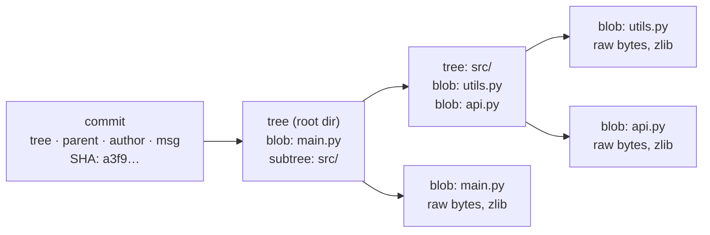
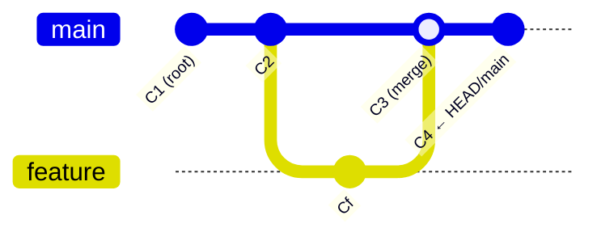
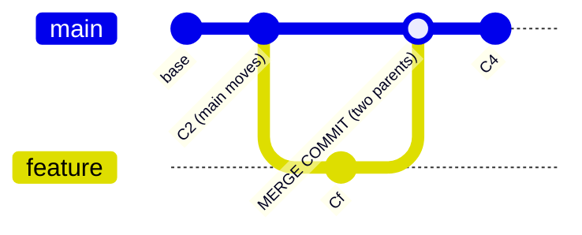

# Git mental model — objects, refs, branches, and worktrees

This document covers git's core data structures from the ground up and connects them to practical tasks: reading ref output, cleaning up branches, reverting to earlier states, and running multiple worktrees for concurrent LLM agent sessions. Examples are drawn from the CNF/BoroughForge repo on `tangoonefour`.

---

## The object store

Everything git knows lives in `.git/objects/`. There are four object types that form a strict directed acyclic graph (DAG). Edges point backward — from child to parent — never forward.



**Blob** — raw file content, zlib-compressed, addressed by SHA-1 of the content itself. No filename, no metadata. Two files with identical content share one blob.

**Tree** — a directory listing: pairs of `(mode, name, SHA)` pointing to blobs or nested trees. Captures a snapshot of the filesystem layout.

**Commit** — points to exactly one root tree, zero or more parent commits, and stores author/committer/timestamp/message. Immutable once written.

**Ref** — a human-readable pointer (`.git/refs/heads/main`) to a commit SHA. Branches are refs. `HEAD` is usually a symbolic ref pointing to a branch ref.

A critical implication: **commits store complete snapshots, not diffs.** Git computes diffs on demand by comparing two trees. This is why reverting is cheap — you are telling git which snapshot to look at, not unwinding a patch chain.

---

## The three zones

Every git operation moves data between three zones:

| Zone | Location | Contents |
|---|---|---|
| Working tree | filesystem | actual files you edit |
| Index (staging area) | `.git/index` | binary snapshot of what the *next commit* will contain |
| Object store | `.git/objects/` | permanent, content-addressed history |

`git add` writes a blob for the file and updates the index entry. `git commit` snapshots the current index into a tree object, wraps it in a commit, and advances the branch ref. Nothing in the object store is ever mutated.

`git checkout` / `git restore` runs in reverse — it reads from the object store, updates the index, and rewrites working tree files.

---

## Refs and HEAD

A **branch** is just a file in `.git/refs/heads/` containing a commit SHA. There is nothing more to it structurally.

`HEAD` is itself a ref, but usually a *symbolic* one — a pointer to a pointer:

```
# Normal state (on a branch):
cat .git/HEAD
→ ref: refs/heads/master

# Detached HEAD (pointing directly at a commit):
cat .git/HEAD
→ a3f9c2e1...
```

When git resolves `HEAD` it follows the chain: `HEAD` → branch ref → commit SHA.

**Tags** come in two flavors:

- **Lightweight tag** — a ref file pointing directly to a commit SHA. Never moves. Structurally identical to a branch, just stored under `refs/tags/`.
- **Annotated tag** — a full git object (type `tag`) with its own SHA, containing tagger identity, timestamp, optional GPG signature, and message, which then points to a commit. Use `v1.0.0^{}` syntax to peel through a tag object to its underlying commit SHA.

```bash
git rev-parse v1.0.0        # SHA of the tag object (annotated) or commit (lightweight)
git rev-parse v1.0.0^{}     # SHA of the commit regardless of tag type
```

---

## Reading ref output in practice

Given this actual CNF repo state after merging `lsa7-sync`:

```
$ cat .git/HEAD
ref: refs/heads/master

$ git log --oneline --decorate
e52e1357 (HEAD -> master, lsa7-sync) copilot instruction collapse; filtering occ period types; other tweaks
66625cf6 merged in little tweaks
b7341764 more data sync pipeline testing work WIP
f7f276cd Consolidated address parsing methods into util classes and property coordinator
edc9da1f some sync testing tweaks, before address consolidation
28950bf5 permit list in file addedit muni specific
177f9e2b (origin/master, origin/HEAD) oops--over removed the hidden folders
1bc24dc1 untrack .github .mbn .vscode
3105267b archiving junk in repo root
6022e732 updated readme.md
873b968e (origin/lsa7-sync) major data sync WIPp; pushed for upgrading readme before sharing with WPRDC
```

**Reading the decoration on `e52e1357`:**

- `HEAD -> master` — HEAD is a symbolic ref; it resolves to the `master` branch; `master` points here. The `->` is git's notation for symbolic ref resolution.
- `lsa7-sync` — the local `lsa7-sync` branch also points to this commit. This is the expected post-fast-forward state: the merge slid `master` forward to where `lsa7-sync` already sat. Both labels now share the same commit.

**Reading `177f9e2b (origin/master, origin/HEAD)`:**

These are remote-tracking refs — local copies of the last known state of the remote as of your last `fetch` or `push`. Five commits separate `177f9e2b` from `e52e1357`, meaning five commits exist locally that have not been pushed. `git status` would report `Your branch is ahead of 'origin/master' by 5 commits`.

**Reading `873b968e (origin/lsa7-sync)`:**

A remote-tracking fossil. `lsa7-sync` was pushed to origin at `873b968e` at an earlier point; subsequent local commits on that branch were never pushed before it was merged. This ref will persist locally until `git fetch --prune` or `git remote prune origin`.

---

## Reachability and branch deletion

**Reachability** is the foundational concept behind most git safety checks. A commit X is reachable from HEAD if you can walk backward through parent pointers starting at HEAD and eventually arrive at X. The commit graph has no forward pointers — a commit has no knowledge of its children.



In this graph, walking backward from HEAD (C4) reaches C3 → then fans out to both C2 and Cf via C3's two parent pointers. Cf is reachable. `git branch -d feature` succeeds.

If `feature` had never been merged, Cf would sit on a separate line with no merge commit connecting it into main's ancestry chain. Walking backward from HEAD never reaches Cf. `git branch -d feature` refuses.

**The precise rule:** `git branch -d` checks whether the *tip* of the target branch is an ancestor of HEAD. It does not walk the branch's commits individually — it checks tip reachability, which by DAG properties implies all ancestors are also reachable.

**Squash merge / rebase caveat:** when a feature branch is integrated via `--squash` or rebase, git creates new commit objects with different SHAs. The original commits on the feature branch are not ancestors of the resulting commits on main. `git branch --merged` will not list the feature branch, and `-d` will refuse even though the work has been integrated. `-D` is the correct cleanup tool in these workflows — but run `git log main..feature` first to verify the diff is actually empty before force-deleting.

### Pre-deletion inspection commands

```bash
# Lists branches whose tips ARE reachable from HEAD (safe to -d)
git branch --merged

# Check against a specific ref rather than HEAD
git branch --merged main

# Lists branches whose tips are NOT reachable (will refuse -d)
git branch --no-merged

# Plumbing-level reachability check; exit 0 = ancestor, exit 1 = not
git merge-base --is-ancestor branch-to-delete main

# Show commits on branch-to-delete that are NOT on main
# Empty output = safe to delete
git log main..branch-to-delete

# Show divergence in both directions (< = only on main, > = only on feature)
git log --left-right --oneline main...branch-to-delete

# Visualize topology of both branches together
git log --oneline --graph --decorate main branch-to-delete
```

---

## Merge outcomes



**Fast-forward** — the current branch tip is a direct ancestor of the branch being merged. No divergence exists. Git moves the branch ref forward along the existing chain. No new commit object is created. Output reads `Updating <old-sha>..<new-sha>` followed by `Fast-forward`.

**True merge** — both branches have moved forward from a shared ancestor. Git creates a new commit object with two parent pointers. This is what `--no-ff` forces even when fast-forward would be possible, to preserve visible branch structure in the DAG.

**Conflict** — same as true merge, but git's three-way merge algorithm finds lines changed differently on both sides. Merge halts. Git writes conflict markers into affected files, records `MERGE_HEAD` in `.git/`, and waits. Resolution path: edit files → `git add` resolved files → `git commit` to write the merge commit. Abort path: `git merge --abort` reads `MERGE_HEAD` and rewinds to pre-merge state.

---

## Revert strategies

"Revert" is an overloaded term. The correct tool depends on whether you want to rewrite history or preserve it, and whether the commits are already on a shared remote.

| Goal | Command | Rewrites history? | Safe after push? |
|---|---|---|---|
| Inspect old state read-only | `git checkout <SHA>` | No (detaches HEAD) | Yes |
| Undo last commit, keep changes staged | `git reset --soft HEAD~1` | Yes | No |
| Undo last commit, keep changes unstaged | `git reset --mixed HEAD~1` | Yes | No |
| Obliterate last commit and its changes | `git reset --hard HEAD~1` | Yes | No |
| Invert a past commit via new commit | `git revert <SHA>` | No | Yes |
| Restore one file to a past state | `git checkout <SHA> -- path/to/file` | No | Yes |

**Relative ref syntax** accepted by `git rev-parse`, `git reset`, and most other commands:

| Expression | Meaning |
|---|---|
| `HEAD~1` | One commit back (first parent) |
| `HEAD~3` | Three commits back along first-parent chain |
| `HEAD^2` | Second parent of HEAD (only meaningful on a merge commit) |
| `main@{1}` | Where `main` pointed one reflog entry ago |
| `HEAD@{2}` | Two reflog entries ago for HEAD |
| `v1.0.0^{}` | Peel tag object to its target commit |

The reflog entries (`@{n}`) are the recovery mechanism for accidental `--hard` resets. The commit still exists in the object store — it is just no longer reachable from any branch ref. `git reflog` shows every position HEAD has occupied, even for orphaned commits. Find the SHA there and `git checkout -b recovery-branch <SHA>` to rescue it before GC runs.

---

## Viewing refs

```bash
# Raw HEAD contents — symbolic ref or bare SHA
cat .git/HEAD

# Resolve any ref or expression to full SHA
git rev-parse HEAD
git rev-parse main~3
git rev-parse v1.0.0^{}

# Branch name only (returns literal "HEAD" if detached)
git rev-parse --abbrev-ref HEAD

# All refs with SHAs — branches, tags, remote-tracking
git show-ref
git show-ref --heads   # local branches only
git show-ref --tags    # tags only

# Local branches with tip SHA and commit message
git branch -v

# Include remote-tracking refs and ahead/behind counts
git branch -vv
git branch -av

# All tags
git tag
git tag -l -n1         # with first line of annotation

# Tag inspection (shows tag object metadata for annotated tags)
git show v1.0.0

# Powerful format-controlled ref iteration
git for-each-ref --format='%(refname:short) %(objectname:short) %(subject)' refs/heads/
git for-each-ref --format='%(refname:short) %(creatordate:short)' refs/tags/ --sort=-creatordate
```

---

## Linked worktrees for concurrent agent sessions

A branch is a ref — it has no working directory of its own. `git checkout feature` rewrites your single working tree and index. You can be on one branch at a time per working directory.

A **linked worktree** is a second filesystem directory with its own index and its own `HEAD` file, sharing the primary repo's object store. Each worktree can have a different branch checked out simultaneously with no interference.

```bash
# Create worktrees for three concurrent agent sessions
git worktree add ../cnf-agent-1 -b agent/task-auth
git worktree add ../cnf-agent-2 -b agent/task-db-schema
git worktree add ../cnf-agent-3 -b agent/task-tests

# Each agent works in its own directory against its own branch
# Object store (.git/objects/) is shared — no duplication of history

# Cleanup after merging
git worktree remove ../cnf-agent-1
git branch -d agent/task-auth
```

**Constraints:**

- A branch can be checked out in at most one worktree at a time. Git enforces this at `worktree add` time.
- The linked worktree's `.git` entry is a plain file (not a directory) containing a pointer back to `.git/worktrees/<name>/` in the primary repo.
- Worktrees isolate working state, not logical work partition. Two agents editing the same file in different worktrees will produce merge conflicts on integration. Partitioning the work scope is your responsibility.
- `git gc` operates on the shared object store and is safe across worktrees, but avoid running it while a commit is in progress in another worktree.

---

## Cleanup sequence for merged feature branches

After confirming a branch is merged and pushed:

```bash
# 1. Confirm tip is reachable (will appear in --merged list)
git branch --merged master

# 2. Delete local branch
git branch -d lsa7-sync

# 3. Delete remote branch
git push origin --delete lsa7-sync

# 4. Prune stale remote-tracking refs locally
git fetch --prune
# or equivalently
git remote prune origin
```

After step 4, `origin/lsa7-sync` disappears from `git log --decorate` output.
