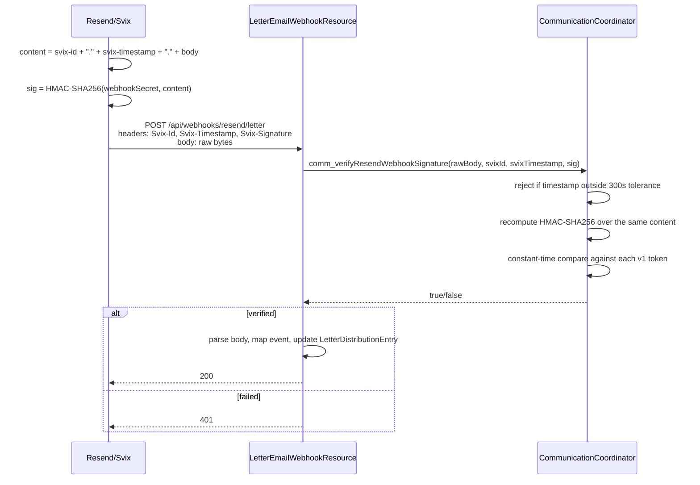

# Resend Email Facility and Webhook Verification

`CommunicationCoordinator` is the shared outbound-email transport for CodeNforce — every
subsystem that sends mail (CEAR confirmations/blasts, the Letters subsystem's
`EMAIL_CNF_API` channel) goes through it, and it also owns the one piece of inbound
infrastructure: verifying signed delivery-status webhooks from Resend.

## Configuration

Loaded once at CDI startup (`initBean()` → `loadEmailConfig()`) from
`${jboss.server.config.dir}/codenforce.properties`:

| Property | Purpose |
|---|---|
| `resend.environment` | `test` (default) or `prod`. In `test`, `sendEmail()` writes the message to stdout instead of calling the Resend API — no live send, no API key required. |
| `resend.api.key` | Resend API key, only used when `resend.environment=prod`. |
| `resend.from.address` / `resend.from.name` | Default sender identity, applied by `getEmailSkeleton()`. |
| `resend.webhook.secret` | Svix/Resend webhook signing secret (`whsec_...`, from resend.com/webhooks). Blank → `isResendWebhookConfigured()` is false and every webhook call is rejected — **fail-closed**, not fail-open. |
| `tcvce.cear.optout.url` | Base URL used to build the unsubscribe link in CEAR update-blast emails. |

If the properties file can't be found or read at all, the coordinator falls back to
`testMode = true` rather than throwing — a missing/misconfigured file degrades to
stdout-only logging instead of taking the app down.

## Outbound send path

1. `getEmailSkeleton()` — factory returning an `EmailMessage` pre-populated with the
   configured from-address/name; callers set `to`/`subject`/`htmlBody`.
2. `sendEmail(msg, ua, muni, refType, refId, category)` — validates required fields
   (`validateEmailMessage`), then either logs to stdout (test mode) or calls
   `callResendApiWithResult()`, which never throws — any `ResendException`/general
   exception is captured into an error string rather than propagated, so a Resend outage
   never crashes the caller's request.
3. Every attempt — success or failure — is persisted as a `logging.emaillog` row
   (`EmailLog`, via `SystemIntegrator.insertEmailLog`), discriminated by
   `EmailCategoryEnum` (`CEAR_CONFIRM_PUBLIC`, `CEAR_CONFIRM_INTERNAL`,
   `CEAR_STAFF_SUBSCRIBE`, `CEAR_ROUTING_UPDATE`, `CEAR_UPDATE_BLAST`,
   `LETTER_EMAIL_DELIVERY`, `LETTER_DISTRIBUTION_RULE_NOTIFICATION`) and tagged with
   `refObjectType`/`refObjectId` (e.g. `"CEACTIONREQUEST"` + the CEAR's id) so any send can
   be traced back to the record that triggered it.
4. On a live send, the Resend-assigned message id is stored on
   `EmailLog.resendMessageId` — this is the join key the inbound webhook later uses to find
   its way back to the send that produced it.
5. `comm_getAllEmailLogs(ua)` exposes a raw, sysadmin-only dump of every `emaillog` row
   system-wide (throws `AuthorizationException` otherwise) — the table carries addresses,
   subjects, and full HTML bodies across every municipality, so it's gated at the top rank
   rather than muni-scoped like most other queries.

## CEAR email features built on this facility

All of these render inline-styled HTML via j2html (`cear_buildConfirmationEmailHTML`,
`cear_buildRoutingUpdateEmailHTML`, `comm_buildCEARUpdateBlastHTML`) and are non-throwing —
individual recipient failures are logged to stderr and accumulated into `notified`/`failed`
lists rather than aborting the whole blast:

- **New-CEAR subscription blast** (`sendCEARSubscriptionBlast`) — sent once, right after a
  CEAR is inserted, to every muni staff subscriber with `cearSubscribeEnabled=true`.
- **Routing update blast** (`sendCEARRoutingUpdateBlast`) — sent when a CEAR is routed, to
  staff subscribers plus the requestor when `cear.isGetEmailUpdates()=true`.
- **Manual resend** (`comm_resendConfirmationToTargets`, `comm_resendStatusUpdateToTargets`)
  — lets an officer re-send a confirmation or status update to any combination of
  requestor / staff subscribers / themselves.
- **Per-municipality update-blast settings** (`comm_getMuniUpdateBlastSettings`,
  `comm_saveMuniUpdateBlastSettings`) — a JSONB-backed, per-event-type configuration
  (`CEARUpdateBlastEventTypeEnum`: `CEAR_ROUTED`, `NOV_MARKED_SENT`, `VIOLATION_ATTACHED`,
  `VIOLATION_MARKED_COMPLIANT`, `VIOLATION_NULLIFIED`, `VIOLATION_STIPCOMP_EXTENDED`,
  `CASE_CLOSED`, `CASE_EVENT_NCM`, `CITATION_STATUS_NCM`) letting each muni independently
  enable follow-up blasts to the original submitter as their case progresses. Loading
  **never returns null** — a missing/blank/undeserializable column yields a fully-populated,
  all-disabled defaults object, and any event key missing from a stored payload is
  back-filled with defaults, so callers never need a null check.
- **Update-blast dispatch** (`comm_sendCEARUpdateBlast`) — the central gate for every
  automated follow-up email, applied in order: (1) muni has the event type enabled, (2) the
  acting officer hasn't opted this specific blast out, (3) the submitter hasn't opted out of
  updates (fails closed — a lookup error suppresses the send rather than risking an
  unwanted email), (4) a delivery address is actually on file. Only after all four pass does
  it render and send — and it clamps the configured detail level (`MINIMAL` / `STANDARD` /
  `FULL`) down from `FULL` to `STANDARD` for any submitter who isn't internal staff, since
  `FULL` can surface internal case specifics.
- Every blast appends a trace note to the CEAR's internal notes
  (`writeBlastTraceNote`) recording exactly which addresses were notified and which failed
  — the per-CEAR audit trail for "who got emailed and did it work."

## Inbound webhook — Resend delivery-status events

Resend calls back into CodeNforce as delivery events happen for a sent message (delivered,
bounced, opened, clicked, complained, delayed). `CommunicationCoordinator` owns signature
verification for this; a JAX-RS resource owns receiving the HTTP call and applying the
result.

> **Currently wired up for Letters only.** The receiver endpoint
> (`LetterEmailWebhookResource`, `POST /api/webhooks/resend/letter`) resolves the event back
> to a `LetterDistributionEntry` and is only reachable for emails logged under the
> `LETTER_EMAIL_DELIVERY` category. CEAR emails are logged to `EmailLog` the same way and
> carry a `resendMessageId`, but nothing currently subscribes their delivery status back
> onto the CEAR — see [BL-4 on the Letters backlog](/dev/subsystems/letters/overview) for
> the one known follow-on (`ContactEmail.bouncedts` isn't written for CEAR bounces either).
> The signature-verification method itself is generic and reusable by any future receiver.

Full walkthrough of the letter-specific receive/apply logic (event mapping, idempotency,
`LetterDistributionEntry` update) lives on the Letters subsystem's own page:
[Distribution channels and webhooks](/dev/subsystems/letters/distribution-channels-and-webhooks).
The rest of this page focuses on the signature-verification mechanism itself, since it's
shared infrastructure and the part most likely to be reused or gotten subtly wrong.

### `comm_verifyResendWebhookSignature` — what it actually checks

```java
public boolean comm_verifyResendWebhookSignature(byte[] rawBody, String svixId,
        String svixTimestamp, String signatureHeader)
```

1. Rejects immediately if no webhook secret is configured, or if any of `rawBody`/`svixId`/
   `svixTimestamp`/`signatureHeader` is null or blank.
2. Parses `svixTimestamp` as unix seconds and rejects if it's unparseable, or if it's more
   than `WEBHOOK_TIMESTAMP_TOLERANCE_SECONDS` (300s) away from the server's current time —
   this is the replay defense (see primer below).
3. Strips the secret's `whsec_` prefix and base64-decodes the remainder to get the raw HMAC
   key — **no fallback** to raw UTF-8 bytes if that decode fails; a misconfigured secret must
   fail loudly rather than silently succeed via a second, non-spec encoding.
4. Builds the signed content as `<svix-id>.<svix-timestamp>.<raw body>` and computes
   HMAC-SHA256 over it with the decoded key.
5. Splits the signature header on whitespace into `v1,<base64sig>` tokens and compares each
   decoded signature against the computed one with `MessageDigest.isEqual` (constant-time,
   to avoid a timing side-channel) — any single match is a pass, which is what allows Resend
   to support secret rotation (multiple valid signatures during a rotation window).

The caller (`LetterEmailWebhookResource`) captures the request body as `byte[]`, never
`String`, and only parses it with Jackson **after** verification succeeds — no JSON
provider or charset round-trip is allowed to touch the bytes the signature was computed
over, and parsing before verification would hand an attacker a signature-bypass oracle.

## Primer: the protocols behind webhook signing

This section explains the two pieces of jargon in
`comm_verifyResendWebhookSignature`'s javadoc — "Svix envelope" and "bare HMAC" — for anyone
who hasn't worked with signed webhooks before.

### What is HMAC, and what would a "bare HMAC of the body" mean?

**HMAC** (Hash-based Message Authentication Code) is a standard construction that combines a
cryptographic hash function (here, SHA-256) with a secret key to produce a short tag that
proves two things at once: the message wasn't altered, *and* the sender knew the shared
secret. Only someone who has the key can produce a tag that verifies — that's what makes it
usable for authenticating a webhook call instead of just detecting corruption.

$$\text{HMAC-SHA256}(\text{key}, \text{message}) \rightarrow \text{32-byte tag}$$

A **"bare HMAC of the body"** would be the simplest possible scheme: compute
`HMAC(secret, rawBody)` and send that tag in a header; the receiver recomputes it over the
body it received and compares. This is a real scheme some providers use — but on its own it
has a gap: if an attacker ever captures one legitimate request (network log, misconfigured
proxy, browser history on a webhook-testing tool), that exact body+signature pair remains
valid **forever**, since nothing about the signed content ever changes. The attacker can
replay it any time.

### What is the Svix envelope, and why does it exist?

[Svix](https://www.svix.com) is a webhook-sending platform; Resend uses Svix's conventions
for its own webhooks (hence the `Svix-Id` / `Svix-Timestamp` / `Svix-Signature` header
names even though the caller is Resend). The **envelope** is the extra structure Svix wraps
around the raw payload before signing, specifically to close the bare-HMAC replay gap above:

$$\text{signed content} = \texttt{svix-id} \;\|\; \texttt{"."} \;\|\; \texttt{svix-timestamp} \;\|\; \texttt{"."} \;\|\; \text{raw body}$$

- **`svix-id`** — a unique id for this specific delivery attempt.
- **`svix-timestamp`** — unix seconds when the event was sent.
- Both are concatenated with dots **around** the raw body, then the *whole thing* — not
  just the body — is what gets HMAC'd.

This buys two properties a bare-body HMAC can't:

1. **Replay defense.** Because the timestamp is inside the signed content, a receiver can
   independently check "is this timestamp still recent?" (CodeNforce's 300-second tolerance
   window) and reject old-but-validly-signed requests outright — an attacker replaying a
   captured request days later fails the freshness check even though the signature itself is
   still mathematically correct.
2. **Per-delivery uniqueness even for identical bodies.** Two deliveries of the literal same
   event (a provider's at-least-once retry) get different `svix-id`s, so the signed content
   differs even when the JSON body is byte-for-byte identical — useful for idempotency
   tracking on the receiver side, separate from the security property above.

The signature header itself is a space-delimited list of `v1,<base64>` tokens (versioned so
future signature schemes can be introduced without breaking old receivers), and providers
that support **secret rotation** send multiple valid tokens during the rotation window — the
receiver just needs any one of them to verify, which is why
`comm_verifyResendWebhookSignature` loops over every token instead of checking only the
first.



## See also

- [Letters — distribution channels and webhooks](/dev/subsystems/letters/distribution-channels-and-webhooks) —
  the letter-specific event-to-status mapping and `LetterDistributionEntry` update logic.
- [Subsystem registry](/system/subsystem-registry), entry #17 (`communication`).

Back to: [Communication — Developer Notes](/dev/subsystems/communication/overview)
