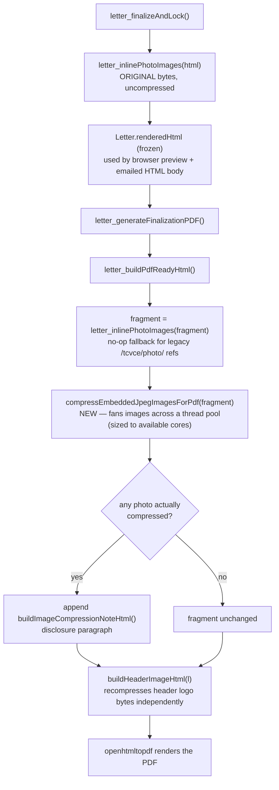

# PDF Image Compression — What We Built + a JPEG/Resolution Primer

Background reading for anyone touching `LetterCoordinator`'s PDF-generation path or debugging
"why is this letter PDF huge / why do these photos look soft." Part 1 documents what III.H
actually built (2026-08-12). Part 2 is conceptual background — how JPEG compression works and
how "resolution" reconciles a camera's pixel grid with what a page/screen actually displays —
kept in the same doc because the implementation decisions in Part 1 don't make sense without it.

See [overview.md](/dev/subsystems/letters/overview) for the subsystem's architecture and the
[PDF & document encoding primer](/dev/subsystems/letters/pdf-encoding-primer) for the
HTML→PDF rendering pipeline this feature hooks into. The codenforce repo's
`docs/subsystems/letters+emailing/III-H-image-compression.md` is the authoritative spec/decision
log (ECD's answers to the open design questions live there).

## Part 1 — What III.H actually built

### The problem

Phone-camera JPEGs run 8–12 MB each. Before this change, `LetterCoordinator` embedded the
**full-resolution original bytes** of every violation photo, appendix photo, and header image
directly into the generated PDF as base64 `data:` URIs — a letter with several photos could
trivially produce a PDF too large for Resend or a recipient's inbox to accept.

### The fix — recompress at PDF-render time only, in parallel across cores

Core methods in `LetterCoordinator.java`:

| Method | Job |
|---|---|
| `recompressJpegForPdf(byte[] original, int longEdgeCap, float quality)` | Decodes a JPEG via `ImageIO.read`, downscales it (bilinear) so its longer edge doesn't exceed `longEdgeCap` px — skipped if it's already smaller — then re-encodes via the JDK's built-in JPEG `ImageWriter` at the given `ImageWriteParam.setCompressionQuality`. Zero new Maven dependency; `javax.imageio` ships in every JDK. This is the one CPU-heavy step per image. |
| `compressEmbeddedJpegImagesForPdf(String html)` | Regex-scans PDF-bound HTML for every `data:image/jpeg;base64,...` match up front, then **fans the per-image recompression work out across a bounded thread pool** (see below) since each image is fully independent, then rebuilds the HTML string sequentially from the results. Returns a small `PdfImageCompressionResult` (html + total/compressed counts + settings used), not a plain `String`. Any single image that fails to decode/recompress — or doesn't finish inside a 5-minute batch timeout — is left at its original bytes; one bad photo never aborts PDF generation. |
| `buildImageCompressionNoteHtml(PdfImageCompressionResult)` | Builds a small, muted disclosure paragraph (`.letter-pdf-compression-note` in `letter-print.css`) appended once, after the letter body, whenever at least one photo was actually compressed — e.g. *"Note: 6 of 7 embedded photos were compressed for PDF delivery (max long edge 1200px, quality 0.55)... Full-resolution originals remain on file."* |
| `isPdfImageCompressionEnabled()` / `getPdfImageCompressionLongEdgePx()` / `getPdfImageCompressionQuality()` | Read the three system-wide settings (below), each falling back to the current-tier default if a key is missing or unparseable. |

**Wiring — scoped to PDF generation only, nothing else:**



- `letter_buildPdfReadyHtml` only ever mutates a **local `fragment` string** — it reads
  `l.getRenderedHtml()` but never writes back to it. The frozen `renderedHtml` (what the browser
  print view and the emailed HTML body both use) is never touched by this feature.
- `buildHeaderImageHtml` fetches the header logo's bytes fresh from the blob store (a separate
  code path from the inlined fragment) and recompresses them the same way, inline, before
  base64-encoding. It's not counted in the disclosure note — that note is scoped to a letter's
  actual photos, not the fixed header logo.
- The underlying `Blob` row in the database — the actual stored original — is **never
  mutated**. This was a deliberate call (ECD, 2026-08-12): violation photos are case evidence,
  and permanently degrading them on upload would be a real problem if full resolution is ever
  needed later (records request, court). Compression happens fresh, from the untouched
  original, every single time a PDF is generated — it is not cumulative (see Part 2, §5, for why
  that distinction matters for a lossy format).

### Why parallelize, and how

The first working version processed photos one at a time — decode, resize, re-encode, next photo
— and on real test data (7 photos, 8–12 MB phone originals) that took roughly a minute of
wall-clock time. Since every photo's compression is a pure function of its own bytes (no shared
state, no ordering dependency between images), this is what's called an **embarrassingly
parallel** workload — the kind of problem parallelization was made for, with none of the usual
coordination headaches (locks, shared mutable state, race conditions). See Part 3 below for the
full technical rationale; in short, `compressEmbeddedJpegImagesForPdf` now:

1. Collects every `data:image/jpeg;base64,...` match up front (cheap, sequential regex scan).
2. Submits one task per image to a `java.util.concurrent.ExecutorService` fixed thread pool
   sized to `Runtime.getRuntime().availableProcessors()`, and waits for all of them via
   `invokeAll(tasks, 5, TimeUnit.MINUTES)` — the timeout is a safety net, not an expected case.
3. Rebuilds the final HTML string sequentially afterward from the (by-then-complete) per-image
   results — cheap string work, not worth parallelizing.

Settings (`longEdgeCap`/`quality`) are read **once, before any worker thread is created**, on
the calling (request) thread — this matters because `getResourceBundle` depends on the current
request's JSF `FacesContext`, which simply doesn't exist on a separate worker thread. Passing
already-resolved primitive values into each task sidesteps that entirely; no worker thread ever
touches JSF-dependent code.

### Settings — system-wide, not per-letter

The original spec asked for a per-letter High/Medium/Low control (mirroring
`Letter.photoDisplaySize`). ECD explicitly descoped that for the MVP: *"Most users won't want to
think about compression size... Let's NVP this with configurable resolution and compression
targets system wide."* Settings live in the existing
`src/main/webapp/WEB-INF/classes/dbFixedValueLookup.properties` resource bundle (read via
`getResourceBundle(Constants.DB_FIXED_VALUE_BUNDLE)` — the same mechanism the codebase already
uses for other fixed/system config values, not a new WildFly-config-dir file):

```properties
letter_pdf_image_compression_enabled=true
letter_pdf_image_longedge_px=1200
letter_pdf_image_quality=0.55
```

These track the three-tier design explored up front (High/Medium/Low). The MVP shipped with
Medium (1600px/0.70) first; a 7-photo real-world test the same day (55.2 MiB → 2.2 MiB) worked,
but with power users sending letters with ~30 photos in mind, the setting was bumped down one
rung to High for more headroom before that becomes a problem:

| Tier | Long-edge cap | JPEG quality | Rough size vs. a ~10 MB phone original |
|---|---|---|---|
| **High (current default, shipped 2026-08-12)** | **1200px** | **0.55** | **~150–400 KB** |
| Medium (shipped first, superseded same day) | 1600px | 0.70 | ~400–800 KB |
| Low (largest, not shipped) | 2000px | 0.85 | ~800 KB–1.5 MB |

Because this bundle is packaged into the WAR (unlike `codenforce.properties`, which lives in the
WildFly config directory and is re-readable without a redeploy), **changing these values requires
a redeploy** — an accepted tradeoff for a system-wide, infrequently-tuned knob.

Non-JPEG images (PNG/GIF) pass through completely untouched — see Part 2, §6, for why "JPEG
quality" doesn't mean anything for those formats. Thumbnailing for case/violation listing pages
(a related but separate ask in the same spec item) was explicitly deferred and is not built.

## Part 2 — A JPEG & resolution primer

This section is the "why" behind every number in Part 1. It's conceptual background, not
CodeNForce-specific — skip it if you already know how JPEG and raster image scaling work.

### 1. A digital photo is just a grid of numbers — nothing more

A phone photo has no inherent physical size. It's a rectangular grid of pixels — say
4032×3024 for a typical 12-megapixel camera (4032 × 3024 ≈ 12.2 million pixel positions, each
storing a red/green/blue intensity triplet). That's it. There is no "8 inches" or "300 DPI"
baked into that grid — **DPI (dots per inch) / PPI (pixels per inch) is not a property of the
image data itself; it's a conversion factor applied only when you decide to map that pixel grid
onto a physical size** (a printed page, a specific monitor). The same 4032×3024 grid can be
printed at 1×0.75 inches (absurdly sharp, ~4000+ DPI) or 40×30 inches (a highly visible-pixel
poster, ~100 DPI) — the pixel data never changes; only the physical-size assumption does.

A JPEG file *can* carry a suggested DPI value in its metadata (the JFIF header's density field),
and some tools respect it as a hint for print sizing — but it's advisory only. Nothing forces a
viewer or a PDF renderer to honor it, and openhtmltopdf/PDFBox in this pipeline do not use it for
anything; an embedded image is placed at whatever CSS pixel dimensions the surrounding HTML/CSS
gives it, full stop.

### 2. Why "displaying it smaller" doesn't shrink the file

This is the exact bug III.H fixes, so it's worth spelling out precisely. `Letter.photoDisplaySize`
(small/medium/large) only controls **CSS layout width** — `max-height`/layout packing in
`letter-print.css` (see the [PDF encoding primer](/dev/subsystems/letters/pdf-encoding-primer),
§4). It tells the renderer "draw this image occupying this many CSS pixels of page space." It
does **not** resample the underlying pixel data. A 4032×3024 original embedded into a ``
tag styled to render at 300×225 CSS px on the page still carries **all 12.2 million original
pixels' worth of bytes** inside the PDF — the renderer just scales it down visually at display
time, the same way your phone doesn't shrink a photo file when you view a thumbnail of it in a
gallery app. The bytes for the full original always travel with the document; only the *on-screen
footprint* changes. This is why a "Large" letter layout with 8 embedded originals produced the
exact "mega-PDF" scenario from the original bug report — the layout choice affected how the
photos looked on the page, not how many bytes were sitting inside the file.

Actually reducing file size requires either (a) genuinely reducing the pixel count (downscaling —
producing a smaller grid of numbers) or (b) discarding information within the existing pixel data
via lossy compression (below) — cosmetic display-size CSS does neither.

### 3. What "resolution" even means, depending on who's asking

"Resolution" gets used loosely to mean at least three different things, and mixing them up causes
real confusion:

- **Pixel dimensions** — the actual grid size (4032×3024). This is the only number that affects
  file size and detail capacity. This is what `longEdgeCap` in our code controls.
- **DPI/PPI** — a *print* concept: how densely those pixels get packed into a physical inch when
  printed. ~150–300 DPI is the generally accepted "looks sharp on paper" range for a
  letter-quality laser/inkjet print; going meaningfully above that spends file size for detail no
  human eye resolves at normal reading distance.
- **Device pixel ratio / CSS pixels** — a *screen* concept (browsers, not relevant to PDF output
  directly, but the reason this distinction matters generally): a "CSS pixel" is a
  resolution-independent unit; a physical screen might render 1, 2, or 3 physical device pixels
  per CSS pixel (Apple's Retina displays popularized 2×/3×). A 300×225 CSS-pixel `` on a 2×
  display needs 600×450 *actual* source pixels to look crisp, not soft — but not 4032×3024.

Our `longEdgeCap` of 1600px is chosen against the *print* framing: at a plausible ~4–6 inch
printed photo width in a letter appendix, 1600px long edge comfortably clears 300 DPI at normal
photo sizes on a page (1600px ÷ 300 DPI ≈ 5.3 inches of printable width at full sharpness) while
throwing away the roughly 2.5× linear (≈6.3× total pixel count) of extra detail a 4032px-wide
phone original carries that a printed letter page was never going to be able to show anyone.

### 4. How JPEG compression actually works, step by step

JPEG (ISO/IEC 10918-1, 1992) is a **lossy**, block-based transform codec. Roughly, in order:

1. **Color space conversion: RGB → YCbCr.** Human vision is far more sensitive to luminance
   (brightness, `Y`) than to chrominance (color, `Cb`/`Cr`). Separating them is what makes the
   next step possible.
2. **Chroma subsampling** (commonly 4:2:0). Because color perception is coarser than brightness
   perception, the two chroma channels are downsampled — typically to a quarter of the
   luminance channel's resolution (half horizontally and half vertically) — with little
   perceptible quality loss. This alone is a big, "free" compression win before any lossy
   quantization even happens.
3. **8×8 block splitting.** Each channel is chopped into 8×8-pixel blocks (the awkward partial
   blocks at odd image edges get padded).
4. **DCT — Discrete Cosine Transform.** Each 8×8 block of pixel values is transformed into an
   8×8 block of *frequency coefficients*: one "DC" coefficient representing the block's average
   value, and 63 "AC" coefficients representing increasingly fine spatial detail/texture within
   the block. This step is **mathematically lossless** (aside from floating-point rounding) — no
   information is discarded yet, it's just re-expressed in a different, more compressible basis
   where real-world photos tend to concentrate most of their energy in a few low-frequency
   coefficients.
5. **Quantization — this is the actual lossy step, and this is what "quality" controls.** Each of
   the 64 frequency coefficients is divided by a corresponding entry in a quantization table and
   rounded to the nearest integer. Higher-frequency (fine detail/noise) coefficients get divided
   by larger numbers — the encoder is deliberately throwing away detail human vision is least
   likely to miss, and rounding to an integer is where information is irreversibly lost. A
   "quality" setting scales this entire table up or down: high quality = small divisors = little
   rounding loss = larger file; low quality = large divisors = aggressive rounding = smaller file,
   more visible blockiness/"ringing" artifacts especially near sharp edges. **This is the one and
   only place JPEG throws information away.** Everything before and after this step is exact.
6. **Zig-zag reordering + run-length encoding.** After quantization, most high-frequency
   coefficients round to zero. Reading the 8×8 block in a zig-zag pattern (rather than row by
   row) groups the surviving low-frequency, nonzero coefficients together and produces long runs
   of zeros for the rest — a shape that compresses extremely well.
7. **Entropy coding (Huffman, in baseline JPEG).** The final, genuinely lossless step: the
   zig-zag/run-length data is Huffman-coded, assigning shorter bit patterns to more common
   symbols. No further information is lost here — it's the same idea as ZIP/gzip, just tuned
   for this specific data shape.

The upshot: **steps 4, 6, and 7 are lossless; only step 5 (quantization) is lossy, and it's the
step a "quality" slider controls.** Everything before it is just re-expressing the same pixel
data in a form step 5 can discard more intelligently than just, say, deleting random pixels
would.

### 5. Why generation loss is a real concern — and why it doesn't apply here

Because quantization rounds real numbers to integers and throws away the remainder, **re-encoding
an already-JPEG-compressed image as JPEG again compounds the loss** — each pass re-quantizes
data that's already been rounded once, and the errors don't cancel out, they accumulate (this is
"JPEG generation loss," the same phenomenon behind the "meme dequality" effect from repeated
social-media re-uploads). This is exactly why III.H was designed to recompress from the
**original, untouched blob bytes every single time a PDF is generated**, rather than storing and
reusing a previously-compressed copy: regenerating a letter's PDF a second time re-derives the
compressed image fresh from the pristine original, not from the first PDF's already-lossy
output, so there's no cumulative degradation across repeated PDF generations.

### 6. Why PNG/GIF are skipped entirely

PNG is **lossless** — it uses DEFLATE (the same algorithm as ZIP/gzip) on the raw pixel data,
with no quantization step at all; there's no "quality" dial to turn because nothing is
approximated. GIF is a **256-color palette** format with its own lossless LZW compression. Neither
format has anything resembling JPEG's quantization step, so `ImageWriteParam.setCompressionQuality`
has no equivalent meaning for them, and naively re-encoding a PNG *as* a JPEG would be a lossy
format conversion with its own can of worms (loss of transparency, banding on flat-color/graphic
content JPEG's DCT handles poorly). Skipping non-JPEG images entirely in this first pass avoids
that; it's a known, documented gap (spec explicitly flags it), not an oversight.

### 7. A worked example, tying it back to our two knobs

A typical uncompressed 4032×3024 phone photo, saved as JPEG at the phone's own high-quality
setting, commonly lands around 8–12 MB. Two independent levers shrink that for our PDF:

- **Resolution (linear ↓ ⇒ pixel count ↓ quadratically).** Capping the long edge at 1600px
  scales both dimensions by roughly 1600⁄4032 ≈ 0.40, so total pixel count drops to
  roughly 0.40² ≈ **16%** of the original (4032×3024 ≈ 12.2 MP → ~1600×1200 ≈ 1.9 MP). Because
  file size scales roughly with pixel count for a fixed quality setting, this single change does
  most of the heavy lifting.
- **Quality (quantization coarseness ↓ ⇒ diminishing, non-linear size drop).** Going from a
  near-lossless ~0.95 down to 0.70 typically cuts remaining size by roughly half again, with
  the loss concentrated in fine texture/noise a printed letter photo was never showing anyone at
  that size anyway.

Combined, that's why the medium tier (1600px, quality 0.70) reliably lands original 8–12 MB
phone photos in the ~400–800 KB range — comfortably inside Resend's and most inboxes' attachment
ceilings even with several photos in one letter — while resolution alone, without any quality
reduction, would already have gotten most of the way there. This is also why our implementation
downscales *before* re-encoding rather than adjusting quality alone: shrinking pixel count is the
bigger lever, and doing both in the right order (resize, then quantize) avoids wasting bits
encoding detail that's about to be thrown away by resizing anyway.

### 8. Known gotchas / footguns

- **`ImageIO.read` does not honor EXIF orientation.** Phone cameras often store images
  "sideways" relative to how they're meant to be viewed, with a separate EXIF `Orientation` tag
  telling viewers to rotate/flip on display. `ImageIO.read` decodes the raw pixel grid only — it
  does not read or apply that tag. This isn't a new bug introduced by III.H (the pre-existing
  code never touched EXIF either), but it's worth knowing: if a photo has ever looked
  unexpectedly rotated in a rendered PDF, this is why, and it's orthogonal to compression.
- **`BufferedImage.TYPE_INT_RGB` has no alpha channel** — correct for JPEG output (JPEG has no
  transparency), but would silently flatten any alpha channel to opaque if this code were ever
  reused for a format that has one. Not an issue today since only JPEGs reach this code path.
- **Java's `ImageWriteParam.setCompressionQuality(float)` scale (0.0–1.0) is not guaranteed to
  match another tool's "quality" numbers 1:1** (e.g. libjpeg/ImageMagick's familiar 0–100 scale,
  or a phone camera's own internal setting) — they're all ultimately scaling a quantization
  table, but the exact curve/table used is implementation-specific. Don't assume "0.70" here
  means visually identical output to "70%" in another tool; if exact visual parity with another
  pipeline ever matters, compare rendered output directly rather than assuming the numbers line
  up.
- **Recompression is per-PDF-generation, not cached.** Every time a finalized letter's PDF is
  (re)generated, every embedded photo is decoded and recompressed again from scratch. For a
  letter with many photos this is real CPU work at generation time — acceptable today (PDF
  generation is already a best-effort, non-blocking step per `letter_generateFinalizationPDF`'s
  own doc comment), but worth knowing if PDF generation performance is ever profiled.
- **A quantization-table "quality" knob is not a linear size-vs-quality tradeoff** — the low end
  of the range gives big size wins for real visible artifacting, the high end gives tiny size
  wins for almost no visible change. There's no universal "correct" number; the medium tier's
  0.70 is a starting point ECD asked to test against real officer photos, not a measured/locked
  value (see the spec doc's open questions).

## Part 3 — Parallelizing the compression step

Background on *why* `compressEmbeddedJpegImagesForPdf` fans work out across a thread pool, and
the general concurrency concepts behind that decision — useful background for anyone tempted to
parallelize a similar batch-of-independent-work problem elsewhere in the codebase.

### Why this workload parallelizes almost perfectly

A workload is called **embarrassingly parallel** when the work items have no dependency on each
other — no shared mutable state, no required ordering, the output for item *i* depends only on
the input for item *i*. Recompressing 7 (or 30) independent JPEGs is closer to a textbook example
of this than almost anything: photo #3's compression can't affect photo #5's in any way. That
means there's no locking, no coordination overhead, no risk of a data race to design around — the
only real engineering question is "how many of these should run at once," not "how do these
threads avoid stepping on each other."

### Amdahl's Law — why parallel speedup has a ceiling

Amdahl's Law formalizes the intuitive limit on parallel speedup: if a fraction *S* of a job is
inherently serial (can't be parallelized) and the rest runs on *N* parallel workers, total speedup
is bounded by 1 ⁄ (S + (1−S)/N) — as *N* grows without bound, speedup approaches 1/S, not
infinity. The serial portion becomes a hard ceiling no amount of extra hardware can push past.
Applied here: the serial parts of `compressEmbeddedJpegImagesForPdf` are the initial regex scan
and the final string-rebuild pass, both cheap relative to the actual JPEG decode/resize/encode
work for a multi-megabyte image — so *S* is small, and near-linear speedup (roughly proportional
to however many cores are actually available) is a realistic expectation, not wishful thinking.
The 55.2 MiB → 2.2 MiB, "~1–2 minutes sequentially for 7 photos" numbers from real testing are
the pre-parallelization baseline; this change hasn't been re-timed against real files yet (see
Not done in this pass, below) — but the workload's shape is exactly the case Amdahl's Law
predicts should scale well.

### CPU-bound vs. I/O-bound — why the pool is capped at core count, not "as many as possible"

Two very different kinds of "waiting" get conflated under the word "concurrency":

- **I/O-bound work** (an HTTP call to Resend, a database query, reading a file over a network
  filesystem) spends most of its time *blocked*, not consuming CPU cycles — the thread is parked
  waiting for a response. Because blocked threads don't compete for CPU, it's normal and
  beneficial to run **far more** concurrent I/O-bound tasks than you have CPU cores; this is the
  standard justification for large web-server thread pools.
- **CPU-bound work** (JPEG decode/resize/encode — genuinely occupying the CPU the entire time) has
  no idle waiting to hide behind. Once you have as many actively-running threads as physical CPU
  cores, every additional thread just adds context-switching overhead without adding real
  throughput — there's no more CPU capacity to give it.

`recompressJpegForPdf` is squarely CPU-bound, which is exactly why
`PDF_IMAGE_COMPRESSION_THREADS` is capped at `Runtime.getRuntime().availableProcessors()` rather
than some larger arbitrary number, or "one thread per photo" unconditionally for a 30-photo
letter. Also worth knowing: the JVM has no Python-style Global Interpreter Lock — Java threads
doing pure computation genuinely run simultaneously across multiple cores with plain
`Thread`/`ExecutorService`, no special async framework required to get real parallel CPU
utilization.

### Why a plain fixed thread pool, not Java 21 virtual threads

This codebase runs on Java 21 (confirmed via `pom.xml`'s `<release>21</release>`), which shipped
virtual threads (Project Loom) as a stable feature. Virtual threads solve a different problem,
though: cheaply juggling *massive numbers of concurrently blocked* (I/O-waiting) tasks by
decoupling lightweight "logical" threads from a much smaller pool of real OS ("carrier") threads.
For genuinely CPU-bound work, a virtual thread still needs a real carrier thread to actually
execute on — and the JVM's default carrier pool is itself sized to available processors, so using
virtual threads here would converge on the same core-bound concurrency ceiling as a plain
`Executors.newFixedThreadPool(...)`, with added conceptual overhead and no real benefit. Virtual
threads would be a good fit for a *different* letters-subsystem problem — e.g., firing many
concurrent Resend API calls, which is I/O-bound — but not this one.

### Scoped to one call, not a shared persistent pool

The `ExecutorService` is created fresh inside each `compressEmbeddedJpegImagesForPdf` invocation
and shut down (`pool.shutdown()`) before the method returns — no thread outlives the method call,
and nothing leaks across separate PDF-generation requests. A shared, injected, persistent pool
(e.g., a CDI-managed bean) would avoid the small overhead of creating a pool per call, but raises
lifecycle questions (when/how does it shut down cleanly? `@PreDestroy`?) that aren't worth
solving before there's actual evidence per-call pool creation overhead matters — PDF generation
is a per-user, per-letter, infrequent action, not a hot loop. Simplicity wins until profiling says
otherwise.

### The timeout — "best effort" applies at two grains here

`letter_generateFinalizationPDF` is already documented as best-effort — callers don't roll back
letter finalization if PDF generation fails outright. The 5-minute `invokeAll(..., timeout)`
safety net extends that same philosophy one level deeper: if one particular image's
decode/resize/encode somehow hangs (corrupt bytes triggering a pathological codec path, for
example), the batch doesn't wait forever — that one image simply falls back to its original,
uncompressed bytes (the same fallback used for any other per-image failure), and the PDF still
gets generated with everything else compressed normally.

### Defending the code — what these four lines actually guarantee

The setup immediately before the parallel task loop looks unremarkable, but every line is
answering a specific concurrency question. Worth being able to defend each one individually in
review:

```java
String[] replacements = new String[matches.size()];
AtomicInteger compressedCount = new AtomicInteger(0);
int poolSize = Math.min(matches.size(), PDF_IMAGE_COMPRESSION_THREADS);
ExecutorService pool = Executors.newFixedThreadPool(poolSize);
```

#### `String[] replacements` — a plain array is safe here because access is *partitioned*, not *shared*

The reflexive question in review is "isn't a plain array unsafe to write from multiple threads
without synchronization?" The answer is: it depends entirely on the **access pattern**, not the
data structure itself.

- The array is allocated and fully sized (`new String[matches.size()]`) on the main thread,
  **before** any worker thread exists. No thread ever resizes it — array length is fixed at
  construction in Java, so "concurrent resize" isn't even a possibility here.
- Every task writes to exactly one index — its own `idx`, captured as an effectively-final local
  in the loop — and **no two tasks ever write the same index**. This is a *partitioned* (or
  "sharded") access pattern: each thread owns a disjoint slice of the array for the task's
  lifetime. Two threads writing to genuinely different memory locations is not a data race by
  definition, whether that memory happens to live in the same array object or not — the classic
  unsafe case (multiple threads reading/writing the *same* index, or one thread iterating while
  another mutates) never occurs here.
- What remains is a **visibility** question: after `pool.invokeAll(...)` returns on the main
  thread, is it guaranteed to see every worker thread's writes to `replacements[]`, or could a
  worker's write still be sitting in that CPU core's cache, invisible to the main thread? This is
  where the JVM's own concurrency contract does the real work — see the `invokeAll` note below.

Using a `ConcurrentHashMap` or `Collections.synchronizedList` here would work too, but would be
solving a problem that doesn't exist (concurrent access to *shared* slots) at the cost of
unnecessary locking overhead. A plain, pre-sized array indexed by a private per-task slot is the
simplest correct tool for "N independent workers, N independent output slots."

#### `AtomicInteger compressedCount` — why not a plain `int`?

This one has no partitioning escape hatch — every worker thread that successfully compresses an
image increments the **same** counter. A plain `int compressedCount = 0` with `compressedCount++`
would be a textbook data race: `++` is not one CPU instruction, it's three separate steps
(read the current value, add one, write the new value back). If two threads both read the value
`4` before either writes back `5`, one increment is silently lost — the final count comes out
too low, non-deterministically, depending on timing. This exact bug class is why "just use `int`
for a shared counter" is a classic interview red flag.

`AtomicInteger.incrementAndGet()` avoids this without needing a heavier `synchronized` block or
`Lock`: under the hood it uses a hardware-level **compare-and-swap (CAS)** instruction — "set
this memory location to `old + 1`, but only if it still equals `old`; if another thread changed
it in between, retry automatically." That retry loop happens entirely at the CPU/JVM intrinsic
level (`sun.misc.Unsafe`/`VarHandle` underneath `java.util.concurrent.atomic`), so it's both
correct (no lost updates, ever) and cheap (no thread ever blocks waiting for a lock — it just
retries a fast instruction) for exactly this "many threads incrementing one shared counter"
shape.

#### `Math.min(matches.size(), PDF_IMAGE_COMPRESSION_THREADS)` — don't allocate threads you don't need

If a letter has 2 photos and the server has 16 cores, spinning up a 16-thread pool would create
14 threads that will never receive a task. Each Java thread reserves real resources — a call
stack (commonly ~512 KB–1 MB by default per thread) plus OS-level thread-table bookkeeping — so
capping pool size at `matches.size()` avoids paying that cost for threads that would sit
permanently idle. It's a small optimization, but a free one: this line only matters for
small-photo-count letters, and costs nothing for large ones (where it just evaluates to
`PDF_IMAGE_COMPRESSION_THREADS`).

#### `Executors.newFixedThreadPool(poolSize)` — what "fixed" buys you, and its one real tradeoff

`Executors.newFixedThreadPool(n)` is a convenience factory; under the hood it's equivalent to:

```java
new ThreadPoolExecutor(n, n, 0L, TimeUnit.MILLISECONDS, new LinkedBlockingQueue<Runnable>());
```

The key detail defending the choice: **core pool size equals max pool size**, so the pool never
grows past `n` threads no matter how many tasks are submitted — this is exactly the "don't
oversubscribe past available cores" property this workload needs (see the CPU-bound-vs-I/O-bound
discussion above). Contrast with `Executors.newCachedThreadPool()`, which creates a *new* thread
for every task if none are idle and has no upper bound — fine for short-lived I/O-bound bursts,
a real resource-exhaustion risk for CPU-bound work with a large task count. `newSingleThreadExecutor`
was also considered and rejected implicitly — it would serialize everything, throwing away the
entire point of parallelizing.

The tradeoff worth flagging honestly: the backing queue (`LinkedBlockingQueue`) is **unbounded**,
so if `poolSize` tasks are already running, any additional submitted tasks just pile up in memory
waiting for a free thread rather than blocking the submitter. That's a non-issue at this call
site — `matches.size()` is bounded by how many photos one letter embeds (realistically dozens at
most) — but it's the detail to revisit if this exact pattern is ever copy-pasted onto a workload
with an unbounded or very large task count.

#### Why each task catches `Exception` internally instead of letting it propagate

`pool.invokeAll(tasks, timeout, unit)` returns a `List<Future<Void>>`, but that list is
deliberately never consumed in this method. That matters: if a task throws and nobody ever calls
`.get()` on its corresponding `Future`, the exception is captured inside the `Future` and
**silently never surfaces** — no stack trace, no log line, nothing, unless something later calls
`.get()` and unwraps the resulting `ExecutionException`. Since the whole point of this method is
"one bad photo must not silently corrupt output or silently vanish without a trace," each task
catches `Exception` itself and logs to `System.err` before falling back to the original bytes —
that's the only path that guarantees the failure is actually visible anywhere.

#### `Callable<Void>` and `return null;` — not `Runnable`

`Runnable.run()` cannot throw checked exceptions and returns nothing; `Callable<V>.call()` can
throw checked exceptions and returns a value — used here purely for the checked-exception
flexibility inside the lambda body (`ImageIO`/`IOException`), even though no result is actually
needed. Generic type parameters must be reference types, not primitives, so `void` isn't a legal
type argument — `Void` (the boxed, uninstantiable wrapper class) is the idiomatic stand-in for
"no meaningful return value," and the lambda must end with a literal `return null;` to type-check
against it.

#### `invokeAll(..., timeout, unit)` and the re-interrupt idiom

`invokeAll` blocks the calling thread until every task completes **or** the timeout elapses,
whichever comes first; on timeout it cancels (interrupts) whatever hasn't finished — those tasks
simply leave their `replacements[idx]` slot at its pre-seeded fallback (the original image
bytes), which is exactly the intended degrade-gracefully behavior, not a special case that needed
extra code. The surrounding `catch (InterruptedException ex) { Thread.currentThread().interrupt(); ... }`
is the standard Java idiom for handling interruption you're not actually prepared to fully
recover from: catching `InterruptedException` clears the thread's interrupt flag as a side
effect, so re-setting it via `Thread.currentThread().interrupt()` restores that signal for
whatever code runs next (e.g., a container noticing the thread was asked to stop) instead of
silently swallowing it — "catch, log, and continue" without this line would hide a real shutdown
signal from everything downstream.

#### Tying it back to `invokeAll` and memory visibility

The one guarantee everything above depends on: `java.util.concurrent`'s executor framework
establishes an explicit **happens-before** relationship (per the JLS and the `Executor`
interface's own documented "memory consistency effects") between everything a worker thread did
*before* finishing its task and everything the submitting thread does *after* observing that
completion. Concretely: every write a worker makes to its `replacements[idx]` slot or to
`compressedCount` is guaranteed visible on the main thread once `pool.invokeAll(...)` returns —
no `volatile`, no manual `synchronized` block, no explicit memory barrier needed anywhere in this
method. This is the single fact that makes the whole plain-array-plus-atomic-counter design
provably correct rather than "probably fine in practice" — it's a guarantee built into the
`java.util.concurrent` API contract, not an assumption about how the JVM happens to behave today.

### 9. Where to look in code

| File | Purpose |
|---|---|
| `LetterCoordinator.java` — `recompressJpegForPdf`, `compressEmbeddedJpegImagesForPdf`, `isPdfImageCompressionEnabled`/`getPdfImageCompressionLongEdgePx`/`getPdfImageCompressionQuality` | The compression implementation and its settings readers (Part 1). |
| `LetterCoordinator.java` — `PdfImageCompressionResult`, `PDF_IMAGE_COMPRESSION_THREADS`, `PDF_IMAGE_COMPRESSION_TIMEOUT_MINUTES` | The parallelization scaffolding (Part 3): the multi-value result holder and thread-pool sizing/timeout constants. |
| `LetterCoordinator.java` — `buildImageCompressionNoteHtml` | Builds the auto-appended on-document disclosure paragraph when compression actually fired. |
| `LetterCoordinator.java` — `letter_buildPdfReadyHtml`, `buildHeaderImageHtml` | The two PDF-only call sites that invoke compression. |
| `LetterCoordinator.java` — `letter_finalizeAndLock`, `letter_inlinePhotoImages` | The shared, uncompressed path — frozen `renderedHtml` for browser preview/email. Confirm any future change here does **not** call the compression methods. |
| `src/main/resources/css/letter-print.css` — `.letter-pdf-compression-note` | Styling for the auto-appended disclosure paragraph. |
| `src/main/webapp/WEB-INF/classes/dbFixedValueLookup.properties` | The three system-wide settings keys (`letter_pdf_image_compression_enabled`/`_longedge_px`/`_quality`), currently the "High" tier (1200px/0.55). |
| `docs/subsystems/letters+emailing/III-H-image-compression.md` (codenforce repo) | The full spec/design doc, including ECD's answers to the original open questions and the deferred thumbnail-strategy design. |

### 10. Further reading

- ISO/IEC 10918-1:1994 — the original JPEG standard (the DCT/quantization/Huffman pipeline
  described in §4 is straight from this spec).
- `javax.imageio` / `ImageWriteParam` Javadoc — the JDK API surface used directly in
  `recompressJpegForPdf`.
- Gene Amdahl, "Validity of the single processor approach to achieving large scale computing
  capabilities" (1967) — the original paper behind Amdahl's Law (Part 3).
- `java.util.concurrent.ExecutorService` / `Executors` Javadoc, and JEP 444 (Virtual Threads,
  Java 21) — the concurrency primitives discussed in Part 3, and why virtual threads weren't the
  right tool for this specific CPU-bound workload.
- The [PDF & document encoding primer](/dev/subsystems/letters/pdf-encoding-primer) — how the
  PDF this compression feeds into is itself structured, and why images have to be inlined as
  base64 `data:` URIs in the first place.
