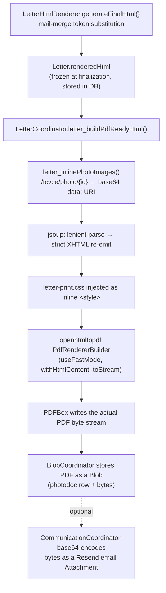

# PDF & Document Encoding — Developer Primer

This is background reading for anyone working on the letters subsystem's finalization
pipeline (HTML → PDF) or the email-attachment path. It's conceptual, not a how-to —
see [overview.md](/dev/subsystems/letters/overview) for the subsystem's architecture and
the codenforce repo's `docs/subsystems/letters+emailing/` for phase-by-phase implementation
history. Nothing here is CodeNForce-specific trivia you can find by reading the code once —
it's the "why does this keep breaking" context that isn't obvious from the source alone.

## 1. The libraries we use, and what each one actually does

| Library | Version | Role |
|---|---|---|
| **openhtmltopdf-pdfbox** | 1.0.10 | Takes well-formed XHTML + CSS and *lays it out* as a PDF content stream — the actual HTML→PDF renderer. |
| **Apache PDFBox** | 2.0.22 | Low-level PDF object model: reads/writes the actual PDF file structure (objects, xref table, streams, document-info dictionary). openhtmltopdf uses it as its output backend; we also use it *directly* in `BlobCoordinator` to strip metadata from uploaded PDFs. |
| **jsoup** | 1.18.1 | HTML tidying/parsing. Rich-text-editor output (from `LetterHtmlRenderer`-generated content) is rarely well-formed XML. jsoup parses it leniently, then re-emits it as strict XHTML so openhtmltopdf's XML parser won't choke on it. |
| **resend-java** | 4.13.0 | Email transport (Resend API client). Not a PDF library, but it's the other place binary document bytes get encoded/transported in this subsystem — see §6. |

A note so you don't go down a rabbit hole: `pom.xml` still defines an `<itext.version>RELEASE</itext.version>`
property, but there is no actual iText dependency anywhere in the project. It's vestigial —
grep for `com.itextpdf` before assuming iText is involved in anything; it isn't.

### Why openhtmltopdf instead of a headless browser (e.g. wkhtmltopdf/Chromium)?

It's a pure-JVM library — no native binary, no headless-browser subprocess to manage on
WildFly, no sandboxing/process-lifecycle concerns. The tradeoff (see §4) is that it only
implements a subset of CSS and does not execute JavaScript or fetch network resources during
render, which shapes several of our design decisions.

## 2. The actual rendering pipeline



Code entry points, in pipeline order:
- `LetterCoordinator.letter_generateFinalizationPDF(Letter, UserAuthorized)` — the public
  orchestration method (called from `LetterFlowBB` after finalization).
- `LetterCoordinator.letter_buildPdfReadyHtml(...)` — builds the full XHTML document string
  (stylesheet + inlined photos), runs it through jsoup.
- `LetterCoordinator.letter_inlinePhotoImages(...)` — regex-scans for `/tcvce/photo/{id}` `src`
  attributes and swaps each for a `data:<mime>;base64,<bytes>` URI, pulling the actual bytes
  from `BlobCoordinator.getBlob(id)`.
- `LetterCoordinator.letter_renderPdfBytes(...)` — the actual `PdfRendererBuilder` call.
- `LetterCoordinator.letter_loadPrintCss()` — loads `/css/letter-print.css` from the classpath.

**Why inline photos as base64 data URIs instead of just pointing at the URL?** openhtmltopdf's
render happens synchronously inside the app server, with no live HTTP request/response cycle
backing it and no default resolver that can authenticate against and hit our own running
servlet. Handing it a `data:` URI means the image bytes are already *in* the document it's
parsing — no I/O, no auth, no network dependency at render time.

## 3. What a PDF file actually is

A PDF is not a picture of a page — it's a program, in a very restricted sense. Conceptually:

- **A page is a sequence of drawing operators** in a *content stream*: move-to, line-to, "show
  this text run in this font at this position," "paint this image XObject here." Text position
  isn't reflowable at that layer; by the time you have a content stream, layout has already
  happened. This is why editing text in an existing PDF is notoriously painful — you're
  editing pre-computed positioning instructions, not a document model.
- **Fonts are resources**, referenced by name from the content stream and either (a) one of the
  14 "standard" fonts every PDF-consuming application must support without embedding
  (Times/Helvetica/Courier + bold/italic/oblique variants, plus Symbol and ZapfDingbats), or
  (b) embedded font program binaries (subset or full) bundled directly into the PDF file
  itself.
- **Objects are numbered and indexed** — every piece of the file (pages, fonts, images,
  content streams, the document-info dictionary) is a numbered *indirect object*, and a
  cross-reference table (`xref`) at the end of the file maps object numbers to byte offsets so
  a reader can jump straight to any object without parsing the whole file linearly.
- **The page tree** is a hierarchy of `Pages`/`Page` objects, each `Page` referencing its
  content stream(s) and resource dictionary (fonts, images, etc.) — this is what lets a PDF
  viewer figure out "page 3 uses these two fonts and this content stream" without loading
  everything.
- **Incremental updates**: PDF was designed so that editing a file can *append* new/changed
  objects and a new xref section at the end rather than rewriting the whole file — which is
  efficient for viewers/annotation tools but is also exactly why "deleted" content can still be
  physically present in a PDF's bytes (recoverable) unless the file is properly resaved/
  flattened. Relevant to §5 below.

### When did this become an open standard?

PDF was Adobe's proprietary format from 1993 until **2008**, when Adobe submitted the PDF 1.7
specification to ISO, which published it as **ISO 32000-1:2008**. That was the moment PDF
stopped being "whatever Adobe's spec document says" and became an independently-governed
standard. In **2017**, ISO published **ISO 32000-2:2017** ("PDF 2.0") — the first version
developed directly by the ISO committee (not adapted from an existing Adobe spec), adding
things like better accessibility/tagging support, more robust encryption, and cleanup of
ambiguous corners of the 1.7 spec. PDFBox and openhtmltopdf both target the older,
vastly-more-common 1.x object model; we are not doing anything PDF-2.0-specific here.

## 4. Where HTML/CSS → PDF rendering hurts (and why)

openhtmltopdf implements a **fixed, print-oriented CSS subset** — treat it like a well-behaved
CSS 2.1 engine with a handful of CSS3 additions (`@page`, some `@font-face`, basic
`box-shadow`/`border-radius`), not like a real browser:

- **No flexbox, no CSS grid.** Layout has to be done with block/inline/table-based CSS. This is
  a big reason `letter-print.css` is deliberately simple (percentage-width `inline-block`
  photo grid, plain `<table>` for the violations table) rather than reusing any of the app's
  normal flexbox-based screen CSS.
- **No JavaScript execution, no live network fetches.** Anything that depends on JS-driven
  layout, web fonts fetched at render time, or images fetched over HTTP will silently fail or
  render blank — see the base64 data-URI workaround in §2.
- **Unsupported CSS is silently ignored, not an error.** A typo'd property name or an
  unsupported selector doesn't throw — it just doesn't apply. This means "the build passed"
  and even "no exception was thrown at render time" tell you nothing about whether a letter
  actually *looks right*. Always eyeball a rendered test PDF after touching `letter-print.css`
  or the mail-merge templates; don't trust silence.
- **`@page` controls page geometry**, not a wrapper `<div>`. Page size/margins/orientation live
  in the `@page` at-rule (`letter-print.css`'s `@page { size: letter portrait; margin: 1in; }`),
  and orientation is currently toggled at *runtime* by a literal string
  `.replace("size: letter portrait;", "size: letter landscape;")` in
  `LetterCoordinator.letter_buildPdfReadyHtml()` — fragile if the CSS text ever gets
  reformatted, but simple and effective as-is.
- **It wants strict, well-formed XHTML**, not tolerant HTML5. Browsers forgive unclosed `<p>`
  tags, unescaped `&`, mismatched nesting, etc.; openhtmltopdf's parser (by default) does not.
  This is the entire reason the jsoup tidy-pass exists in `letter_buildPdfReadyHtml()` — it's
  not optional cleanup, it's a required translation step between "whatever a rich text editor
  produced" and "what a strict XML parser will accept." **If a letter renders fine in the
  browser preview but throws or silently mangles on PDF generation, suspect malformed markup
  first** and check what jsoup did to it.
- **Prefer absolute units** (`pt`, `in`) over viewport-relative units (`vw`, `%` of an
  undefined viewport, `rem` tied to a browser default) — there's no real "viewport" once
  you're targeting a fixed page size.

## 5. Fonts, glyphs, and why your PDF might show boxes instead of letters

`letter-print.css` intentionally sticks to the generic families `serif`/`sans-serif` rather
than a specific webfont, so PDFBox can satisfy every glyph request from its built-in
**base-14 fonts** — no font files to embed, no licensing to track, smaller output files.

The catch: the base-14 fonts only guarantee **WinAnsiEncoding/StandardEncoding** coverage —
essentially Latin-1/Windows-1252. That covers standard English text and most Word-pasted
"smart quotes"/em-dashes fine, but:

- Anything outside that range (non-Latin scripts, many symbol/emoji glyphs, some accented
  characters outside Latin-1) will render as a missing-glyph box ("tofu") or drop silently,
  because there's no embedded font providing those glyphs and the base-14 fonts don't define
  them.
- If this subsystem ever needs genuine Unicode support (non-English correspondence, for
  example), the fix is **embedding a real Unicode font** via PDFBox's `PDType0Font` (composite/
  CID-keyed font, subset or full), which openhtmltopdf can be configured to use per-font-family
  — a materially bigger change than swapping a CSS `font-family` value, since it means shipping
  and licensing a font binary, not just naming one.

## 6. Two unrelated base64 encodings — don't cross the streams

There are two completely separate places `byte[]` gets turned into base64 text in this
subsystem, and they solve different problems:

1. **`LetterCoordinator.letter_inlinePhotoImages()`** — base64-encodes *image* bytes into a
   `data:` URI so they can be embedded **inside the HTML that openhtmltopdf renders**. This
   base64 text becomes part of the document *being turned into a PDF* — it never leaves the
   server, and it disappears once the PDF's own binary image XObject is written.
2. **`CommunicationCoordinator`'s Resend attachment mapping** (`~line 1236`) — base64-encodes
   the **finished PDF's own bytes** (or any `EmailAttachment.content`) because Resend's API
   (like virtually every JSON-based email API) requires attachment content as a base64 string
   inside a JSON payload, since JSON has no native binary type:
   ```java
   Attachment.Builder ab = Attachment.builder()
           .filename(att.getFilename())
           .content(Base64.getEncoder().encodeToString(att.getContent()));
   ```
   This base64 text is transport-only — Resend decodes it back to bytes before actually
   attaching the file to the outgoing MIME email.

If you're debugging an attachment/image issue, figure out **which** of these two encodings
you're actually looking at before changing anything — they have different lifetimes, different
consumers, and fixing one by copying a pattern from the other is a common way to introduce a
new bug.

## 7. PDF metadata — the Document Information dictionary

Every PDF carries a small metadata dictionary (Author/Title/Subject/Keywords/Creator/Producer/
CreationDate/ModificationDate) alongside the actual page content — separate from the visible
text, invisible in any normal viewer's page display, but trivially readable by anyone who opens
the file's properties panel (or just great-search greps the raw bytes; older PDFs often store
this as plain, uncompressed text).

This matters for **uploaded** PDFs (not ones we generate) because that metadata was written by
whatever software the *original author* used, and may leak information nobody intended to
share (real names, internal file paths in the `Creator`/`Producer` fields, original creation
timestamps that predate what the case record implies, etc.). `BlobCoordinator` scrubs this on
ingest:

```java
PDDocument doc = PDDocument.load(input.getBytes());
PDDocumentInformation docInfo = doc.getDocumentInformation();
blobMeta.setProperty(new MetadataKey("Author"), docInfo.getAuthor());
docInfo.setAuthor("");
// ...same pattern for Title/Subject/Keywords/Creator/Producer/CreationDate/ModificationDate...
doc.save(output);   // re-saved with the info dictionary cleared
input.setBytes(output.toByteArray());
```

Note it *extracts* the original values into our own `Metadata`/`MetadataKey` model before
blanking them in the PDF itself — so the information isn't lost, just moved somewhere we
control rather than left embedded in a file we're about to store and potentially hand back out.

Two things worth knowing if you touch this code:
- This only clears the classic **Document Information dictionary**. Modern PDF producers
  (recent Adobe/Office/Google exports) increasingly *also* embed an **XMP metadata stream**
  (an XML/RDF blob) that can duplicate or extend the same fields. `PDDocumentInformation`
  scrubbing does **not** touch XMP — if a compliance requirement ever demands scrubbing *all*
  embedded metadata, this method needs a second pass against the document's XMP stream too.
- Because of the incremental-update behavior described in §3, simply blanking fields and
  calling `doc.save()` produces a clean, fully-rewritten file here (PDFBox's `save()` isn't
  doing an incremental append in this path) — but it's a good reason to be suspicious of any
  future "quick edit" of a PDF that only *appends* changes; old bytes can survive on disk even
  when a viewer no longer displays them.

## 8. Known gotchas / footguns (running list — add to this as you hit new ones)

- **openhtmltopdf silently drops unsupported CSS.** No exception, no log line — the property
  just doesn't apply. Always visually check a rendered PDF after touching styles/templates.
- **Malformed rich-text HTML breaks the strict XML parser.** If PDF generation throws but the
  browser preview of the same letter looks fine, suspect the raw HTML first; check what jsoup's
  tidy pass produced from it.
- **Non-Latin-1 glyphs can render as missing-glyph boxes** with the current base-14-only font
  setup (§5) — this is a design constraint, not a bug, until/unless a Unicode font gets
  embedded.
- **Images must be inlined as base64 `data:` URIs.** There's no live request context during
  render, so anything pointing at `/tcvce/photo/{id}` as a plain URL will not resolve.
- **PDFBox and openhtmltopdf-pdfbox are version-locked.** openhtmltopdf-pdfbox 1.0.10 is the
  last release built against PDFBox 2.0.x (see the comment in `pom.xml`) — bumping PDFBox
  without checking openhtmltopdf compatibility first risks a hard runtime break in rendering,
  not just a compile error.
- **The `itext.version` pom property is vestigial** — no iText dependency actually exists in
  this project. Don't assume iText is involved in anything just because that property exists.
- **No PDF/A, no tagged/accessible PDF output today.** If a future requirement needs
  accessibility compliance (tagged PDF, reading order, alt text baked into the PDF structure)
  or long-term-archival PDF/A conformance, that is a meaningfully different rendering pipeline
  from what's implemented now — not a config flag on the current one.
- **Two unrelated base64 encodings exist in this subsystem** (§6) — know which one you're
  looking at before changing either.

## 9. Where to look in code

| File | Purpose |
|---|---|
| `LetterCoordinator.java` (`letter_generateFinalizationPDF` and the private `letter_*Pdf*`/`letter_inlinePhotoImages`/`letter_loadPrintCss` methods) | Orchestrates the whole HTML→PDF pipeline. |
| `/css/letter-print.css` (classpath resource, `src/main/resources/css/`) | The print stylesheet injected before rendering — the CSS subset actually exercised by this pipeline. |
| `BlobCoordinator.java` (PDF metadata scrub, near `PDDocument.load(...)`) | Strips Document Information dictionary fields from uploaded PDFs on ingest. |
| `CommunicationCoordinator.java` (Resend attachment mapping, `~line 1236`) | Base64-encodes finished document bytes for email transport — unrelated to the data-URI encoding used during rendering. |
| `EmailAttachment.java` / `EmailMessage.java` | Plain POJOs carrying attachment bytes/metadata between the coordinator and the Resend client. |

## 10. Further reading

- ISO 32000-1:2008 (PDF 1.7, the original ISO ratification) and ISO 32000-2:2017 (PDF 2.0) —
  the actual normative standards, if you ever need to settle a "is this even legal PDF"
  argument.
- Apache PDFBox project documentation (`pdfbox.apache.org`) — the object-model API we use
  directly in `BlobCoordinator`.
- The openhtmltopdf project (`github.com/openhtmltopdf/openhtmltopdf`) — its README/wiki is
  the best source of truth for exactly which CSS properties are and aren't supported, since
  that surface changes across releases.
- jsoup documentation (`jsoup.org`) — for the HTML-tidying API used in `letter_buildPdfReadyHtml`.
