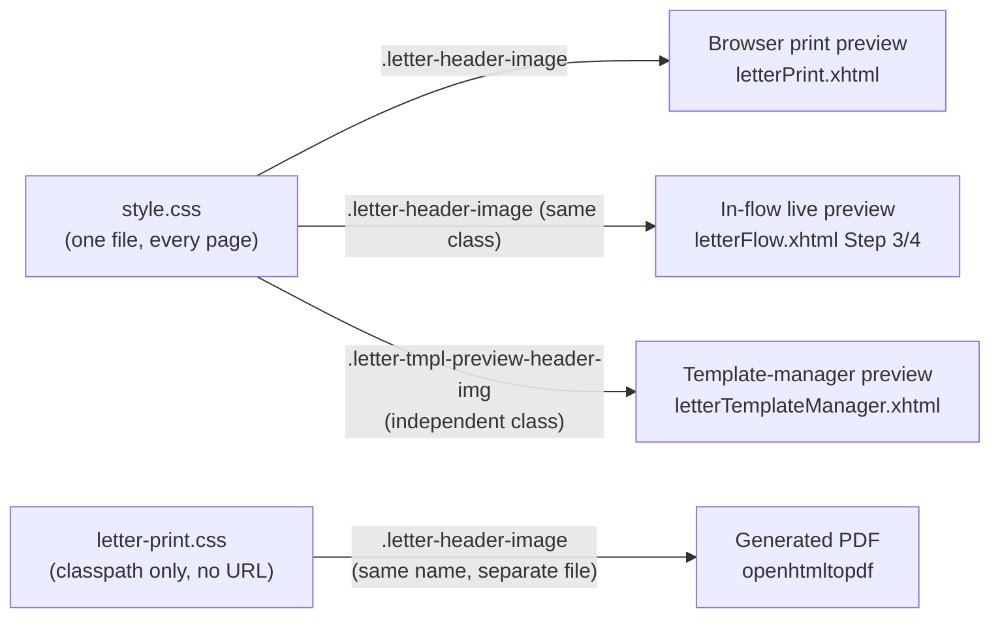

# Print & Preview Styling Architecture — Developer Brief

A refresher on how letter styling actually works, written after Item VI.A (header-image
centering + style sync) touched all four render surfaces. See
[overview.md](/dev/subsystems/letters/overview) for subsystem architecture and the
[PDF & document encoding primer](/dev/subsystems/letters/pdf-encoding-primer) for the deeper
PDF/CSS mechanics this page summarizes practically.

## The short answer: there is no dedicated "letter browser-print" stylesheet

There are exactly **two** CSS files involved, and they split along a different line than you'd
expect — not "one per render surface," but "one for anything a browser loads, one for the PDF":

| File | Where it lives | Who loads it, and how |
|---|---|---|
| `src/main/webapp/resources/css/**style.css**` | A static web resource, part of the JSF resource library | **Every single page in the app** — restricted and public — links this one file via `<h:outputStylesheet name="css/style.css"/>` (or a plain `<link>`). It is the app's one and only stylesheet, not something scoped to letters. Letter-specific rules (`.letter-header-image`, `.letter-print-document`, etc.) are just more classes living in this same file, picked out by name. |
| `src/main/resources/css/**letter-print.css**` | A classpath resource (note: `main/resources`, *not* `main/webapp/resources` — never served over HTTP, has no URL) | Only `LetterCoordinator.letter_loadPrintCss()`, which reads it as a plain text stream at PDF-generation time and hands the string to `letter_buildPdfReadyHtml()`. |

So: **browser print preview, the in-flow live preview, and the template-manager preview panel
all share the exact same `style.css`** that every other screen in the app uses — there was never
a reason to split those three into their own file, since they're all just JSF-rendered HTML in a
normal browser. Only the PDF pipeline needed a second file, and that's a consequence of *how* PDF
rendering works (next section), not a deliberate "4 stylesheets for 4 surfaces" design.

## How PDFs actually interact with CSS (the part that surprises people)

openhtmltopdf is not a browser — there's no live page, no `<link>` tag being fetched, no DOM a
stylesheet attaches to after the fact. The pipeline (`LetterCoordinator.letter_buildPdfReadyHtml()`)
does this, every time a letter is finalized:

1. Read `letter-print.css` off the classpath into a plain Java `String`.
2. Do **literal text substitution** on that string for the handful of values that vary per
   letter — page margin, header-image max-height — by replacing placeholder tokens
   (`__LETTER_HEADER_MAX_HEIGHT__`) or known default literals (`margin: 1in 1in 1in 1in;`) with
   the computed value. This is the same trick used twice today (see `LetterCoordinator.java`
   around `letter_buildPdfReadyHtml()`): there's no CSS variable mechanism in play, just
   find-and-replace on raw text before it's ever parsed as CSS.
3. Paste the resulting string wholesale into a `<style>` block at the top of the HTML document
   being built.
4. Hand the whole HTML string to openhtmltopdf's `PdfRendererBuilder`, which parses and lays it
   out as a PDF content stream.

Consequences worth keeping in mind:
- **The PDF never "links" a stylesheet** — there's no request, no caching, no 404 possible.
  Whatever text is in `letter-print.css` on disk at build time is what every PDF gets, baked in.
- **Nothing connects `letter-print.css` to `style.css`.** They are two independent files a human
  has to keep numerically consistent by hand (or, as of VI.A, by making sure both define the
  same class name with the same values — still manual, just less error-prone than copying
  numbers into an inline `style=` string).
- **openhtmltopdf only supports a CSS 2.1-ish subset** (no flexbox/grid, no JS, no live network
  image fetches — see the [PDF primer §4](/dev/subsystems/letters/pdf-encoding-primer) for the
  full list) — this is *why* `letter-print.css` exists as a separate, deliberately simpler file
  instead of just reusing `style.css` wholesale: `style.css` is full of flexbox/grid rules for
  the rest of the app's screens that openhtmltopdf would silently ignore (unsupported CSS doesn't
  error, it just doesn't apply — see that primer's warning about trusting silence).
- **Unsupported/mistyped CSS fails silently.** A typo in `letter-print.css` won't throw a build
  or runtime error — the rule just won't render in the PDF. Always eyeball an actual generated
  PDF after touching this file.

## How "preview" styling works — two genuinely different situations

"Preview" means two different things depending on which screen you're looking at, and they have
different sync properties:

1. **Browser print preview (`letterPrint.xhtml`) and the in-flow live preview
   (`letterFlow.xhtml` Step 3/4)** — these aren't actually two separate implementations. They
   render the same markup pattern with the **same CSS class** (`letter-header-image`, etc.) out
   of the same `style.css`. A styling fix to one of these classes fixes both automatically,
   because they were never actually divergent — they're one styling source serving two render
   sites in the DOM.
2. **The template-manager preview panel (`letterTemplateManager.xhtml`)** — this one uses its
   **own separate class** (`.letter-tmpl-preview-header-img`), independently added later (A6,
   2026-08-24) for a genuinely different preview context (previewing a *template*, not a
   finalized letter). It is **not** connected to the other two at all — a change to
   `.letter-header-image` does nothing for this panel unless you remember to also touch
   `.letter-tmpl-preview-header-img`. This is a real, standing drift risk, not a one-time bug —
   there's no shared source of truth forcing these two classes to agree going forward.

## Current state as of VI.A (2026-10-07)

| Surface | Styling source | Shares a file with |
|---|---|---|
| Browser print preview | `style.css` `.letter-header-image` | In-flow live preview (same class) |
| In-flow live preview | `style.css` `.letter-header-image` | Browser print preview (same class) |
| Template-manager preview | `style.css` `.letter-tmpl-preview-header-img` | Nobody — its own class |
| Generated PDF | `letter-print.css` `.letter-header-image` | Nobody — separate file, name kept in sync by hand |

Before VI.A, the PDF didn't even have a CSS rule for the header image at all — `buildHeaderImageHtml()`
hand-built an inline `style="..."` string in Java with numbers a human had copied from `style.css`.
VI.A replaced that with a real rule in `letter-print.css` plus the placeholder-substitution
technique above, so the PDF's `` tag is now class-only, same as the other three surfaces —
closing most (not all — see the template-manager caveat above) of the "nothing enforces continued
agreement" risk. Full as-built detail: codenforce
`docs/subsystems/letters+emailing/pt6/VI-A-pdf-browser-print-style-sync.md`.

See also: [overview.md](/dev/subsystems/letters/overview),
[PDF & document encoding primer](/dev/subsystems/letters/pdf-encoding-primer).
