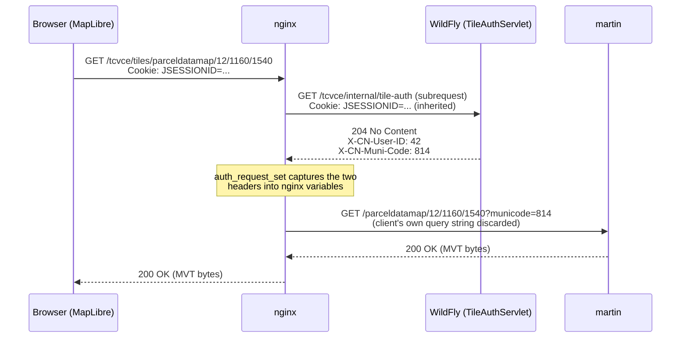

> Updated 2026-09-04: this primer originally documented the pre-M2 plural-muni protocol
> (`X-CN-Muni-Codes`, `?municodes=...`, `p.municode = ANY(codes)`). M2 has since shipped, and
> every example below now reflects the single-active-muni protocol (`X-CN-Muni-Code`,
> `?municode=...`, `p.municode = code`) that actually runs today. See the codenforce repo's
> `docs/subsystems/mapping/M1-map-auth-review.md` §7 for the refactor record.

# Map Auth Chain — nginx Header Referee Primer

Background reading for a Java developer who knows servlets and JSF cold but has never had to
reason about nginx as an active participant in an authorization decision. It uses the mapping
subsystem's real `nginx.conf` as the worked example throughout — see
[overview.md](/dev/subsystems/mapping/overview) for the subsystem's shape and the codenforce
repo's `docs/subsystems/mapping/M1-map-auth-review.md` for the conformity review and the
single-active-muni refactor (M2) this primer's examples reflect. Nothing here is
mapping-specific trivia — the `auth_request` mechanism explained below is nginx's general answer
to "how do I gate access to an upstream that doesn't understand my auth model," and shows up
anywhere a JVM app fronts a non-JVM service.

**Files this primer is annotating**, so you can follow along with the real source instead of
snippets:
- `cnf-mapping-data/nginx/conf.d/default.conf` — the nginx config
- `cnf-mapping-data/martin/config.yaml` — the tile server config
- `codenforce/src/main/java/com/tcvcog/tcvce/rest/TileAuthServlet.java` — the subrequest target
- `codenforce/src/main/java/com/tcvcog/tcvce/rest/AuthorizedMuniResolver.java` — session/identity resolution shared by the whole `rest` package

## 1. The problem nginx is solving

Martin (the vector tile server) has no idea what a `UserAuthorized`, a `UserMuniAuthPeriod`, or a
`JSESSIONID` cookie is, and never will — it speaks Postgres and HTTP, nothing else. Yet every
tile it serves must be filtered to the requesting browser's authorized municipalities. Three
architectural choices follow from that:

1. **Codenforce (WildFly) remains the only thing that understands the session.** It is the sole
   place `HttpSession`/`SessionBean`/`UserAuthorized` exist.
2. **Martin remains the only thing that queries parcel geometry.** It is the sole place with a
   live connection to the `mapping` schema for tile serving.
3. **Something has to sit between the browser and martin, ask codenforce "who is this and what
   may they see" on every tile request, and translate the answer into something martin's SQL
   function can filter on** — that something is nginx, and the mechanism is `auth_request`.



Nothing here is martin-specific either — swap "martin" for any tile server, search index, or
internal API that can accept a filter parameter but cannot authenticate a browser session, and
the same shape applies.

## 2. Why the browser never talks to martin directly

`docker-compose.yaml`/`default.conf` put codenforce, the frontend, and the tile endpoint all
behind **one nginx origin** (`http://localhost:8081` in dev). This isn't a simplification for
dev convenience — it's load-bearing for the auth mechanism:

- WildFly deploys codenforce at context root `/tcvce` (`jboss-web.xml`), and its `web.xml` sets
  no `<cookie-config>`, so Undertow issues `JSESSIONID` with `Path=/tcvce`. A browser only
  attaches that cookie to requests whose path starts with `/tcvce`.
- The tile endpoint is therefore mounted at `/tcvce/tiles/`, **not** a top-level `/tiles/`. If it
  were top-level, the browser's tile requests would carry no `JSESSIONID` at all, the
  `auth_request` subrequest below would arrive at `TileAuthServlet` with no session, and every
  tile would 401 — not a bug in the servlet, a structural consequence of cookie path scoping.
- This is also why the frontend's `MARTIN_URL` (`frontend/src/lib/constants.ts` /
  `components/map.tsx`) defaults to the relative path `/tcvce/tiles`, and the code comment there
  explicitly warns the app must be loaded through nginx, not `next dev`'s own port directly.

## 3. `auth_request` — nginx asking a question before it answers one

```nginx
location /tcvce/tiles/ {
    auth_request /internal/tile-auth;
    auth_request_set $cn_user $upstream_http_x_cn_user_id;
    auth_request_set $cn_muni $upstream_http_x_cn_muni_code;
    ...
}

location = /internal/tile-auth {
    internal;
    proxy_pass http://codenforce/tcvce/internal/tile-auth;
    proxy_pass_request_body off;
    proxy_set_header Content-Length "";
    proxy_set_header Host $http_host;
    proxy_set_header X-Original-URI $request_uri;
    proxy_cache tileauth;
    proxy_cache_key $cookie_JSESSIONID;
    proxy_cache_valid 204 30s;
    proxy_ignore_headers Cache-Control Expires Set-Cookie;
}
```

`auth_request` is an nginx module (`ngx_http_auth_request_module`) whose entire job is: *before
serving this location, fire a second, internal HTTP request at some other location, and only
proceed if that second request comes back 2xx.* Key mechanics a Java dev coming from servlet
filters will not expect:

- **It is a real, separate HTTP request-response cycle**, dispatched internally by nginx — not a
  function call, not a shared object graph. The only way information crosses from the subrequest
  back to the original request is through **response headers on the subrequest**, captured
  explicitly (see §4). There is no shared "request context" the way a servlet `Filter` shares one
  `HttpServletRequest` with the chain it wraps.
- **The subrequest is always a `GET` with no body**, regardless of what the original request was.
  That's why the target location sets `proxy_pass_request_body off;` and
  `proxy_set_header Content-Length "";` — without the latter, nginx would forward whatever
  `Content-Length` the *original* request had (if any) on a request it just stripped the body
  from, and a naive upstream could hang waiting to read bytes that will never arrive.
- **The subrequest inherits headers from the original request** — critically, `Cookie`. This is
  the entire mechanism that lets `TileAuthServlet` see the caller's session: nginx doesn't
  construct a new, empty request, it clones the relevant parts of the one the browser sent. That
  is why `TileAuthServlet.doGet` can just call `req.getSession(false)` like any other servlet —
  from its point of view, it *is* an ordinary request, it just happens to have no body and no
  meaningful path beyond its own URL.
- **Only 2xx, 401, and 403 are legal outcomes.** 2xx → `auth_request` lets the original request
  proceed. 401/403 → nginx fails the *original* request with that same status, without ever
  reaching martin. *Anything else* — a 500, a timeout, a 302 — nginx treats as a hard failure of
  the whole mechanism and answers the original request with a 500, even though the subrequest's
  actual status might have been perfectly meaningful for a browser (e.g. a 302 to a login page).
  This is exactly why `TileAuthServlet` doc comment says it is **deliberately left outside any
  `web.xml` security-constraint**: a `security-constraint`-guarded servlet answers an
  unauthenticated request with a container-generated 302 redirect to the login page, which
  `auth_request` cannot interpret as "unauthenticated" — it would 500 the whole tile request
  instead of cleanly 401ing it. The servlet does its own `req.getSession(false)` /
  `AuthorizedMuniResolver.resolveSessionUser` check in code specifically so it can hand back a
  literal `401`/`403`, not rely on the container's FORM-auth machinery to do it.
- **`internal;` on the subrequest's own location** (`location = /internal/tile-auth { internal; ... }`)
  means nginx refuses to route any request to that location that didn't originate from an
  internal redirect/subrequest — a client `curl`ing `http://localhost:8081/internal/tile-auth`
  directly gets nginx's own 404, before the request is even proxied anywhere. This matters
  because the servlet's response headers (`X-CN-User-ID`, `X-CN-Muni-Code`) would otherwise be
  directly fetchable by any client that knows the URL, defeating the "harvest the header values"
  concern noted in the config's own comment. `TileAuthServlet`'s response headers today are
  `X-CN-User-ID` and the singular `X-CN-Muni-Code` (one value, one muni per session).
- **Location match order matters, and it's "longest prefix wins," not "first listed wins."**
  `location /tcvce/tiles/ { ... }` must exist as (effectively) a more specific prefix than
  `location /tcvce/ { ... }` (the plain proxy to WildFly) for tile requests to be intercepted by
  the `auth_request` block at all — nginx doesn't evaluate prefix locations top-to-bottom, it
  keeps the longest matching prefix among all of them. If a future edit ever introduced a
  *broader* prefix that happened to also match `/tcvce/tiles/...` (there isn't one today), get
  the ordering assumption checked, don't assume "declared first" is safe.

## 4. `auth_request_set` and header→variable naming

```nginx
auth_request_set $cn_user $upstream_http_x_cn_user_id;
auth_request_set $cn_muni $upstream_http_x_cn_muni_code;
auth_request_set $auth_cache $upstream_cache_status;
```

`$upstream_http_<name>` is nginx's general convention for "a response header from the last
upstream response nginx dealt with, exposed as a variable" — `<name>` is the header name,
lowercased, with every `-` turned into `_`. So the servlet's literal response header
`X-CN-Muni-Code: 814` becomes the *variable* `$upstream_http_x_cn_muni_code`. That variable
only exists/is only valid in the context of the `auth_request` subrequest's response — it isn't
generally addressable from arbitrary config — which is precisely why `auth_request_set` exists:
it's the one directive whose whole purpose is to copy a subrequest-scoped value into an
ordinary, request-scoped `$variable` so the rest of the config (in particular, a later
`proxy_set_header` in a *different* location block) can read it.

**A Java-dev framing that helps:** think of nginx variables not as mutable fields you assign
into, but as **lazily-evaluated, memoized expressions scoped to one request** — closer to a `val`
than a `var`. Once a variable has been evaluated once within a request, its value doesn't change
underneath you for the rest of that request's processing, even across an internal
redirect/subrequest boundary; `auth_request_set` explicitly writes a fresh value into a variable
you've declared, precisely because the "quietly re-evaluate on every read" behavior most nginx
variables have wouldn't work for a value that only exists transiently on a subrequest response
you're about to discard.

## 5. `proxy_set_header` — overwrite, never merge, and why that's the whole security model

```nginx
proxy_set_header X-CN-User-ID   $cn_user;
proxy_set_header X-CN-Muni-Code $cn_muni;
```

These two lines run in the **main** `/tcvce/tiles/` location, using the variables §4 populated
from the *subrequest's* response — not headers the browser sent. That distinction is the entire
point. If a client's own request happened to carry a header literally named `X-CN-Muni-Code:
999` (nothing stops a browser dev tools user from adding one), that header:

- **is never read by anything in this chain.** Nothing in `default.conf` or `TileAuthServlet`
  ever inspects an inbound `X-CN-Muni-Code` from the client. `TileAuthServlet` derives its
  answer purely from the session; the client-sent header, if any, is just inert bytes that
  arrived at nginx and go nowhere.
- **is overwritten, unconditionally, by `proxy_set_header`.** `proxy_set_header <name> <value>`
  in nginx does not append to or merge with an existing header of that name on the request being
  built for the upstream — it **replaces** it. So even in the hypothetical where something
  *did* forward the client's header through, this line stomps it with the servlet's value before
  the request ever reaches martin. Both headers are set this way *unconditionally* — the config's
  own comment calls this out explicitly: "Overwrite, never merge... Both are set unconditionally
  so no client-supplied value can survive to the upstream."
- This is the load-bearing difference between `proxy_set_header` and, say, `add_header`.
  `add_header` *adds* a header to the **response** nginx is about to send back downstream, on top
  of whatever's already there — the opposite direction and the opposite (additive) semantics.
  Confusing the two is a common way to accidentally leave a spoofable header in place.

**Defense in depth, explicitly noted in the config:** martin itself never reads
`X-CN-User-ID`/`X-CN-Muni-Code` — the actual fence is the query string built in §7 below. These
two headers exist only so the access log (`log_format tileproxy`) can record who a tile request
was for, and so that a future consumer downstream of nginx that *does* start trusting them
inherits a value that's already been forcibly overwritten rather than one that might still be
attacker-controlled.

## 6. The `map` directive (a quick aside, since it's in the same file)

```nginx
map $http_upgrade $connection_upgrade {
    default upgrade;
    ''      close;
}
```

Unrelated to the auth chain, but it's in the same `default.conf` and worth naming so it doesn't
get mistaken for part of the auth mechanism: `map` is nginx's general-purpose "build a variable
by looking up another variable's value in a table" directive — here it's just computing the
`Connection` header value needed to proxy Next.js's HMR WebSocket upgrade correctly (`upgrade`
when the client sent `Upgrade: websocket`, `close` otherwise). It has the same "one variable, one
expression, request-scoped" character as `auth_request_set`, just driven by a static lookup table
instead of a subrequest response.

## 7. `proxy_pass` with variables — the query-string trap

This is the single most surprising nginx behavior in the whole config, and the comment inline
calls it out as something to specifically never "simplify" away:

```nginx
location ~ "^/tcvce/tiles/parceldatamap/(?<tz>[0-9]{1,2})/(?<tx>[0-9]{1,8})/(?<ty>[0-9]{1,8})$" {
    set $args "";
    proxy_pass http://martin/parceldatamap/$tz/$tx/$ty?municode=$cn_muni;
}
```

nginx's `proxy_pass` behaves **differently depending on whether its target URI is a literal
string or contains variables**, and the difference is entirely about what happens to the
*client's original query string*:

| `proxy_pass` form | Example | Client requests `...?foo=bar` | What martin actually receives |
|---|---|---|---|
| **Static** (literal URI, optionally with its own `?`) | `proxy_pass http://martin/parceldatamap;` | anything | `/parceldatamap?foo=bar` — nginx **appends** the client's query string automatically |
| **Static, with its own query string** | `proxy_pass http://martin/parceldatamap?x=1;` | `...?foo=bar` | `/parceldatamap?x=1?foo=bar` — nginx still appends, producing a malformed double-`?` URI |
| **Dynamic** (URI built from `$variables`) | `proxy_pass http://martin/parceldatamap/$tz/$tx/$ty?municode=$cn_muni;` | `...?municode=999` (attacker-supplied) | `/parceldatamap/12/1160/1540?municode=814` — nginx passes the URI **exactly as built**, and the client's own query string is **not appended at all** |

Because this config's `proxy_pass` target contains `$tz`/`$tx`/`$ty`/`$cn_muni`, it's in the
"dynamic" row: nginx builds the whole upstream URI itself from those variables and sends exactly
that, dropping the client's own query string on the floor entirely — not merging it, not letting
it override, not even seeing it as a separate thing to reason about. A request to
`/tcvce/tiles/parceldatamap/12/1160/1540?municode=999` (an attempt to inject a different
municode) reaches martin as `/parceldatamap/12/1160/1540?municode=814` — the servlet's answer,
full stop.

Two belt-and-braces details in the same block reinforce this rather than substitute for it:

- **`set $args "";`** clears nginx's own "args" variable (the parsed query string nginx keeps
  for the *current* request) before the `proxy_pass`. With a variable-containing `proxy_pass`
  this is a no-op for the reason above (the client's args were never going to be appended
  regardless), but it protects against a future edit that switches this block back to a static
  `proxy_pass` — nginx also auto-appends `$args` specifically (not just "whatever the client
  sent" in the abstract), so clearing it removes that hazard at the source too.
- **The z/x/y values come from the regex's named capture groups** (`(?<tz>[0-9]{1,2})` etc.), not
  from copying anything out of the client's raw path. Since the *location* itself only matches
  when the whole path is exactly `parceldatamap/<digits>/<digits>/<digits>`, by the time
  `$tz`/`$tx`/`$ty` are interpolated into the upstream URI they are guaranteed to already be
  validated as bounded-length digit strings — there is no path-traversal or SQL-injection surface
  in that part of the URI construction.

## 8. The tile-auth cache — what's cached, what isn't, and why

```nginx
proxy_cache_path /var/cache/nginx/tileauth
                 levels=1:2 keys_zone=tileauth:10m max_size=64m
                 inactive=5m use_temp_path=off;
...
proxy_cache       tileauth;
proxy_cache_key   $cookie_JSESSIONID;
proxy_cache_valid 204 30s;
proxy_ignore_headers Cache-Control Expires Set-Cookie;
```

Without this cache, a single map pan/zoom — which fires dozens of tile requests in quick
succession — would fire one `auth_request` subrequest (a full round trip into WildFly, JSF
session lookup and all) **per tile**. The cache exists purely to collapse that fan-out.

- **`proxy_cache_key $cookie_JSESSIONID`**: the cache is keyed on the *session cookie itself*,
  not on the request URI (the tile-auth subrequest's URI is always the same
  `/internal/tile-auth` regardless of which tile triggered it — see `X-Original-URI` below — so
  keying on URI would be useless; keying on session is what makes this "cache this user's
  verdict," not "cache this URL's response"). This also means two different users' verdicts can
  never collide in the cache, and a given user's cache entry is naturally invalidated the moment
  their `JSESSIONID` changes (e.g. a fresh login after logout gets a brand-new session ID from
  WildFly, hence a fresh unpopulated cache key).
- **`proxy_cache_valid 204 30s;` caches only the 204 (success) response**, for 30 seconds. 401
  and 403 are *not* listed, so they are never cached — the comment in the config explains why:
  caching a failure would lock out a user who, moments later, logs in or has their authorization
  granted, for the rest of the TTL. An always-fresh negative + a briefly-cached positive is the
  deliberate asymmetry.
- **The cost of that 30-second window**: a session that's just been logged out, or whose
  authorization has just been revoked, can still successfully pull tiles for up to 30 seconds
  after — the cached 204 (and whatever muni code was baked into it) keeps answering
  `auth_request` calls until it expires. This is documented explicitly as a tradeoff, not an
  oversight; lower `30s` if that staleness window matters more than the subrequest load it's
  buying down. (The single-active-muni refactor — see the M1 review's §7 — introduced a *second*
  trigger for the same staleness window: switching which UMAP is credentialized mid-session,
  which can now actually change which muni's tiles a session sees. Same tradeoff, same knob, one
  more cause.)
- **`proxy_ignore_headers Cache-Control Expires Set-Cookie;`** stops nginx from letting the
  *subrequest's own* response headers override the cache policy this block just set, and
  specifically stops it from trying to propagate a `Set-Cookie` from the subrequest's response
  (there isn't one here, since `TileAuthServlet` sets none — but a future change to that servlet
  that started setting one wouldn't accidentally leak into the cache/response handling for what
  is, from the browser's point of view, an entirely invisible internal request).
- **`$auth_cache` (`$upstream_cache_status`)**, captured back in the main `auth_request_set` line
  and written into the access log, is nginx's own `HIT`/`MISS`/`EXPIRED`/etc. status for *this*
  cache — the log comment explains why it must come from `auth_request_set` rather than the bare
  `$upstream_cache_status`: at the time the main request's access log line is written, a bare
  reference to that variable would resolve against martin's response (which isn't cached by this
  block at all), reading `-` on every single line. `auth_request_set` is specifically the
  mechanism that reaches *into* the subrequest to pull a value out before that context is gone.

## 9. Worked example, byte-for-byte

Scenario: user 42 is logged in, has credentialized muni 814 as their session's active
municipality, and their browser (via MapLibre) requests tile `z=12, x=1160, y=1540`. Assume a
cache miss (first tile of a fresh pan).

**1. Browser → nginx** (what MapLibre actually sends, driven by `parcelSource.tiles` in
`components/map.tsx`):
```
GET /tcvce/tiles/parceldatamap/12/1160/1540 HTTP/1.1
Host: localhost:8081
Cookie: JSESSIONID=ABCDEF0123456789.node1
```

**2. nginx → WildFly** (the `auth_request` subrequest — method forced to GET, no body, cookie
inherited verbatim, `X-Original-URI` added for the servlet's own logging/debugging use even
though `TileAuthServlet` doesn't currently read it):
```
GET /tcvce/internal/tile-auth HTTP/1.1
Host: localhost:8081
Cookie: JSESSIONID=ABCDEF0123456789.node1
X-Original-URI: /tcvce/tiles/parceldatamap/12/1160/1540
Content-Length: 0
```

**3. WildFly → nginx** (`TileAuthServlet.doGet`, after `resolveSessionUser` finds a live session
and `AuthorizedMuniResolver.resolveActiveMuni` returns the session's single credentialized muni):
```
HTTP/1.1 204 No Content
Cache-Control: no-store
X-CN-User-ID: 42
X-CN-Muni-Code: 814
```

**4. nginx's internal state after `auth_request_set`:**
```
$cn_user     = "42"
$cn_muni     = "814"
$auth_cache  = "MISS"
```

**5. nginx → martin** (the *only* request martin ever sees for this tile — built entirely from
step 4's variables and the regex captures, per §7; the browser's own request had no query string
to begin with here, but even if it had, it would not appear):
```
GET /parceldatamap/12/1160/1540?municode=814 HTTP/1.1
Host: martin:3000
X-CN-User-ID: 42
X-CN-Muni-Code: 814
Cookie:
```
(`Cookie:` empty on purpose — `proxy_set_header Cookie "";` strips it before this hop, since
martin has no use for a session cookie and a per-session cache key would fragment martin's own
tile cache for no benefit.)

**6. martin → nginx → browser:** martin's `parceldatamap_mvt(12, 1160, 1540, '{"municode": 814}')`
runs (see the SQL walked through in the M1 review §1/§4), returns MVT bytes filtered to
`municode = 814`, and nginx relays them back with `Cache-Control: private, no-store` added (so no
shared cache between nginx and the browser can replay one user's tile bytes to another, since the
URL itself carries no user-specific information — only the *bytes* differ per caller).

## 10. Where the JSF session actually lives through all of this

For a Java dev, the part that can feel like a black box is step 2→3 above: how does
`req.getSession(false)` in a plain `@WebServlet` (`TileAuthServlet`, `SessionInfoServlet`,
`LogoutServlet` — none of them JSF-managed beans) find the *same* session a JSF-managed
`SessionBean` is living in? Answer: there is only ever **one underlying container `HttpSession`
per browser**, keyed by the one `JSESSIONID` cookie WildFly issues. JSF's `@SessionScoped`
managed beans are not a separate storage mechanism — Mojarra/JSF stores each session-scoped bean
as a plain attribute on that same `HttpSession`, under its managed-bean name. Concretely, per
`faces-config.xml`:

```xml
<managed-bean>
    <managed-bean-name>sessionBean</managed-bean-name>
    <managed-bean-class>com.tcvcog.tcvce.session.SessionBean</managed-bean-class>
    <managed-bean-scope>session</managed-bean-scope>
</managed-bean>
```

That `<managed-bean-name>sessionBean</managed-bean-name>` is *exactly* the attribute key
`AuthorizedMuniResolver.resolveSessionBean` looks up:

```java
private static final String SESSION_BEAN_ATTR = "sessionBean";
...
Object sessAttr = session.getAttribute(SESSION_BEAN_ATTR);
```

So the chain is: browser's `JSESSIONID` cookie → WildFly resolves the one `HttpSession` it
identifies → `session.getAttribute("sessionBean")` → the exact same `SessionBean` instance any
JSF page's EL expression `#{sessionBean}` would resolve to. `TileAuthServlet` isn't doing
anything JSF-aware or magic — it's doing exactly what any plain servlet can always do, and JSF
happens to have put the object it wants there under a name that's really just string convention,
not an API contract nginx or the servlet spec knows anything about.

## 11. Quick-reference: symptom → cause

| Symptom | Likely cause |
|---|---|
| Every tile request 401s after an unrelated change | Check `location` ordering/specificity — `/tcvce/tiles/` must still win over `/tcvce/`, or the `auth_request` block is being bypassed (or hit at the wrong point) |
| A client appears able to influence which muni's parcels come back | Shouldn't be possible — verify `proxy_pass` still uses the **dynamic** (`$variable`-containing) form (§7); a refactor to a static `proxy_pass` reopens the query-string-append hole |
| A revoked/logged-out session can still see tiles briefly | Expected — the `tileauth` cache's `30s` TTL on 204 responses (§8); not a bug, tune the TTL if the window is unacceptable |
| Tile requests spike WildFly load under normal panning | The `tileauth` proxy cache isn't being hit — check `$auth_cache` in the access log for `MISS` where you expected `HIT`; likely a `JSESSIONID` that's changing per request, or the cache zone/path misconfigured |
| Frontend HMR (`next dev`) WebSocket doesn't connect through nginx | Check the `map $http_upgrade $connection_upgrade` block (§6) and that `Upgrade`/`Connection` headers are forwarded on the `/` (frontend) location, not just the tile/API locations |
| A new servlet needs the same identity-resolution logic as `TileAuthServlet` | Reuse `AuthorizedMuniResolver`, don't reimplement `getSession(false)` + attribute lookup — see `LogoutServlet`/`SessionInfoServlet` for the existing pattern |

## 12. History — the pre-M2 plural-muni protocol

Everything in §1–§9 above describes the **current, shipped** behavior: a single active muni
(`X-CN-Muni-Code`, `?municode=...`, `p.municode = code`) sourced from `SessionBean.getSessMuni()`.

Before the M2 refactor (2026-09-04), the same chain carried a *list* of every muni the user held
any `UserMuniAuthPeriod` in — plural `X-CN-Muni-Codes`, `?municodes=814,847`,
`p.municode = ANY(codes)`. That was replaced because a JSF session can only ever credentialize
one UMAP at a time (`SessionInitializer.sessionInit_credentializeUserMuniAuthPeriod`), so a
plural, independently-re-derived list of "every muni this user could theoretically see" was both
a needless duplication of that check and capable of drifting from it. See the mapping subsystem's
index (item M2) and `docs/subsystems/mapping/M1-map-auth-review.md` §7 in the codenforce repo for
the full refactor record. The `auth_request`/`proxy_set_header`/cache mechanics explained
throughout this primer didn't change shape across that refactor — only the cardinality of the
value flowing through them did (one muni instead of a list).
