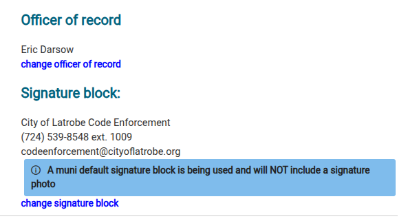

# Generic Officer Signatures

A municipality can opt to sign letters from a generic/arbitrary person without using an
individual signature image. The issuing officer is still tracked internally, but the
recipient only ever sees the designated generic person as the letter's signing party.

Setup is a one-time administrative task — see the
[admin guide](/admin/subsystems/letters/generic-officer-signatures) if it hasn't been
configured yet for your municipality.

## Using the generic signing person

Once configured, all letters in that municipality are signed by the default generic person
automatically. You can click **Change signature block** in the letter configuration dialog to
sign a specific letter with a non-generic person instead, when that's needed.

See also: [Generating and sending a letter](generating-and-sending-a-letter).
