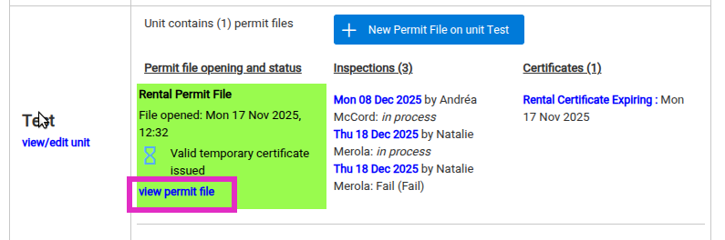
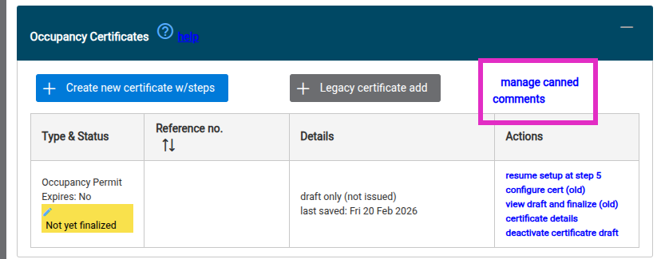
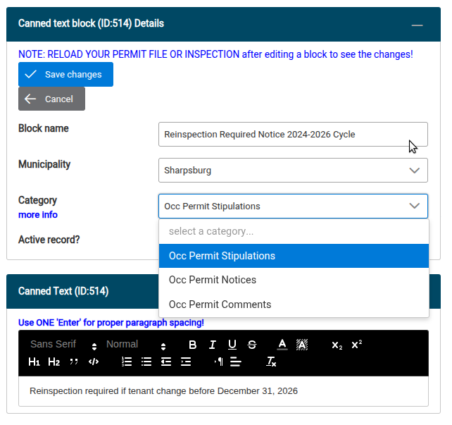
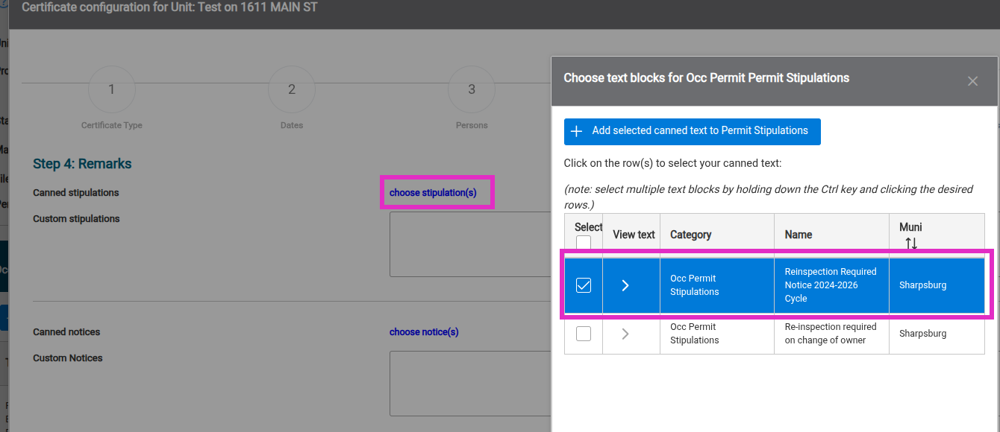

# Managing canned text on certificates

CNF provides tools to insert saved chunks of text into certificates, either by default during
the certificate flow or on a per-certificate basis. These chunks of text are called canned
text blocks or canned comments.

The high-level steps for configuring canned text blocks on certificates are:
1. Configure the canned text blocks outside of the certificate flow.
2. Apply one or more canned text blocks to a particular certificate, and optionally choose to
   always attach the selected text blocks to certificates of that type in the future.

## Managing canned text blocks

To configure text blocks for use on a certificate:

1. Navigate to any permit file through a property profile. The easiest path is to use a permit
   file on your muni property — the property loaded when you enter a new CNF session. You can
   also reach your muni property by clicking the **muni tools** link in the Municipality box
   in the upper left of the screen, then **muni property**.
2. On the property profile page, permit files live inside units, listed in the upper-right
   column. Click the **view permit file** link inside any permit file.
   
3. Once on the permit file profile, locate the **Occupancy Certificates** panel in the left
   column.
4. Click **manage canned comments** in the upper right of this panel.
   
5. This opens the canned text block manager dialog, where you can create a new canned text
   block, edit existing ones, or deactivate a block.
6. When creating or editing a canned text block, the **Category** dropdown selects which of
   the three possible certificate labels your text block can be added to: Stipulations,
   Notices, and Comments. All labels function the same way; which you assign your text block
   to is a matter of preference.
   
7. Save your changes to the text block and close the dialog with the X in the upper right.
8. Now, when configuring a certificate in the flow, you can apply your canned text block to
   the label as desired using the blue **choose (label name)** link.
   
